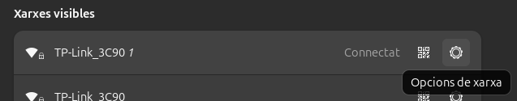
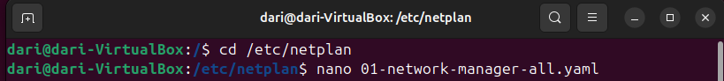

# __Configuración básica de red__
En Ubuntu 24 podemos configurar la red vía interfaz gráfica o por terminal.

### __Interfaz gráfica__
Entrando en __parámetros__ del sistema las dos primeras opciones son __wifi__ y __red__, ya en dependecia si estamos conectados por wifi o cable entraremos en una de las dos.

Indiferentemente de cual sea el caso hay que entrar en __opciones de red__.

Dentro del apartado __ipv4__ selecciono manual ya que me interesa poner una ip estática. Introduzco la ip que quiero, su máscara y puerta de enlace, además tambien pongo un servidor dns manualmente.

### __Terminal__

Para configurar la red por el terminal he seguido estos comandos y configurado estos ficheros manualmente.

Este archivo nos aparece con dhcp4 en "yes" por defecto,

Para poner una ip estática se cambia el "yes" por un no y se rellena el archivos con la siguiente información.

Para guardar el archivo se usa __CTRL + O__ y después para salir __CTRL + X__.

Por último para aplicar los cambios se usa este comando.

### __Clonezilla__

Sobre clonezilla entraremos en profundidad en el sprint 2 pero se usa a nivel de gestor de sistemas, donde hay que hacer puntos de restauración para muchos equipos e ir uno a uno es una tarea que nos ocuparía mucho tiempo pudiendo utilizar está herramienta.

Clonezilla Server se utiliza para clonar simultáneamente varios equipos a través de una red, es decir, en remoto. También se puede utilizar para implementar sistemas operativos en varios equipos mediante la creación de imágenes de uno solo.