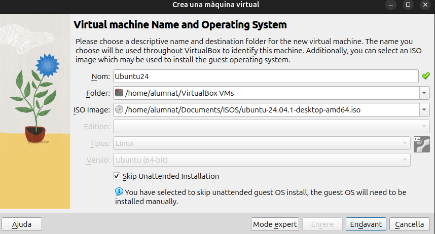
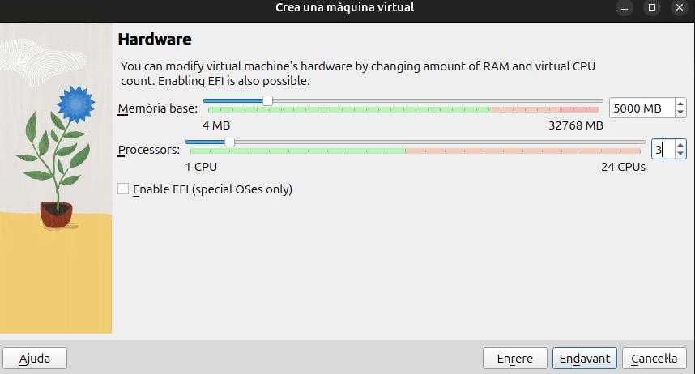
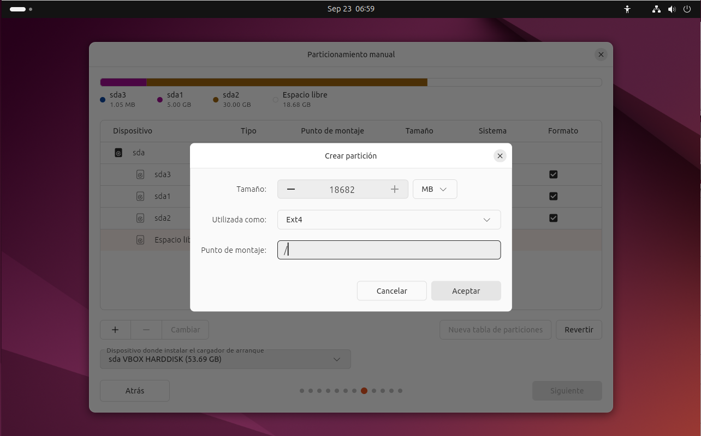

# __Virtualización__
Para hacer los ejercicios utilizaré una máquina virtual con VirtualBox.
A continuación mostraré los pasos que he seguido para crear la máquina virtual.

Para este paso, una vez creada la máquina virtual, he entrado en parámetros y en el apartado "Xarxa", y he cambiado el adaptador1 a Xarxa NAT

## __Instalación de Ubuntu__

Al empezar la instalción de Ubuntu saldrá unas cuantas pantallas donde es todo darle a siguiente

En esta pantalla que es la octava, selecciono la instalación manual para poder hacer las particiones a mi gusto.

Aqui sale un único disco en el cual comienzo a hacer particiones. 
La primera para SWAP, a la cual le asigno 5000MB.

Tambien crearemos dos particiones más, donde una será para la "/home" y otra para "/". 

Una vez creadas las particiones se ve asi.

Ahora ya solo queda crear un usuario y revisar las elecciones que hemos hecho. Ya tenemos Ubuntu instalado.

