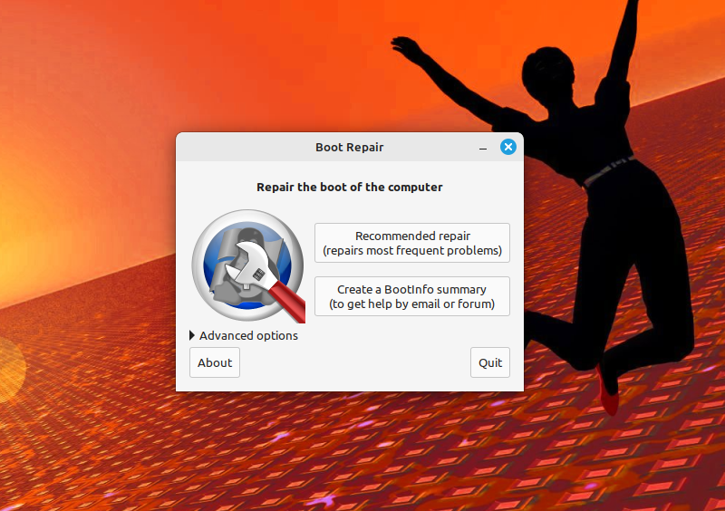
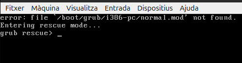
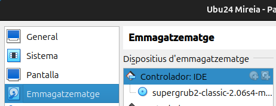

# __Recuperación gestor de arranque__

Con estas dos herramientas de recuperación del gestor de arranque, para simular un fallo, borraremos el directorio grub de /boot. 

### __Boot-Repair__

Con esta captura se demuestra que el gestor de arranque falla.

Ahora mediante una iso haciendo como si fuera un liveUSB, ponemos el boot-repair en la máquina virtual y empezamos la recuperación.

En este caso no he querido probar de utilizar la ultima versión, asi que le doy a no.

En esta pantalla he seleccionado la opción recomendada.

Aqui hago click en si.

Al terminar muestra un archivo .txt con información de lo que ha hecho boot-repair.

Esta captura muestra como ha funcionado correctamente.

### __SuperGrub 2__

Vuelvo a repetir la simulación de fallo borrando el directorio grub y vuelvo a repetir el proceso de antes pero ahora con la iso de supergrub.

Entro en la opcion de detectar y mostrar los metodos de boot.

Busco la opción de linux y le doy al enter para que empiece la recuperación.

Al terminar cierro el pc y extraigo la iso que simula el liveUSB, el sistema operativo vuelve a cargar correctamente.

Con SuperGrub2, al terminal hay que poner unos comandos en la terminal para que se aplique la restauración, sino al reiniciar vuelve a petarse.

