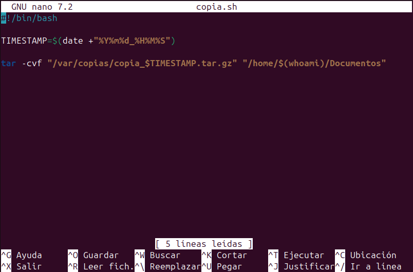
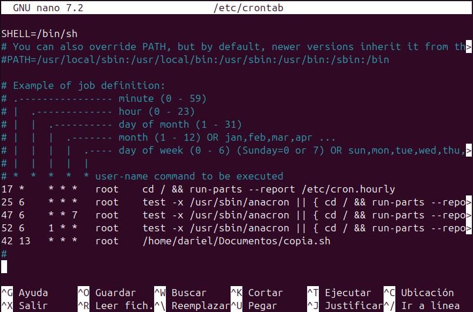
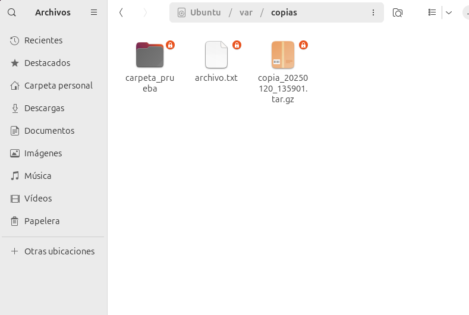
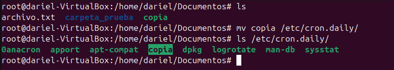
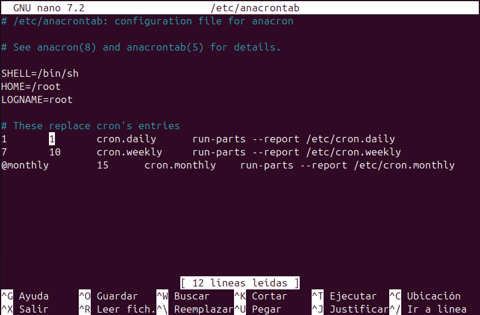
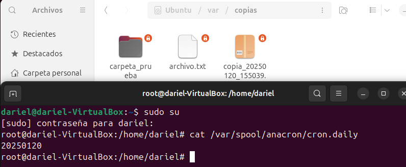

# __Automatización de tareas con Cron y Anacron__
## ¿Qué es Cron?

Cron es una utilidad de software en sistemas Unix-like que permite programar la ejecución de comandos o scripts en intervalos de tiempo específicos. Es ideal para tareas repetitivas que necesitan ejecutarse a intervalos regulares, como respaldos, actualizaciones de sistemas, y mantenimiento.

### Archivos relacionados con Cron

- `/etc/crontab`: Archivo de configuración principal de Cron.
- `/var/spool/cron/crontabs`: Directorio donde se almacenan los archivos crontab de los usuarios.
- `crontab -e`: Comando para editar el archivo crontab del usuario actual.
- `/etc/cron.d`: Directorio donde se pueden colocar archivos crontab adicionales.
- `/etc/cron.daily`: Directorio para tareas que se ejecutan diariamente.
- `/etc/cron.hourly`: Directorio para tareas que se ejecutan cada hora.
- `/etc/cron.monthly`: Directorio para tareas que se ejecutan mensualmente.
- `/etc/cron.weekly`: Directorio para tareas que se ejecutan semanalmente.

## ¿Qué es Anacron?

Anacron es una utilidad similar a Cron, pero está diseñada para sistemas que no están encendidos todo el tiempo. Anacron garantiza que las tareas programadas se ejecuten al menos una vez, incluso si el sistema estuvo apagado durante el tiempo programado. Es útil para computadoras portátiles y otros dispositivos que no están siempre en funcionamiento.

### Archivos relacionados con Anacron

- `/etc/anacrontab`: Archivo de configuración principal de Anacron.
- `/var/spool/anacron`: Directorio donde Anacron guarda los registros de las tareas ejecutadas.

## Diferencias entre Cron y Anacron

- **Frecuencia de Ejecución**: Cron puede ejecutar tareas en intervalos de tiempo muy cortos (por ejemplo, cada minuto), mientras que Anacron está diseñado para ejecutar tareas al menos una vez al día.
- **Disponibilidad del Sistema**: Cron asume que el sistema está siempre encendido, mientras que Anacron está diseñado para sistemas que pueden estar apagados durante largos períodos.
- **Configuración**: Los trabajos de Cron se configuran en el archivo `crontab`, mientras que los trabajos de Anacron se configuran en el archivo `/etc/anacrontab`.

Ambas herramientas son complementarias y pueden ser utilizadas juntas para asegurar que las tareas críticas se ejecuten de manera oportuna, independientemente de la disponibilidad del sistema.

## __Ejemplo Práctico CRONTAB__

Aprovechando el apartado anterior de cópias de seguridad, automatizaré las copias de seguridad que estaba realizando manualmente en dicho apartado.

1. __Creación del Script__
    
    Al script hay que darle permisos de ejecucion, se puede utilizar el comando `sudo chmod +x copias-sh`

2. __Editar fichero CRONTAB__
    Ahora vamos a indicarle a crontab la frecuencia con la que tiene que ejecutar el script y obviamente le vamos a indicar donde está el scriot que tiene que ejecutar.
    
    El script se ejecutará todos los días, a las 13:42.

3. __Comprobación__
    Esperamos a la hora indicada y revisamos la carpeta /var/copias a ver si se genera el fichero .tar.
    

## __Ejemplo Práctico CRON__

__!!IMPORTANTE!!__
Para que funcione un script en las carpetas de cron como cron.daily, hay que eliminar la extencion del script.

1. __Creación del Script__
    En este caso utilizaremos el mismo que antes, pero lo vamos a mover a `/etc/cron.daily`, ya que quiero que se ejecute diariamente.
    

2. __Modificación del archivo /etc/anacrontab__
    Por defecto, los scripts diarios se ejecutan a los 5 minutos de que el PC esté encendido, voy a cambiar ese valor a 1.
    

3. __Comprobación__
    Como el PC ya lleva encendido mas de 5 minutos, los scripts diarios ya se han ejecutado, voy a mostrar como resetear esto y comprobar que funciona.
    

