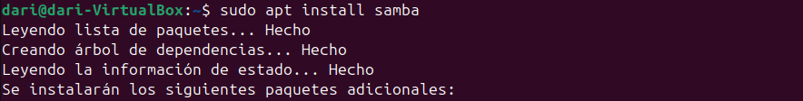
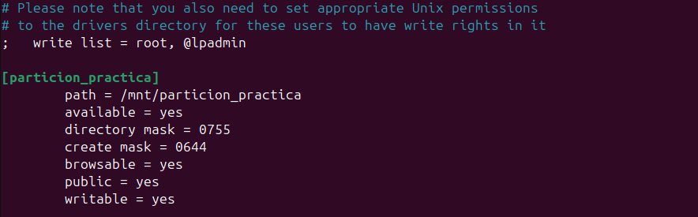
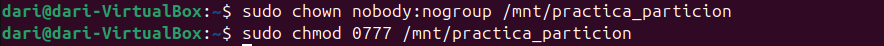
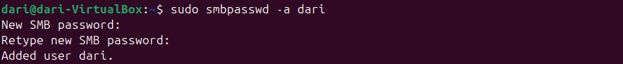
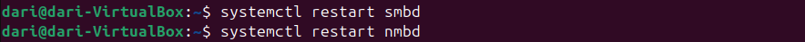
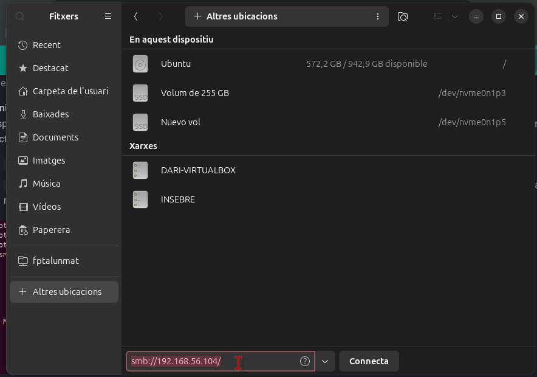
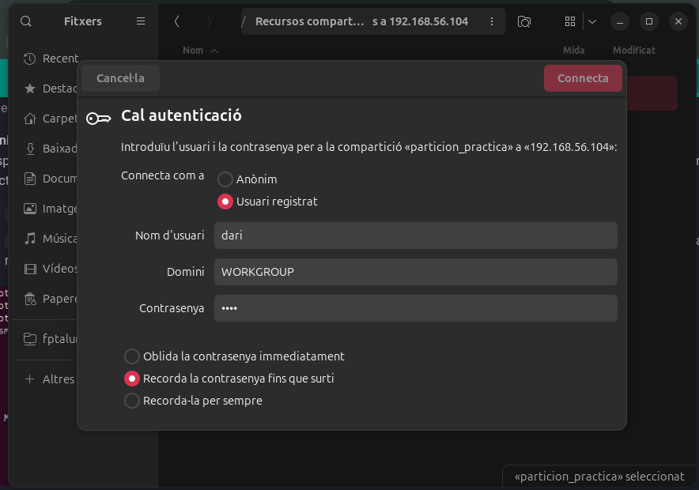

# __Compartir Archivos en Red__

En este apartado voy a mostrar como aprovechar la partición del anterior apartado para compartir archivos en red mediante Nautilus y Samba.

## __¿Qué es Nautilus?__

Nautilus es el administrador de archivos predeterminado para el entorno de escritorio GNOME. Permite a los usuarios navegar por sus archivos y carpetas, así como realizar operaciones básicas como copiar, mover y eliminar archivos. Además, Nautilus facilita la compartición de archivos en red de manera sencilla.

```
NAUTILUS NO FUNCIONA CORRECTAMENTE EN UBUNTU 24 EXPLICARÉ COMO SERÍA SU FUNCIONAMIENTO EN UBUNTU 22 PERO NO ACOMPAÑARÉ CON CAPTURAS
```

### __Instalación y Configuración de Nautilus__

Para instalar Nautilus en Ubuntu 24, abre una terminal y ejecuta el siguiente comando:

```bash
sudo apt update
sudo apt install nautilus
```

Una vez instalado, puedes abrir Nautilus desde el menú de aplicaciones o ejecutando `nautilus` en la terminal.

Para compartir una carpeta en red usando Nautilus:
1. Navega a la carpeta que deseas compartir. En este caso la que hemos usado de punto de montaje el anterior apartado.
2. Haz clic derecho sobre la carpeta y selecciona "Propiedades".
3. Ve a la pestaña "Compartir" y marca la opción "Compartir esta carpeta".
4. Configura los permisos según tus necesidades y haz clic en "Crear compartición".

## __¿Qué es Samba?__

Samba es una implementación libre del protocolo de compartición de archivos de Windows (SMB/CIFS) que permite a los usuarios compartir archivos y recursos como impresoras entre sistemas operativos Unix/Linux y Windows. Samba es una herramienta poderosa para la integración de redes heterogéneas.

### __Instalación y Configuración de Samba__

Para instalar Samba en Ubuntu 24, abre una terminal y ejecuta los siguientes comandos:

```bash
sudo apt update
sudo apt install samba
```



Después de la instalación, edita el archivo de configuración de Samba para definir las carpetas que deseas compartir. Abre el archivo con tu editor de texto favorito:

```bash
sudo nano /etc/samba/smb.conf
```

Añade la siguiente configuración al final del archivo para compartir una carpeta específica:

```ini
[NombreCompartido]
    path = /ruta/a/tu/carpeta
    available = yes
    directory mask = 0755
    create mask = 0644
    browsable = yes
    public = yes
    writable = yes
```


### __Cambiar Permisos de la Carpeta Compartida__
Para cambiar los permisos de la carpeta compartida a `nobody:nogroup` y permitir que cualquier usuario pueda acceder, ejecuta el siguiente comando:

```bash
sudo chown nobody:nogroup /mnt/particion_practica
sudo chmod 0777 /mnt/particion_practica
```



Esto cambiará el propietario y el grupo de la carpeta a `nobody:nogroup` y establecerá los permisos para que todos los usuarios puedan leer, escribir y ejecutar archivos en la carpeta.
Guarda los cambios y reinicia el servicio de Samba para aplicar la nueva configuración:

### __Agregar un Usuario a Samba__

Para agregar un usuario a Samba, primero necesitas asegurarte de que el usuario exista en el sistema. Si no existe, puedes crearlo con el siguiente comando:

```bash
sudo adduser nombre_usuario
```

Luego, agrega el usuario a Samba utilizando el comando `smbpasswd`:

```bash
sudo smbpasswd -a nombre_usuario
```



Se te pedirá que ingreses y confirmes una contraseña para el usuario de Samba. Una vez hecho esto, el usuario estará agregado y podrá autenticarse en el servidor Samba con las credenciales proporcionadas.

Guarda los cambios y reinicia el servicio de Samba para aplicar la nueva configuración:


```bash
sudo systemctl restart smbd
sudo systemctl restart smnd
```



### __Conectarse a Samba desde Otro Ordenador en Ubuntu Linux__

Para conectarte a una carpeta compartida en Samba desde otro ordenador con Ubuntu Linux, sigue estos pasos:

Abre el administrador de archivos en el ordenador cliente.
En la barra de direcciones, escribe `smb://` seguido de la dirección IP o el nombre del host del servidor Samba. Por ejemplo:

```
smb://192.168.1.100
```


Presiona `Enter` y se te pedirá que ingreses tus credenciales de usuario. Introduce el nombre de usuario y la contraseña configurados en el servidor Samba.



Una vez autenticado, podrás ver y acceder a las carpetas compartidas en el servidor Samba.
