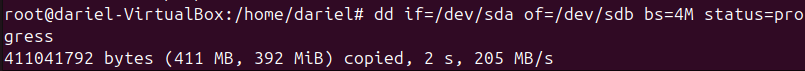

# __Copias de Seguridad en Linux__

## __¿Qué es una copia de seguridad?__

Una copia de seguridad es una duplicación de datos importantes que se almacena en un lugar seguro para poder recuperarlos en caso de pérdida, daño o corrupción de los datos originales. Las copias de seguridad son esenciales para proteger la información y garantizar la continuidad del trabajo.

## __Tipos de copias de seguridad__

1. **Copia de seguridad completa**: Es una copia exacta de todos los datos seleccionados. Aunque es la más segura, también es la que más espacio y tiempo requiere. 
    - **Recomendación**: Realizar una copia de seguridad completa semanalmente o mensualmente, dependiendo del volumen de datos y la criticidad de la información.

2. **Copia de seguridad incremental**: Solo copia los datos que han cambiado desde la última copia de seguridad (completa o incremental). Es más rápida y ocupa menos espacio, pero la restauración puede ser más compleja.
    - **Recomendación**: Realizar copias de seguridad incrementales diariamente para minimizar el tiempo y espacio de almacenamiento.

3. **Copia de seguridad diferencial**: Similar a la incremental, pero copia todos los datos que han cambiado desde la última copia de seguridad completa. Es un equilibrio entre la copia completa y la incremental.
    - **Recomendación**: Realizar copias de seguridad diferenciales cada pocos días (por ejemplo, cada 3 días) para mantener un equilibrio entre tiempo de copia y facilidad de restauración.

## __El comando `cp` en Linux__

El comando `cp` en Linux se utiliza para copiar archivos y directorios de un lugar a otro. Es una herramienta fundamental para la gestión de archivos en sistemas Unix y Linux.

### __Sintaxis básica__

```bash
cp [opciones] origen destino
```

### __Parámetros comunes__

- `-r` o `--recursive`: Copia directorios de forma recursiva, incluyendo todos los archivos y subdirectorios.
- `-i` o `--interactive`: Pide confirmación antes de sobrescribir archivos existentes en el destino.
- `-u` o `--update`: Copia solo los archivos que son más nuevos que los existentes en el destino o que no existen en el destino.
- `-v` o `--verbose`: Muestra información detallada de los archivos que se están copiando.
- `-a` o `--archive`: Preserva la estructura de directorios, atributos de archivo y enlaces simbólicos. Es equivalente a usar `-dR --preserve=all`.

El comando `cp` es una herramienta poderosa y flexible para la gestión de archivos en Linux, permitiendo realizar copias de seguridad y transferencias de archivos de manera eficiente.

### __Ejemplo Práctico__

En este ejemplo páctico de `cp`, voy a copiar lo que se encuentre dentro del directorio `/home/<usuario>/Documentos` en `/var/copias`.


Ejecución del comando `cp -R /home/<usuario>/Documents/* /var/copies` y verificación de la cópia:


## __El comando `rsync` en Linux__

El comando `rsync` es una herramienta avanzada para copiar y sincronizar archivos y directorios de manera eficiente entre diferentes ubicaciones. A diferencia de `cp`, `rsync` solo transfiere las diferencias entre el origen y el destino, lo que lo hace ideal para realizar copias de seguridad incrementales y diferenciales.

### __Sintaxis básica__

```bash
rsync [opciones] origen destino
```

### __Parámetros comunes__

- `-a` o `--archive`: Modo de archivo, que preserva permisos, tiempos de modificación, y otros atributos.
- `-v` o `--verbose`: Muestra información detallada de los archivos que se están sincronizando.
- `-z` o `--compress`: Comprime los datos durante la transferencia para ahorrar ancho de banda.
- `-P`: Muestra el progreso de la transferencia y permite reanudar transferencias interrumpidas.
- `--delete`: Elimina archivos en el destino que ya no existen en el origen.

### __Ejemplo Práctico__

En este ejemplo práctico de `rsync`, voy a sincronizar el contenido del directorio `/home/<usuario>/Documentos` con `/var/copias`.

```bash
rsync -avz /home/<usuario>/Documentos/ /var/copias/
```

Este comando sincroniza los archivos y directorios, mostrando detalles de la transferencia y comprimiendo los datos durante el proceso.


El comando `rsync` es una herramienta poderosa y eficiente para realizar copias de seguridad y sincronizaciones en sistemas Linux.
## __El comando `dd` en Linux__

El comando `dd` en Linux se utiliza para copiar y convertir archivos de una manera más flexible y potente. Es especialmente útil para crear copias de seguridad de discos completos, particiones y dispositivos de almacenamiento.

### __Sintaxis básica__

```bash
dd if=origen of=destino [opciones]
```

### __Parámetros comunes__

- `if`: Especifica el archivo de entrada (origen).
- `of`: Especifica el archivo de salida (destino).
- `bs`: Tamaño del bloque de datos que se copiará a la vez (por ejemplo, `bs=4M` para bloques de 4 megabytes).
- `count`: Número de bloques que se copiarán.
- `status=progress`: Muestra el progreso de la copia.

### __Ejemplo Práctico__

En este ejemplo práctico de `dd`, voy a copiar el contenido del disco entero `/dev/sda` a otro disco `/dev/sdb`.

```bash
dd if=/dev/sda of=/dev/sdb bs=4M status=progress
```

Este comando copia el disco entero `/dev/sda` al disco `/dev/sdb` en bloques de 4 megabytes y muestra el progreso de la copia.



El comando `dd` es una herramienta poderosa para la creación de copias de seguridad de bajo nivel y la clonación de discos en sistemas Linux.

### __Verificación de la copia con `md5sum`__

El comando `md5sum` en Linux se utiliza para calcular y verificar sumas de comprobación MD5, que son valores hash únicos generados a partir del contenido de un archivo. Esto permite verificar la integridad de los archivos copiados, asegurándose de que no se hayan producido errores durante la copia.

__Sintaxis__

```bash
md5sum /dev/sda /dev/sdb
```

La salida de los dos discos debe ser la misma, eso indica que se ha copiado correctamente.

