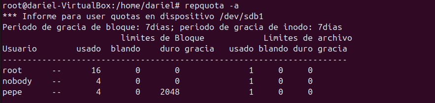

# Cuotas de Disco en Ubuntu

## __¿Qué son las cuotas de disco?__

Las cuotas de disco son una característica del sistema operativo que permite limitar la cantidad de espacio en disco que un usuario o grupo puede utilizar. Esto es especialmente útil en entornos multiusuario donde es necesario gestionar y controlar el uso del espacio en disco para evitar que un solo usuario consuma todos los recursos disponibles.

## __¿Para qué sirven las cuotas de disco?__

Las cuotas de disco sirven para:

- **Prevenir el uso excesivo de espacio en disco**: Ayudan a evitar que un usuario o grupo utilice más espacio del asignado, garantizando que haya suficiente espacio para otros usuarios y aplicaciones.
- **Gestionar recursos de manera eficiente**: Permiten a los administradores del sistema asignar y controlar el uso del espacio en disco de manera más eficiente.
- **Mantener el rendimiento del sistema**: Al limitar el uso del espacio en disco, se puede mantener un rendimiento óptimo del sistema y evitar problemas relacionados con la falta de espacio.

## __Como configurar las cuotas de disco__


### __Instalar los paquetes necesarios__

Para habilitar y gestionar las cuotas de disco en Ubuntu, primero es necesario instalar los paquetes `quota` y `quotatool`. Puedes hacerlo ejecutando el siguiente comando:

```bash
sudo apt-get install quota quotatool
```

### __Crear y montar una partición en /mnt__

Reutilizaré la particion creada en anteriores apartados.
Resumen:

1. **Crear una partición**:
    ```bash
    sudo fdisk /dev/sdX
    ```
    - Dentro de `fdisk`, usa `n` para nueva partición, `p` para primaria, selecciona el número de partición, define el tamaño y usa `w` para escribir los cambios.

2. **Formatear la partición**:
    ```bash
    sudo mkfs.ext4 /dev/sdX1
    ```

3. **Crear un punto de montaje**:
    ```bash
    sudo mkdir -p /mnt/mi_particion
    ```

4. **Montar la partición**:
    ```bash
    sudo mount /dev/sdX1 /mnt/mi_particion
    ```

5. **Actualizar `/etc/fstab` para montaje automático**:
    ```plaintext
    /dev/sdX1 /mnt/mi_particion ext4 defaults 0 2
    ```

Este comando muestra un resumen de las cuotas de disco para todos los sistemas de archivos con cuotas habilitadas, incluyendo el uso actual y los límites establecidos para cada usuario y grupo.

### __Habilitar las cuotas en el sistema de archivos__

Edita el archivo `/etc/fstab` para habilitar las cuotas en el sistema de archivos. Añade las opciones `usrquota` y `grpquota` a las particiones donde deseas habilitar las cuotas. Por ejemplo:

```plaintext
/dev/sda1 / ext4 defaults,usrquota,grpquota 0 1
```


### __Remontar el sistema de archivos__

Después de editar el archivo `/etc/fstab`, es necesario remontar el sistema de archivos para aplicar los cambios:

```bash
sudo mount -o remount /mnt/particion_practica
```


### __Crear los archivos de cuotas__

Crea los archivos de cuotas en la raíz del sistema de archivos donde se habilitaron las cuotas:

```bash
sudo quotacheck -cum /mnt/particion_practica
sudo quotaon -v /mnt/particion_practica
```


### __Asignar cuotas a usuarios y grupos__

Para asignar cuotas a un usuario, utiliza el siguiente comando:

```bash
sudo edquota -u nombre_usuario /mnt/particion_practica
```


Para asignar cuotas a un grupo, utiliza el siguiente comando:

```bash
sudo edquota -g nombre_grupo /mnt/particion_practica
```

### __Verificar las cuotas__

Para verificar las cuotas asignadas, puedes utilizar el siguiente comando:

```bash
repquota -a
```


Con estos pasos, habrás configurado correctamente las cuotas de disco en Ubuntu, permitiendo una mejor gestión y control del uso del espacio en disco en tu sistema.


