# __Gestión de Procesos__

## __Permisos "Normales"__
Me refiero a persmisos normales, a los permisos de lectura, escritura y ejecución de archivos y carpetas.
Existen tres comandos relacionados con la gestíon de estos permisos:

* __chwon [-R]:__ Cambia el propietario de la carpeta/archivo.
```
chown [opciones] propietario[:grupo] archivo
```
* __chgrp [-R]:__ Cambia el grupo propietario.
```
chgrp [opciones] grupo archivo
```
* __chmod [-R]:__ Cambia las opciones de lectura, escritura y ejecución.
```
chmod [opciones] modo archivo
```
Con "chmod" hay que entender su estructura, donde los permisos se simbolizan con numeros.

Este es su equivalencia:

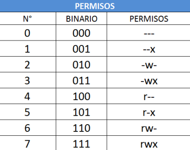

Este es un ejemplo de como vienen los permisos de fabrica cuando un usuario crea un fichero y una carpeta:

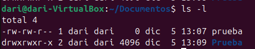


La "R" significa lectura, "W" sifnifica escritura y "X" significa ejecución. Si en vez de una de las letras hay un - significa que no esta habilitado dicho permiso.

---
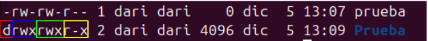

* En un sistema basado en Unix/Linux, los permisos comienzan con un carácter que identifica el tipo de archivo, es lo que hay __señalado en rojo__, en este caso una "D" de directorio.
* De color __azul__ está marcado el bloque de __permisos del usuario__.
* De color __verde__ está marcado el bloque de __permisos del grupo__.
* De color __amarillo__ está marcado el bloque de __permisos del resto de ususarios__.
 
---
Para demostrar el funcionamiento de los permisos voy a crear 3 usuarios y un grupo nuevo, donde voy a ir ajustando los permisos para hacer que unos usuarios en concreto tengan acceso a los ficheros.

Creación de los nuevos usuarios:
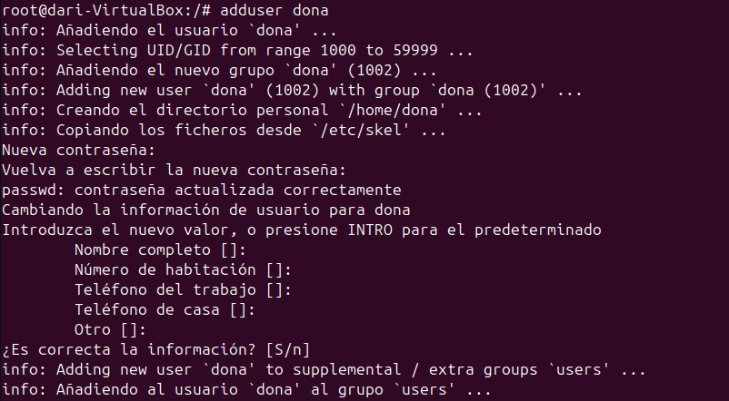

---
Creación del grupo nuevo:
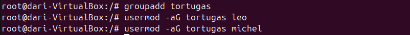

---
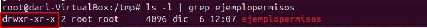
Al crear una carpeta, por defectos viene con los permisos que se pueden ver en la captura. En números sería "755" lo que significa permiso total para el propietario mas para su grupo y el resto, permisos de lectura y ejecución.

---
Creación de la carpeta compartida:

En esta captura se puede ver como utilizo el comando ```chmod -R 770 compartido```, "770" asigna permisos de lectura, escritura y ejecución a el dueño del fichero y sus grupos, mientras que al resto de usuario no pueden entrar al fichero para nada.

---
Demostración de la carpeta compartida:
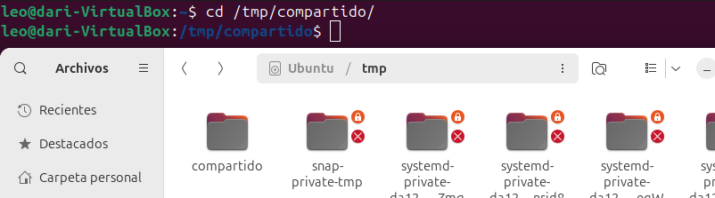
En esta captura he iniciado sesión en la cuenta de "Leo", la cual pertenece al grupo de "Tortugas" y puedo acceder a la carpeta creada anteriormente.

---
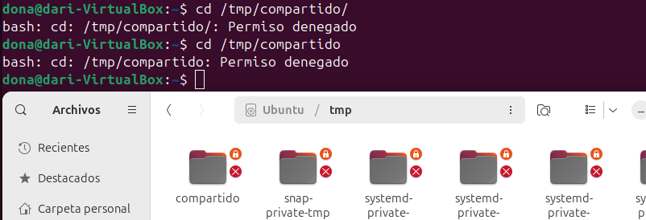
En esta captura, por lo contrario, he iniciado sesión en la cuenta de "Dona", que no pertenece al grupo de "Tortugas" y no puedo acceder a la carpeta.

---
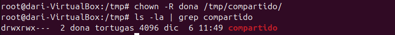
En esta captura, utilizo el comando ```chown -R dona /tmp/compartido/``` para cambiar el propietario de la carpeta y los archivos que hubieran dentro.

---
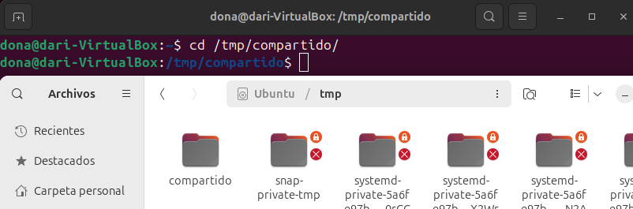
La cuenta de "Dona" ahora al ser propietario, tiene permisos de lectura, escritura y ejecución.

---
## __Permisos Especiales__
En Ubuntu (y sistemas basados en Linux en general), además de los permisos estándar (lectura, escritura y ejecución), existen permisos especiales que ofrecen funcionalidades adicionales para archivos y directorios. Estos son:

* __Setuid:__ Ejecuta un programa con los permisos del propietario.
* __Setgid:__ Herencia de grupo en directorios o ejecución con permisos del grupo.
* __Sticky Bit:__ Restricción para borrar o renombrar archivos en un directorio compartido.

### __Setuid (Seut User ID)__
Este permiso funciona con los programas ejectutables (scripts), donde que un programa se ejecute siempre con los privilegios del propietario.
```
chmod u+s archivo
```

---
### __Setgid (Set Group ID)__
Este permiso especial funciona igual que  el setuid pero con el grupo propietario, también funciona con directorios.
```
chmod g+s archivo_o_directorio
```

---
### __Sticky Bit__
Este permiso especial evita que los usuarios elimen o renombres arichvos dentro de un directorio que nos les pertenezca, es decir, si se activa este permiso especial provoca que solo el usuario propietario pueda eliminar o renombrar el archivo, mientras que el resto podrán seguir leyendolo o ejecutandolo.
```
chmod +t directorio
```

__Ejemplo de uso de los permisos especiales:__
He probado de usar el setuid y setgid pero no funcionan bien, almenos en ubuntu 24.

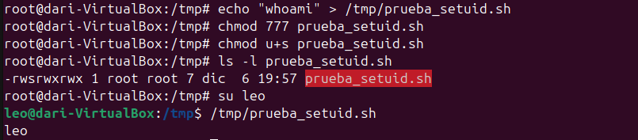
El procedimiento es el correcto, al ejecutar el programa debería salir "root" ya que el usuario propietario es root pero no.

---
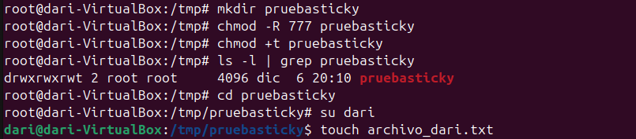
Para demostrar el uso de Sticky Bit, he creado una carpeta y le he asigando permisos de lectura, escritura y ejecución para todos los usuarios. Con estos permisos un usuario podria borrar cualquier fichero pero al usar el comando ```chmod +t pruebasticky``` ya no debería.

---
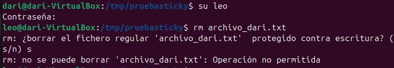
He iniciado sesión con otro usuario y he intentado borrar el archivo, efectivamente no tengo permisos para ello si no es la cuenta propietaria.

---
## __UMASK__
El comando umask sirve para cambiar los permisos predeterminados de un usuario a la hora de crear archivos y directorios. También se puede modificar el archivo /etc/login.defs para que a todos los usuarios que creemos en adelante tengan unos permisos predeterminados personalizados.

### __Cálculo del Umask__

El valor de umask se utiliza para determinar los permisos predeterminados de los archivos y directorios recién creados. Para calcular el umask, se debe restar el valor de umask de los permisos máximos posibles.

Los permisos máximos posibles son:
- Archivos: `666` (lectura y escritura para todos)
- Directorios: `777` (lectura, escritura y ejecución para todos)

Para calcular los permisos resultantes, se resta el valor de umask de los permisos máximos posibles. Por ejemplo, si el umask es `022`:
- Permisos de archivos: `666 - 022 = 644`
- Permisos de directorios: `777 - 022 = 755`

Esto significa que los archivos tendrán permisos de lectura y escritura para el propietario, y solo lectura para el grupo y otros. Los directorios tendrán permisos de lectura, escritura y ejecución para el propietario, y solo lectura y ejecución para el grupo y otros.

### __Comprobar y cambiar máscara__

Para comprobar la máscara de creación de archivos y directorios, se puede utilizar el comando `umask` sin argumentos. Esto mostrará la máscara actual en formato octal.
```
umask
```
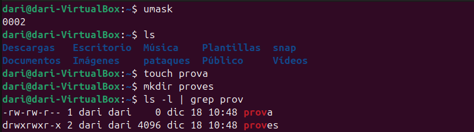

---
Para cambiar la máscara de creación, se puede utilizar el comando `umask` seguido de la nueva máscara en formato octal. Por ejemplo, para establecer una máscara de `033`, se puede utilizar el siguiente comando:
```
umask 033
```
Esto establecerá los permisos predeterminados de los archivos a `744` y de los directorios a `744`.

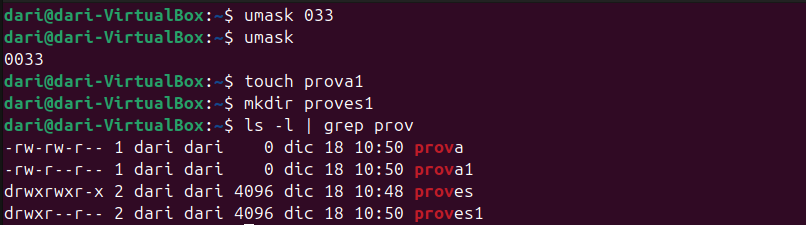


---
### __Modificar Umask en login.defs__
Para modificar el umask en el archivo `/etc/login.defs`, se debe editar dicho archivo con privilegios de superusuario. Se puede utilizar un editor de texto como `nano` o `vim`. A continuación se muestra cómo hacerlo:

Abre el archivo `/etc/login.defs` con un editor de texto:   
``` 
sudo nano /etc/login.defs
```
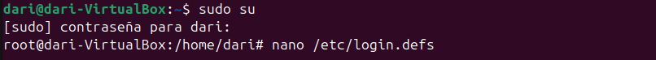

---
Busca la línea que contiene `UMASK`. Si no existe, puedes agregarla. Modifica o agrega la línea para establecer el umask deseado. 
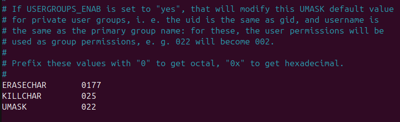

---
Por ejemplo, para establecer un umask de `033`, agrega o modifica la siguiente línea:


---
Guarda los cambios y cierra el editor.

A partir de ahora, los nuevos usuarios creados tendrán el umask especificado en el archivo `/etc/login.defs`.
Para combrobarlo voy a crear un usario, iniciar sesión y utilizar el comando umask.
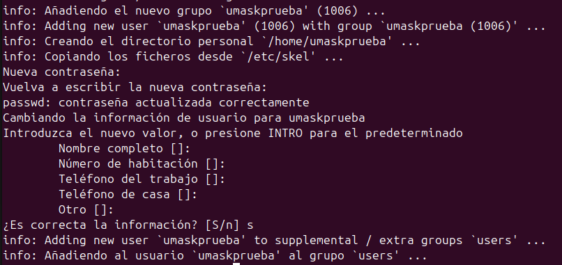


---

## __Listas de Control de Acceso (ACLs)__

Las Listas de Control de Acceso (ACLs) proporcionan un método más flexible para asignar permisos a archivos y directorios en sistemas Unix/Linux. Permiten especificar permisos para usuarios y grupos adicionales más allá de los permisos tradicionales.

### __Habilitar ACLs__

Para utilizar ACLs, el sistema de archivos debe montarse con soporte para ACLs. Esto se puede verificar y habilitar con los siguientes comandos:

1. Verificar si el sistema de archivos soporta ACLs:
    ```
    mount | grep acl
    ```

2. Si no está habilitado, monta el sistema de archivos con soporte para ACLs:
    ```
    sudo mount -o remount,acl /ruta/al/sistema/de/archivos
    ```

### __Comandos Básicos de ACLs__

__setfacl:__ Establece ACLs en archivos y directorios.
```
setfacl -m u:usuario:permisos archivo
setfacl -m g:grupo:permisos archivo
```
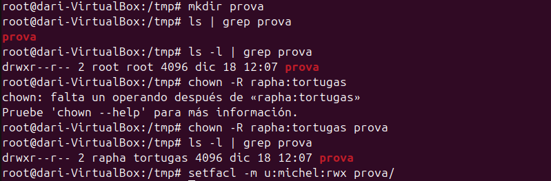

---
__getfacl:__ Muestra las ACLs de archivos y directorios.
```
getfacl archivo
```
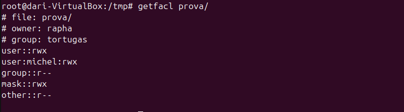

---
__setfacl -x:__ Elimina una ACL específica.
```
setfacl -x u:usuario archivo
```
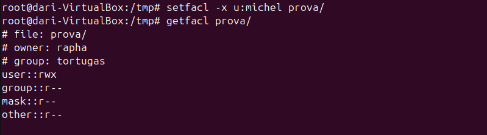

---
__setfacl -b:__ Elimina todas las ACLs de un archivo o directorio.
```
setfacl -b archivo
```

---
### __Ejemplos de Uso de ACLs__

1. __Asignar permisos a un usuario específico:__
    ```
    setfacl -m u:juan:rwx archivo.txt
    ```

2. __Asignar permisos a un grupo específico:__
    ```
    setfacl -m g:desarrolladores:rx proyecto/
    ```

3. __Ver las ACLs de un archivo o directorio:__
    ```
    getfacl archivo.txt
    ```

4. __Eliminar una ACL específica:__
    ```
    setfacl -x u:juan archivo.txt
    ```

---
### __ACLs Predeterminadas__

Las ACLs predeterminadas se pueden establecer en directorios para que los archivos y subdirectorios creados hereden estas ACLs.

1. __Establecer una ACL predeterminada:__
    ```
    setfacl -d -m u:juan:rwx directorio/
    ```

2. __Ver las ACLs predeterminadas:__
    ```
    getfacl directorio/
    ```

Las ACLs proporcionan un control granular sobre los permisos, permitiendo una administración más detallada y específica de los accesos en sistemas Unix/Linux.

---
