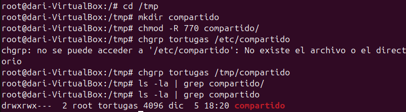

# __Gestión de Procesos__

## __Permisos "Normales"__
Me refiero a persmisos normales, a los permisos de lectura, escritura y ejecución de archivos y carpetas.
Existen tres comandos relacionados con la gestíon de estos permisos:

* __chwon [-R]:__ Cambia el propietario de la carpeta/archivo.
```
chown [opciones] propietario[:grupo] archivo
```
* __chgrp [-R]:__ Cambia el grupo propietario.
```
chgrp [opciones] grupo archivo
```
* __chmod [-R]:__ Cambia las opciones de lectura, escritura y ejecución.
```
chmod [opciones] modo archivo
```
Con "chmod" hay que entender su estructura, donde los permisos se simbolizan con numeros.

Este es su equivalencia:


Este es un ejemplo de como vienen los permisos de fabrica cuando un usuario crea un fichero y una carpeta:


La "R" significa lectura, "W" sifnifica escritura y "X" significa ejecución. Si en vez de una de las letras hay un - significa que no esta habilitado dicho permiso.

---


* En un sistema basado en Unix/Linux, los permisos comienzan con un carácter que identifica el tipo de archivo, es lo que hay __señalado en rojo__, en este caso una "D" de directorio.
* De color __azul__ está marcado el bloque de __permisos del usuario__.
* De color __verde__ está marcado el bloque de __permisos del grupo__.
* De color __amarillo__ está marcado el bloque de __permisos del resto de ususarios__.
 
---
Para demostrar el funcionamiento de los permisos voy a crear 3 usuarios y un grupo nuevo, donde voy a ir ajustando los permisos para hacer que unos usuarios en concreto tengan acceso a los ficheros.

Creación de los nuevos usuarios:


---
Creación del grupo nuevo:


---

Al crear una carpeta, por defectos viene con los permisos que se pueden ver en la captura. En números sería "755" lo que significa permiso total para el propietario mas para su grupo y el resto, permisos de lectura y ejecución.

---
Creación de la carpeta compartida:

En esta captura se puede ver como utilizo el comando ```chmod -R 770 compartido```, "770" asigna permisos de lectura, escritura y ejecución a el dueño del fichero y sus grupos, mientras que al resto de usuario no pueden entrar al fichero para nada.

---
Demostración de la carpeta compartida:

En esta captura he iniciado sesión en la cuenta de "Leo", la cual pertenece al grupo de "Tortugas" y puedo acceder a la carpeta creada anteriormente.

---

En esta captura, por lo contrario, he iniciado sesión en la cuenta de "Dona", que no pertenece al grupo de "Tortugas" y no puedo acceder a la carpeta.

---

En esta captura, utilizo el comando ```chown -R dona /tmp/compartido/``` para cambiar el propietario de la carpeta y los archivos que hubieran dentro.

---

La cuenta de "Dona" ahora al ser propietario, tiene permisos de lectura, escritura y ejecución.

---
## __Permisos Especiales__
En Ubuntu (y sistemas basados en Linux en general), además de los permisos estándar (lectura, escritura y ejecución), existen permisos especiales que ofrecen funcionalidades adicionales para archivos y directorios. Estos son:

* __Setuid:__ Ejecuta un programa con los permisos del propietario.
* __Setgid:__ Herencia de grupo en directorios o ejecución con permisos del grupo.
* __Sticky Bit:__ Restricción para borrar o renombrar archivos en un directorio compartido.

### __Setuid (Seut User ID)__
Este permiso funciona con los programas ejectutables (scripts), donde que un programa se ejecute siempre con los privilegios del propietario.
```
chmod u+s archivo
```

---
### __Setgid (Set Group ID)__
Este permiso especial funciona igual que  el setuid pero con el grupo propietario, también funciona con directorios.
```
chmod g+s archivo_o_directorio
```

---
### __Sticky Bit__
Este permiso especial evita que los usuarios elimen o renombres arichvos dentro de un directorio que nos les pertenezca, es decir, si se activa este permiso especial provoca que solo el usuario propietario pueda eliminar o renombrar el archivo, mientras que el resto podrán seguir leyendolo o ejecutandolo.
```
chmod +t directorio
```

__Ejemplo de uso de los permisos especiales:__
He probado de usar el setuid y setgid pero no funcionan bien, almenos en ubuntu 24.


El procedimiento es el correcto, al ejecutar el programa debería salir "root" ya que el usuario propietario es root pero no.

---

Para demostrar el uso de Sticky Bit, he creado una carpeta y le he asigando permisos de lectura, escritura y ejecución para todos los usuarios. Con estos permisos un usuario podria borrar cualquier fichero pero al usar el comando ```chmod +t pruebasticky``` ya no debería.

---

He iniciado sesión con otro usuario y he intentado borrar el archivo, efectivamente no tengo permisos para ello si no es la cuenta propietaria.

---
## __UMASK__


## __ACLs__