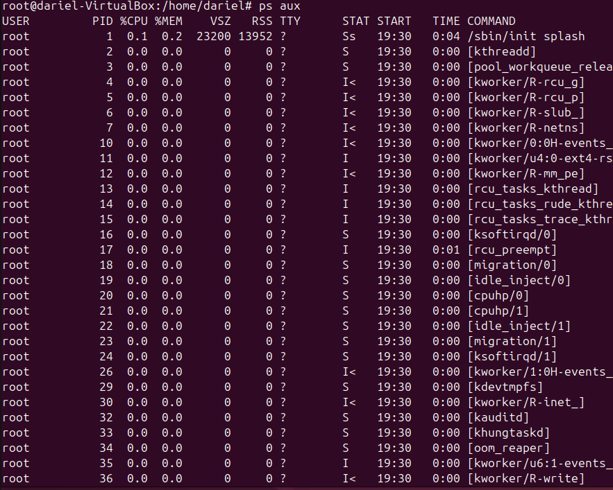

# **Procesos en Linux Ubuntu**

En Linux, un proceso es una instancia de un programa en ejecución. Cada proceso tiene un identificador único llamado PID (Process ID). Los procesos en Linux pueden ejecutarse en primer plano (foreground) o en segundo plano (background).

## **Procesos de Primer y Segundo Plano**

- **Procesos de Primer Plano:** Son aquellos que se ejecutan directamente desde la terminal y ocupan el control de la misma hasta que finalizan.
- **Procesos de Segundo Plano:** Son aquellos que se ejecutan sin ocupar el control de la terminal, permitiendo al usuario seguir utilizando la terminal para otros comandos.

## **Comando `top`**

El comando `top` muestra una lista dinámica de los procesos que están consumiendo más recursos en el sistema. Cada línea de la salida de `top` proporciona información detallada sobre un proceso.


### **Significado de Cada Línea en `top`**

- **PID:** Identificador del proceso.
- **USUARIO:** Usuario que ejecuta el proceso.
- **PR:** Prioridad del proceso.
- **NI:** Valor de nice del proceso.
- **VIRT:** Memoria virtual utilizada por el proceso.
- **RES:** Memoria residente utilizada por el proceso.
- **SHR:** Memoria compartida utilizada por el proceso.
- **S:** Estado del proceso (S: Dormido, R: Ejecutando, Z: Zombie, etc.).
- **%CPU:** Porcentaje de CPU utilizado por el proceso.
- **%MEM:** Porcentaje de memoria utilizado por el proceso.
- **HORA+:** Tiempo total de CPU utilizado por el proceso.
- **ORDEN:** Nombre del comando o proceso.

### **Opciones Útiles con `top`**

- `-u [usuario]`: Muestra los procesos de un usuario específico.
- `-p [PID]`: Muestra información de un proceso específico.
- `-n [número]`: Muestra un número específico de iteraciones y luego sale.

## **Comando `htop`**

`htop` es una versión mejorada de `top` que proporciona una interfaz interactiva y más amigable. Algunas mejoras de `htop` respecto a `top` incluyen:


- Navegación más fácil con teclas de flecha.
- Uso de colores para una mejor visualización.
- Posibilidad de matar procesos directamente desde la interfaz.
- Visualización de la carga de CPU y memoria en forma de barras.

## **Comando `ps aux`**

El comando `ps aux` muestra una instantánea de todos los procesos en el sistema. Cada columna proporciona información similar a `top`, pero en un formato estático.



### **Opciones Útiles con `ps aux`**

- `ps aux --sort=-%mem`: Ordena los procesos por uso de memoria.
- `ps aux --sort=-%cpu`: Ordena los procesos por uso de CPU.
- `ps aux | grep [nombre]`: Filtra los procesos por nombre.

## **Comando `pstree`**

El comando `pstree` muestra los procesos en forma de árbol, lo que permite ver la jerarquía y relación entre procesos.


### **Opciones Útiles con `pstree`**

- `pstree -p`: Muestra los PID de los procesos.
- `pstree -u`: Muestra los usuarios de los procesos.
- `pstree -a`: Muestra los argumentos de los procesos.

## **Finalizar Procesos en Linux Ubuntu**

Para finalizar un proceso en Linux, se puede utilizar el comando `kill` seguido del PID del proceso. Por ejemplo:

```bash
kill 1234
```

Para forzar la finalización de un proceso, se puede usar la señal `-9`:

```bash
kill -9 1234
```

Otra opción es usar `killall` seguido del nombre del proceso:

```bash
killall nombre_proceso
```


