# __Gestión de Usuarios y Grupos__

## __Definiciones__
* __Usuarios:__ En un sistema Ubuntu, un usuario es básicamente una cuenta que permite a una persona interactuar con el sistema. Cada usuario tiene su propio espacio de configuración, archivos y permisos, lo cual ayuda a mantener la privacidad y seguridad entre diferentes cuentas en el sistema. Por ejemplo, en un ordenador compartido, cada persona puede tener su usuario para guardar sus archivos y configuraciones personalizadas sin interferir con los demás.

* __Grupos:__ Un grupo, por otro lado, es una forma de organizar usuarios con características o necesidades comunes. Los grupos permiten asignar permisos de forma colectiva. Por ejemplo, podrías tener un grupo llamado "desarrolladores" al cual añades a todos los usuarios que necesitan acceso a herramientas de desarrollo o a ciertos archivos específicos. Esto hace que la gestión de permisos sea mucho más sencilla, ya que puedes asignar permisos al grupo entero en lugar de hacerlo usuario por usuario.

## __Gestión Gráfica de Usuarios y Grupos__

Al igual que en Windows, puedes gestionar gráficamente los usuarios y los grupos en Ubuntu también. Solo necesitas instalar el paquete correspondiente usando el comando:
```
apt install gnome-system-tools
```


---

Ahora se nos abra instalado una aplicación llamada **"Usuarios y grupos"**, la buscamos y la abrimos.

---

Con esta aplicación podemos modificar usuarios existentes o añadir de nuevos, a parte de modificar tambien sus permisos.

---
Voy a añadir un usuario de prueba.
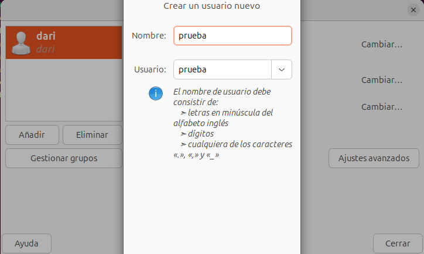
---
Le asigno una contraseña
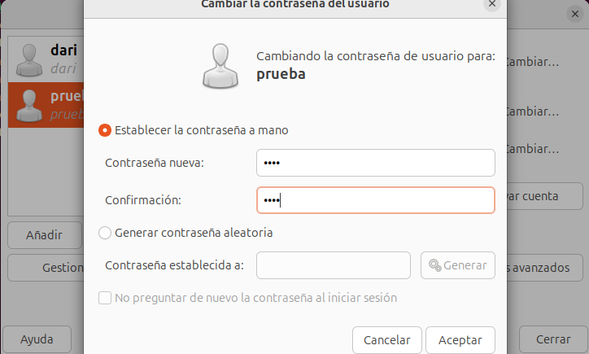
---
Ya está el usuario creado.

---
Cierro sesión para comprobar que se ha creado.

---
Al igual que hemos creado un usuario asi de fácil, también agrego un grupo.
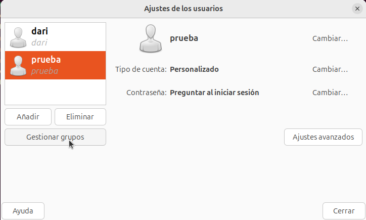
---
Si quisiera modificar un grupo ya creado tendría que buscarlo y clicar en propiedades, pero ahora me interesa solo añadir uno.

---
Lo voy a llamar "grupoprueba" y voy a añadir mis dos usuarios al grupo.

---
Compruebo que se haya creado el grupo.
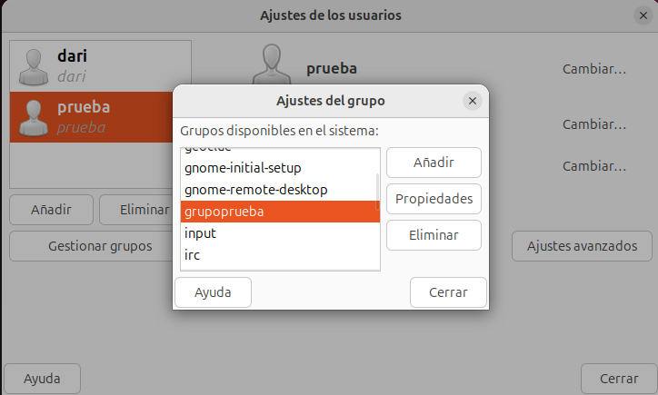
---

## __Gestión de Usuarios y Grupos VIA Terminal__
### __Ficheros Implicados en la Gestión de Usuarios y Grupos__

Si no usamos la versión gráfica, lo primero que debemos conocer son los 4 archivos involucrados en la gestión de usuarios y grupos, que son los siguientes: __/etc/passwd__, __/etc/group__, __/etc/shadow__ y __/etc/gshadow__.

--- 
#### __/etc/passwd__
Este archivo almacena información básica de cada usuario en el sistema. Cada línea representa a un usuario y contiene campos separados por dos puntos (:). Un ejemplo de línea en este archivo podría ser:
```
usuario1:x:1001:1001:Nombre Usuario:/home/usuario1:/bin/bash
```


__Campos:__

+ __usuario1:__ Nombre del usuario.
+ __x:__ Un marcador que indica que la contraseña está almacenada en /etc/shadow.
+ __1001:__ ID de usuario (UID).
+ __1001:__ ID de grupo (GID) por defecto del usuario.
+ __Nombre Usuario:__ Campo para la descripción o el nombre completo.
+ __/home/usuario1:__ Directorio personal del usuario.
+ __/bin/bash__: Shell por defecto cuando el usuario inicia sesión.
---

#### __/etc/group__
Este archivo contiene la información de los grupos en el sistema. Cada línea representa a un grupo y también está separada por dos puntos (:). Un ejemplo podría ser:
```
developers:x:1002:usuario1,usuario2
```


__Campos:__

+ __developers:__ Nombre del grupo.
+ __x:__ Indicador de la contraseña (se encuentra en /etc/gshadow).
+ __1002:__ ID del grupo (GID).
+ __usuario1,usuario2:__ Usuarios que pertenecen al grupo.
---

#### __/etc/shadow__
Este archivo almacena las contraseñas de los usuarios en formato encriptado, así como información sobre las políticas de contraseña. Solo los usuarios con permisos especiales pueden acceder a él. Un ejemplo de línea podría ser:
```
usuario1:$6$abcdefg:18504:0:99999:7:::
```


__Campos:__

+ __usuario1:__ Nombre del usuario.
+ __$6$abcdefg:__ Contraseña encriptada (el prefijo $6$ indica el método de encriptación SHA-512).
+ __18504:__ Días desde el 1 de enero de 1970 en que se cambió la contraseña __(campo epoch)__.
+ __0:__ Días mínimos antes de que se pueda cambiar la contraseña.
+ __99999:__ Días máximos que puede durar una contraseña antes de tener que cambiarse.
+ __7:__ Días de aviso antes de que la contraseña expire.
Los últimos campos hacen referencia a la fecha de inactividad y a la expiración de la cuenta.
---

#### __/etc/gshadow__
Este archivo guarda las contraseñas de los grupos encriptadas y otra información de gestión. Un ejemplo sería:
```
developers:*::usuario1,usuario2
```


__Campos:__

+ __developers:__ Nombre del grupo.
+ __*__ Contraseña encriptada del grupo.
+ __:__ el tercer campo está vacío aquí, donde normalmente irían los administradores del grupo.
+ __usuario1,usuario2:__ Miembros del grupo.

#### *Aclaración de los carácteres* __"*"__ y __"!"__
La presencia de __*__ y __!__ para indicar una contraseña desactivada o bloqueada es específica del archivo __/etc/shadow__, que es donde se gestionan las contraseñas encriptadas y su estado. En los otros archivos, como __/etc/passwd__, __/etc/group__ y __/etc/gshadow__, esos caracteres no se utilizan con este propósito y tienen otros significados o no aparecen en los campos relacionados con contraseñas.

Por ejemplo, en /etc/group y /etc/gshadow, un x en el campo de la contraseña indica que está almacenada en otro lugar, como en /etc/shadow, pero no tiene el mismo uso de bloqueo que * y ! en /etc/shadow.

### __Usuarios__

#### __Añadir Usuarios con adduser__

La herramienta adduser en Linux facilita la creación de usuarios de manera más amigable que el comando useradd. 
La sintaxis es:
```
adduser (usuario)
```
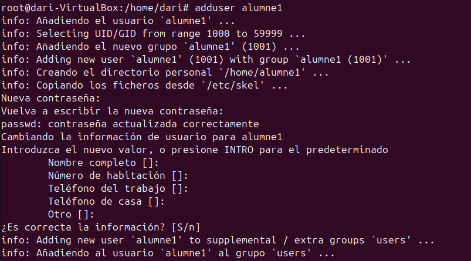
Cuando creas un nuevo usuario con adduser, se configuran varias cosas automáticamente: se genera su carpeta personal (home), se establecen los permisos y, si se configura, también se define una contraseña inicial. 
---

Un detalle interesante es que, aunque el directorio home se crea en el momento de ejecutar adduser, su contenido no se copia hasta que el usuario inicia sesión por primera vez.

Podemos revisar __/etc/passwd__ para comprobar que los usuarios se han creado correctamente.


---
#### __Bloquear/Desbloquear un Usuario__

El bloqueo de un usuario es una medida que permite gestionar el acceso de forma flexible, sin eliminar el usuario ni sus datos, y ayuda a mantener el sistema protegido frente a accesos no autorizados o accidentales.

Un usuario puede ser bloqueado de diversas maneras, la forma más sencilla es usar la opción -l (de "lock") con la comanda passwd:
```
sudo passwd -l nombre_usuario
```
Este comando añade un signo de exclamación ! al inicio de la contraseña en el archivo /etc/shadow, lo que impide el acceso con la contraseña original. Para desbloquear la cuenta, puedes usar:
```
sudo passwd -u nombre_usuario
```
Procedo a monstrarlo en mi máquina virtual utilizando la sintaxis antes mostrada

---
Lo compruebo cerrando sesión.

---
Vuelvo a desbloquear el usuario.

---
Lo compruebo cerrando sesión.
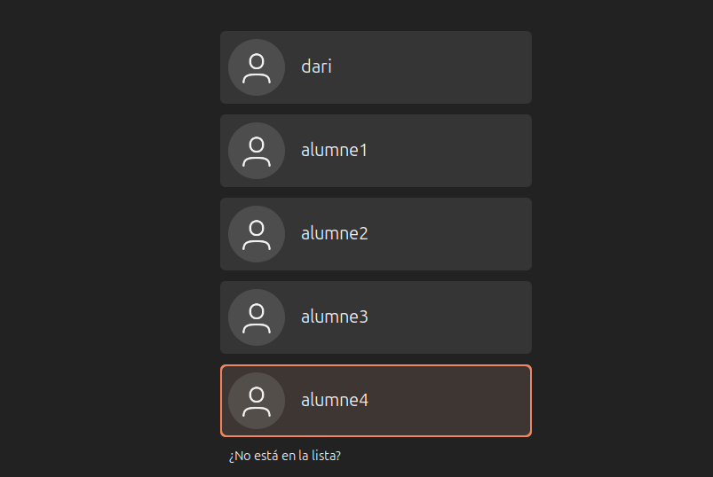
---
También puedes usar la comanda chage para establecer la fecha de expiración de la cuenta. Por ejemplo, si quieres bloquear el usuario a partir de hoy, puedes usar:
```
sudo chage -E 0 nombre_usuario
```
Con este comando, la cuenta queda desactivada, y para reactivarla, basta con eliminar la fecha de expiración:
```
sudo chage -E -1 nombre_usuario
```
Voy a ponerle al alumne1 que mañana caducará su cuenta y lo voy a comprobar en el directorio /etc/shadow


---
#### __Eliminar un Usuario__

Para eliminar un usuario y su directorio hay que utilizar:
```
sudo deluser --remove-home nombre_usuario
```


---
Ahora para comprobarlo voy a revisar el directorio /etc/passwd.

---
Ahora compruebo que se haya borrado su directorio también.
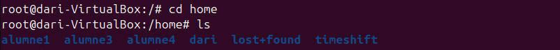
---

#### __Modificar Contraseña__

Con permisos de administrador, puedes cambiar la contraseña de cualquier usuario de esta forma:
```
sudo passwd nombre_usuario
```


---
#### __Modificar Nombre Usuario__

Para poder cambiar el nombre de un usuario y que no cree conflictos hay que cambiar el nombre de su directorio home y su grupo también.

+ Para cambiar el nombre del usuario utiliza el comando usermod con la opción -l para establecer el nuevo nombre de usuario:
```
sudo usermod -l nuevo_nombre_usuario nombre_actual_usuario
```
+ Para cambiar el nombre del grupo usa groupmod para actualizar el nombre del grupo al nuevo nombre:
```
sudo groupmod -n nuevo_nombre_usuario nombre_actual_usuario
```
+ Para cambiar el directorio personal del usuario y que coincida con el nuevo nombre del usuario, sigue estos pasos:
```
sudo mv /home/nombre_actual_usuario /home/nuevo_nombre_usuario
```

Voy a probarlo con el alumne4, lo voy a cambiar por el alumne que he eliminado anteriormente.
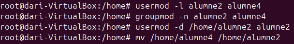
---
Lo compruebo con el directorio /etc/passwd

---

### __Grupos__

#### __Crear Grupos__
La herramienta addgroup en Linux facilita la creación de grupos.
La sintaxis es:
```
addgroup (nombre_grupo)
```
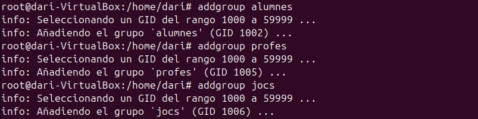

---
Para comprobar que se haya creado bien el grupo reviso, el directorio /etc/group.

---
#### __Borrar Grupos__
Para borrar grupos es igual de fácil que crearlo, para ello hay que usar la sintaxis:
```
delgroup (nombre_grupo)
```
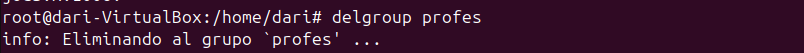

---
Para comprobar que se haya borrado el grupo reviso, el directorio /etc/group.

---
#### __Añadir Usuarios a Grupos__
Para añadir usuarios a un grupo utilizaré adduser:
```
adduser (nombre_usuario) (nombre_grupo)
```


---
Con el comando usermod, puedes añadir un usuario a un grupo con la opción -aG, que significa "añadir al grupo" de forma acumulativa. Es importante usar la opción -a para evitar sobrescribir la lista de grupos del usuario.
```
sudo usermod -aG (nombre_grupo) (nombre_usuario)
```


---
#### __Cambiar Grupo Principal__
Para cambiar el grupo principal de un usuario, podemos usar la sintaxi:
```
 usermod -g nombre_nuevo_grupo nombre_usuario
```


---
#### __Añadir Administrador al Grupo__
Para añadir un usuario como administrador a un grupo, podemos usar la sintaxis:
```
gpasswd -A (nombre_usuario) (nombre_grupo)
```


---
#### __Borrar Usuarios de Grupos__
Para eliminar usuarios de un grupo utilizaré deluser:
```
deluser (nombre_usuario) (nombre_grupo)
```


---
También, con el comando gpasswd, puedes gestionar los miembros de un grupo. La opción -d elimina a un usuario de un grupo.
```
sudo gpasswd -d nombre_usuario nombre_grupo
```

---
#### __Cambiar Nombre de Grupo__
Para cambiar el nombre de un grupo en Linux, puedes utilizar el comando groupmod con la opción -n. Este comando permite renombrar un grupo existente sin afectar sus miembros ni los permisos asociados.
```
sudo groupmod -n nuevo_nombre antiguo_nombre
```


---
#### __Poner Contraseñas a Grupos__
Para establecer una contraseña a un grupo, puedes utilizar la sintaxis gpasswd:
```
gpasswd (nombre_grupo)
```


---
Para comprobar que la contraseña voy a intentar entrar con un usuario que no forme parte del grupo, este solo tendra acceso temporal al grupo.

Al formar parte temporal de un grupo todos los archivos que crees tendran dicho grupo como propietario.
Con la comanda exit ya dejarias de formar parte del grupo y volverias al que tenias anteriormente.

---
#### __Poner el Grupo Restringido__
Con el comando gpasswd podemos utilizar la opción -R para hacer que le grupo sea restringido, es decir, que un usuario que no forma parte aun sabiendo la contraseña.
```
gpasswd -R (nombre_grupo)
```
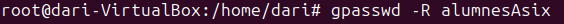

---
### __Personalización de useradd__

Para la personalizacíon de este comando, están implicados 4 ficheros.

* __/etc/default/useradd:__ 
* __/etc/login.defs:__
* __/etc/skel/:__