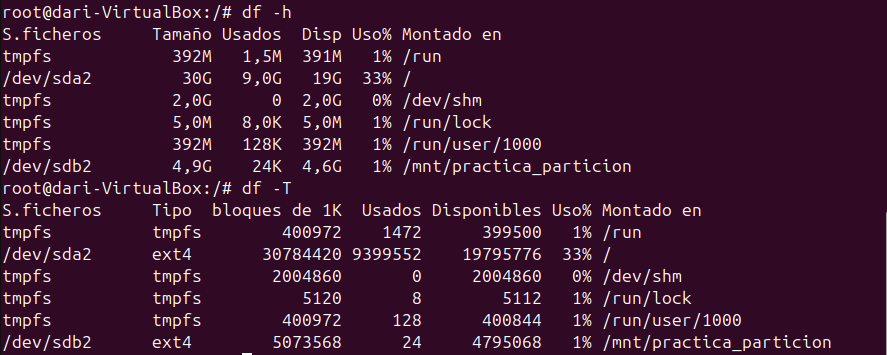

# __Sistemas de Ficheros y Particiones en Linux (Ubuntu)__

## __Estructura Física__

En Ubuntu, los sistemas de ficheros y particiones se basan en dos tipos de estructuras físicas:

- **Discos Sólidos (SSD)**: Utilizan memoria flash para almacenar datos, ofreciendo mayor velocidad y durabilidad.
- **Discos Mecánicos (HDD)**: Utilizan platos giratorios y cabezales de lectura/escritura, siendo más económicos pero más lentos.

---
## __Estructura Lógica__

La estructura lógica de los discos se organiza mediante tablas de particiones, siendo las más comunes:

- **MBR (Master Boot Record)**: Soporta discos de hasta 2 TB y un máximo de 4 particiones primarias. Es una tecnología más antigua.
- **GPT (GUID Partition Table)**: Soporta discos de mayor tamaño y un número casi ilimitado de particiones. Es más moderno y robusto.

---
## __Estructura de la Información__

### __Sector y Bloque__

- **Sector**: Es la unidad mínima de almacenamiento en un disco, generalmente de 512 bytes. Los sectores son las divisiones físicas más pequeñas en las que se puede escribir o leer datos en un disco. Cada sector tiene una dirección única que permite al sistema operativo localizar y acceder a los datos almacenados en él. En discos más modernos, los sectores pueden ser de 4096 bytes (4 KB), conocidos como sectores avanzados.

- **Bloque**: Es una agrupación de sectores y es la unidad mínima de lectura/escritura en los sistemas de ficheros. Típicamente, un bloque tiene un tamaño de 4 KB, aunque este tamaño puede variar dependiendo del sistema de ficheros utilizado. Los bloques permiten una gestión más eficiente del espacio en disco, ya que agrupan varios sectores en una unidad más grande, reduciendo la sobrecarga de gestión y mejorando el rendimiento de lectura/escritura.


### __Fragmentación__

- **Fragmentación Interna**: Ocurre cuando los archivos ocupan más espacio del necesario dentro de un bloque, dejando espacio no utilizado.
- **Fragmentación Externa**: Sucede cuando los archivos se dividen en múltiples bloques no contiguos, lo que puede ralentizar el acceso a los datos.

---
## __Comandos involucrados__
### __Comando `fdisk -l`__

El comando `fdisk -l` se utiliza para listar las tablas de particiones de todos los discos disponibles en el sistema. Al ejecutarlo, se muestra información detallada sobre cada disco y sus particiones, incluyendo:

- El nombre del dispositivo (por ejemplo, /dev/sda)
- El tamaño total del disco
- El tipo de partición (MBR o GPT)
- El tamaño y el tipo de cada partición
- El sistema de archivos utilizado en cada partición

Este comando es útil para obtener una visión general de la estructura de particiones de los discos en un sistema Linux y para diagnosticar problemas relacionados con las particiones.

```sh
sudo fdisk -l
```


---
### __Comando `tune2fs -l`__

El comando `tune2fs -l` se utiliza para listar la información de superbloque y los ajustes de una partición específica en sistemas de archivos ext2/ext3/ext4. Al ejecutarlo, se muestra información detallada sobre la partición, incluyendo:

- El número de inodos y bloques
- El tamaño del bloque
- El estado del sistema de archivos
- La última fecha de montaje y verificación
- El número máximo de montajes antes de una verificación forzada
- La UUID del sistema de archivos

Este comando es útil para obtener una visión detallada de la configuración y el estado de una partición específica, lo que puede ayudar en tareas de administración y diagnóstico.

```sh
sudo tune2fs -l /dev/sda1
```


---
### __Comando `df -T`__

El comando `df -T` se utiliza para mostrar información sobre el uso del espacio en disco y el tipo de sistema de archivos de cada partición montada en el sistema. Al ejecutarlo, se muestra una tabla con información detallada, incluyendo:

- El nombre del sistema de archivos
- El tipo de sistema de archivos (por ejemplo, ext4, xfs, etc.)
- El tamaño total del sistema de archivos
- El espacio utilizado y disponible
- El porcentaje de uso
- El punto de montaje

Este comando es útil para monitorear el uso del espacio en disco y para identificar el tipo de sistema de archivos utilizado en cada partición montada.

```sh
df -T
```


---
### __Comando `du -sh`__

El comando `du -sh (nombre archivo)` se utiliza para mostrar el tamaño de un archivo o directorio específico en un formato legible. 
Al ejecutarlo, se muestra el tamaño total del archivo o directorio especificado, incluyendo todos sus subdirectorios y archivos contenidos. 
La opción `-s` resume el tamaño total en lugar de mostrar el tamaño de cada archivo individual, y la opción `-h` convierte el tamaño en un formato legible para humanos (por ejemplo, KB, MB, GB).

Este comando es útil para obtener una visión rápida del tamaño de un archivo o directorio específico, lo que puede ayudar en la gestión del espacio en disco.

```sh
du -sh /ruta/al/archivo_o_directorio
```


---
### __Comando `e4defrag -c` y `e4defrag`__

El comando `e4defrag -c` se utiliza para comprobar el nivel de fragmentación de un archivo, directorio o sistema de archivos completo en sistemas de archivos ext4. Al ejecutarlo, se muestra un informe detallado del estado de fragmentación, incluyendo:

- El número de archivos fragmentados
- El número total de fragmentos
- El porcentaje de fragmentación

Este comando es útil para evaluar si es necesario realizar una desfragmentación en el sistema de archivos.

```sh
sudo e4defrag -c /ruta/al/archivo_o_directorio
```


El comando `e4defrag` se utiliza para desfragmentar archivos, directorios o el sistema de archivos completo en sistemas de archivos ext4. Al ejecutarlo, se reorganizan los fragmentos de los archivos para que ocupen bloques contiguos, mejorando así el rendimiento de lectura/escritura.

```sh
sudo e4defrag /ruta/al/archivo_o_directorio
```


---
## __¿Qué es una partición y por qué hay que montarla en Ubuntu Linux?__

Una partición es una división lógica de un disco duro que permite al sistema operativo gestionar y organizar los datos de manera más eficiente. Cada partición puede contener un sistema de archivos diferente y puede ser utilizada para distintos propósitos, como almacenar el sistema operativo, datos personales, o archivos de intercambio.

Montar una partición en Ubuntu Linux significa asignarle un punto de montaje en el sistema de archivos, lo que permite al sistema operativo y a los usuarios acceder a los datos almacenados en esa partición. Sin montar una partición, los datos en ella no serían accesibles para el sistema operativo.

---
### __Particionar un Disco__

Voy a añadir un disco virtual a Ubuntu para crear particions en el.


---
Utilizamos el comando `fdisk -l` para localizar el disco que hemos añadido.


---
El mismo comando `fdisk` es el que utilizaremos para crear la partición.


---
Ahora nos pide que entremos una orden, podemos introducir `m` para que nos muestre todo lo que podemos hacer con fdisk. 
 
Utilizaré `n` para crear una nueva
nueva partición.

Ahora hay que seguir estos pasos:


1. Selecciona el tipo de partición:
    - `p` para una partición primaria.
    - `e` para una partición extendida.

2. Especifica el número de la partición (por ejemplo, 2).

3. Define el primer sector (puedes presionar Enter para aceptar el valor predeterminado).

4. Define el último sector o el tamaño de la partición (por ejemplo, `+5G` para una partición de 5 GB). Si no introducimos ningún valor, utilizará el total disponible.

5. Finalmente, escribe los cambios en el disco introduciendo `w`.

Esto creará una nueva partición en el disco especificado.


---
Lo podemos comprobar con `fdisk -l`:


---
### __Montar una Partición__

Para montar particiones en Ubuntu Linux, puedes hacerlo de manera temporal o definitiva. A continuación se explica cómo realizar ambos tipos de montajes:

#### __Montaje Temporal de una Partición__

El montaje temporal de una partición se realiza utilizando el comando `mount`. Este tipo de montaje se perderá después de reiniciar el sistema.

1. Crea un punto de montaje (directorio) donde se montará la partición:
    ```sh
    sudo mkdir /mnt/practica_particion
    ```

    

2. Monta la partición en el punto de montaje:
    ```sh
    sudo mount -t ext4 /dev/sdb2 /mnt/practica_particion
    ```

    

3. Verifica que la partición se ha montado correctamente:
    ```sh
    df -h
    ```

    

---
#### __Montaje Definitivo de una Partición__

Para montar una partición de manera definitiva, es necesario editar el archivo `/etc/fstab`. Esto asegura que la partición se monte automáticamente en cada reinicio del sistema.

1. Crea un punto de montaje (directorio) donde se montará la partición:
    ```sh
    sudo mkdir /mnt/practica_particion
    ```

    

2. Abre el archivo `/etc/fstab` con un editor de texto:
    ```sh
    sudo nano /etc/fstab
    ```

    


3. Añade una línea al final del archivo con la información de la partición y el punto de montaje. Por ejemplo:
    ```sh
    /dev/sdb2 /mnt/practica_particion ext4 defaults 0 2
    ```

    - `/dev/sdb2`: La partición que deseas montar.
    - `/mnt/practica_particion`: El punto de montaje.
    - `ext4`: El tipo de sistema de archivos.
    - `defaults`: Opciones de montaje.
    - `0`: Si se debe hacer un dump del sistema de archivos.
    - `2`: El orden en que se debe verificar el sistema de archivos.

    

4. Guarda los cambios y cierra el editor.

5. Monta todas las particiones especificadas en `/etc/fstab` sin reiniciar:
    ```sh
    sudo mount -a
    ```

    

6. Verifica que la partición se ha montado correctamente:
    ```sh
    df -h
    ```
    

    

Con estos pasos, habrás montado una partición de manera temporal y definitiva en Ubuntu Linux.

---
## __Tipos de Formateos en Linux__

En Linux, existen tres tipos principales de formateos que se pueden realizar en un disco o partición:

1. **Formateo Rápido**:

    Este tipo de formateo elimina la tabla de particiones y el sistema de archivos, pero no borra los datos físicamente del disco. Es un proceso rápido y se utiliza cuando se necesita preparar un disco para un nuevo sistema de archivos sin preocuparse por la recuperación de datos antiguos.

    - Comando: `mkfs -t ext4 /dev/sdb2`

2. **Formateo Completo**:

    El formateo completo no solo elimina la tabla de particiones y el sistema de archivos, sino que también sobrescribe todos los datos en el disco con ceros o un patrón específico. Esto asegura que los datos antiguos no puedan ser recuperados. Es un proceso más lento que el formateo rápido.

    - Comando: `dd if=/dev/zero of=/dev/sdb bs=1M`

3. **Formateo de Bajo Nivel**:

    Este tipo de formateo es más profundo y se realiza a nivel de hardware. Restaura el disco a su estado original de fábrica, eliminando todos los datos y configuraciones. Es raramente necesario y generalmente se realiza con herramientas específicas del fabricante del disco.

Estos formateos se utilizan en diferentes situaciones dependiendo de las necesidades de seguridad y preparación del disco para su uso.