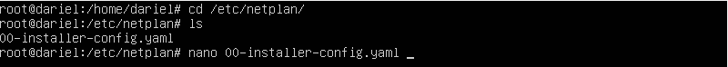

# __Instalacióny Configuración de Dominios LDAP__

Un **dominio** es una estructura jerárquica que organiza recursos y usuarios en una red. En el contexto de LDAP (Lightweight Directory Access Protocol), un dominio es una base de datos que almacena información sobre los usuarios, grupos y otros objetos de la red.

Una **unidad organizativa (OU)** es un contenedor dentro de un dominio que puede contener usuarios, grupos, equipos y otros objetos. Las unidades organizativas se utilizan para organizar y gestionar estos objetos de manera más eficiente.

**Recursos compartidos** son elementos como archivos, impresoras y aplicaciones que están disponibles para ser utilizados por múltiples usuarios en la red. Estos recursos se gestionan a través de permisos y políticas dentro del dominio.

Los **usuarios** son las cuentas individuales que tienen acceso a los recursos y servicios de la red. Los **grupos** son colecciones de usuarios que se gestionan como una sola entidad. En las unidades organizativas, los usuarios y grupos se organizan para simplificar la administración de permisos y políticas, facilitando la gestión de grandes cantidades de cuentas y recursos.

## __Instalación del Dominio CON INTERFICIE GRÁFICA__

### __Configuración previa de la máquina__

Hay dos aspectos claves que si queremos modificar, es importante hacer antes de la instalación del dominio, aunque se puede hacer una vez el dominio instalado pero se complica mucho más.

#### __IP__

Es muy importante tener la IP estática.


---
Poner la IP estática.


---
#### __Cambiar el hostname__

Puedes cambiar el nombre del host modificando estos dos archivos:


---
### __Instalación del Dominio__

Instalación de los paquetes.


Cuando termine la instalación nos pedira que instroduzcamos una constraseña para el administrador.

---
Comprobación de que se ha instalado correctamente y su configuración por defecto.


---
### __Configuración del Dominio__

Existen dos métodos para la configuración del dominio:

- Mediante __comandos__.
- Mediante __ficheros de configuración__.

#### __Comandos__

Ejecutamos este comando:


---
Se nos abrirá una pantalla para configurar el paquete, donde por pantallas vamos rellenando con nuestros datos del servidor y opciones:


---
Para comprobar los cambios, hago un slapcat:


---
#### __Ficheros de Configuración__

Mediante archivos .ldif podemos cargar configuraciónes a nuestro dominio

Los archivos `.ldif` (LDAP Data Interchange Format) son archivos de texto que contienen datos en un formato que puede ser utilizado para importar y exportar información de un servidor LDAP. Estos archivos son útiles para la configuración y administración de dominios LDAP. A continuación, se describen algunos de los archivos `.ldif` más comunes utilizados en la configuración de dominios LDAP:

**Base.ldif**: Este archivo contiene la configuración básica del dominio, incluyendo la estructura del árbol LDAP y las entradas iniciales necesarias para que el dominio funcione correctamente.


---
**Users.ldif**: Este archivo se utiliza para importar usuarios al dominio LDAP. Contiene entradas para cada usuario, incluyendo atributos como el nombre de usuario, contraseña, y otros detalles personales.


---
**Groups.ldif**: Este archivo se utiliza para definir grupos dentro del dominio LDAP. Contiene entradas para cada grupo, incluyendo el nombre del grupo y los miembros que pertenecen a él.


---
**OUs.ldif**: Este archivo se utiliza para crear unidades organizativas (OUs) dentro del dominio LDAP. Las OUs son contenedores que pueden contener usuarios, grupos y otros objetos, y se utilizan para organizar y gestionar estos objetos de manera más eficiente.


---
**Permissions.ldif**: Este archivo se utiliza para definir permisos y políticas dentro del dominio LDAP. Contiene entradas que especifican qué usuarios o grupos tienen acceso a qué recursos y qué acciones pueden realizar.


---
Para cargar estos archivos en el servidor LDAP, se utiliza el comando `ldapadd` o `ldapmodify`, dependiendo de si se están añadiendo nuevas entradas o modificando entradas existentes. Por ejemplo:

```sh
ldapadd -x -D "cn=admin,dc=example,dc=com" -W -f base.ldif
```

Este comando añade las entradas del archivo `base.ldif` al servidor LDAP, utilizando las credenciales del administrador.


---
Para comprobar los cambios, hago un slapcat:


---

## __Instalación del Dominio SIN INTERFICIE GRÁFICA__

La instalación sigue el mismo procedimiento que con interficie gráfica. Para el hostname es exactamente igual que con interfaz gráfica, la variación está en la IP, que esta vez vamos a ponerla estática mediante comandos.

Para ello, tenemos que modificar este fichero:



---
En este archivo introducimos:

```bash 
network:
  version: 2
  renderer: networkd
  ethernets:
    enp0s3:
      dhcp4: no
      addresses:
        - 10.0.2.20/24
      gateway4: 10.0.2.1
      nameservers:
        addresses:
          - 8.8.8.8
          - 8.8.4.4
```
Podemos comprobar el adaptador de internet con un `ip a`.

---

Ahora ya podemos seguir el mismo procedimiento que con interfaz gráfica en nuestro servidor Ubuntu.