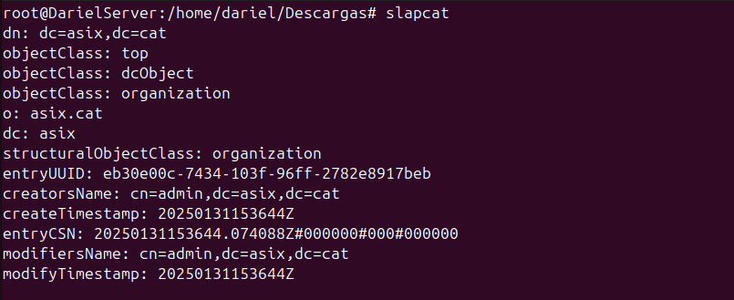
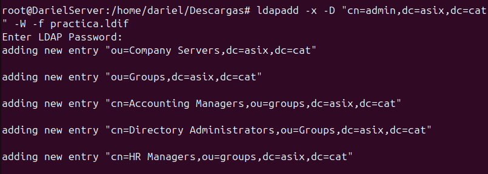
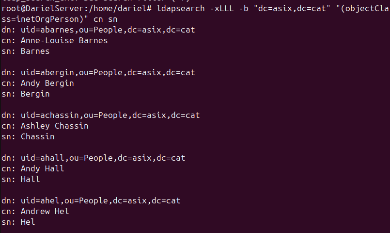
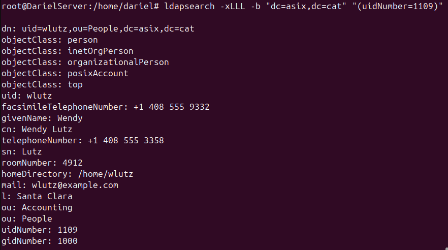
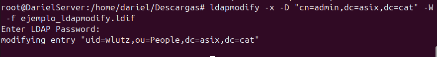
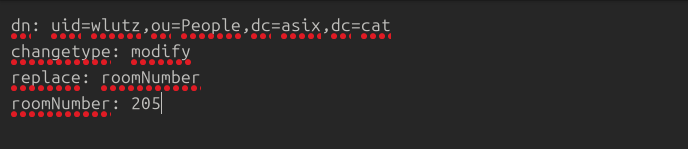
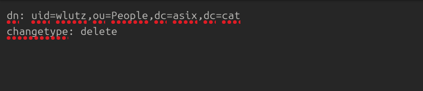
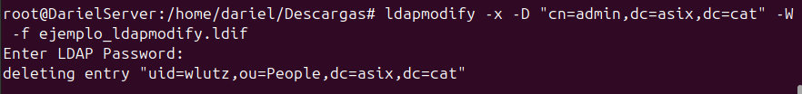

# __Gestión del dominio LDAP__
Para gestionar un dominio LDAP, se pueden utilizar varios comandos como `ldapadd`, `ldapmodify`, entre otros. A continuación, se explica cómo utilizar estos comandos y cómo se pueden modificar mediante archivos `.ldif`.

Para este apartado he ejecutado el comando `dpkg-reconfigure slapd` para borrar los datos introducidos en los anteriores apartados y partir de un servidor limpio.

Reviso que se ha hecho correctamente con `slapcat`:



## __Archivos `.ldif`__
Los archivos `.ldif` (LDAP Data Interchange Format) se utilizan para representar entradas y modificaciones en el directorio LDAP. Un archivo `.ldif` típico para añadir una entrada podría verse así:
```ldif
dn: uid=jdoe,ou=People,dc=example,dc=com
objectClass: inetOrgPerson
uid: jdoe
sn: Doe
givenName: John
cn: John Doe
displayName: John Doe
mail: jdoe@example.com
```
Para modificar una entrada existente, el archivo `.ldif` podría contener:
```ldif
dn: uid=jdoe,ou=People,dc=example,dc=com
changetype: modify
replace: mail
mail: john.doe@example.com
```
En este ejemplo, se está reemplazando el valor del atributo `mail` de la entrada con `uid=jdoe`.

Estos son solo ejemplos básicos, pero los comandos `ldapadd` y `ldapmodify` junto con los archivos `.ldif` proporcionan una forma poderosa y flexible de gestionar un dominio LDAP.

## __Comandos LDAP__

### __`ldapadd`__
Este comando se utiliza para añadir entradas al directorio LDAP. La sintaxis básica es:
```sh
ldapadd -x -D "cn=admin,dc=example,dc=com" -W -f archivo.ldif
```
Donde:
- `-x` indica el uso de autenticación simple.
- `-D` especifica el DN del usuario administrador.
- `-W` solicita la contraseña del usuario administrador.
- `-f` especifica el archivo `.ldif` que contiene las entradas a añadir.



El fichero que he ejecutado es uno de practica en el cual hay muchos registros y desconozco el contenido.

### __`ldapsearch`__
Este comando se utiliza para buscar y recuperar entradas del directorio LDAP. La sintaxis básica es:
```sh
ldapsearch -xLLL -b "dc=asix,dc=cat" (Atributo que se desea buscar)
```
Como he explicado anteriormente, he cargado un archivo sin saber lo que hay dentro, voy a utilizar ldappsearch para ver que usuarios hay, y filtro para que solo aparezca el nombre y el apellido:



---
Habiendo localizado los usuarios, imaginamos que nos han pedido sacar toda la información que hay de uno en concreto.

Utiliza este comando:
```sh
ldapsearch -xLLL -b "dc=asix,dc=cat" "(cn=nombre_usuario)"
``` 


### __`ldapmodify`__
Este comando se utiliza para modificar entradas existentes en el directorio LDAP. La sintaxis básica es:
```sh
ldapmodify -x -D "cn=admin,dc=asix,dc=cat" -f modificar_room.ldif
```


El archivo modificar_room.ldif debe ser asi:



Explicación línea por línea:

1. `dn: uid=wlutz,ou=People,dc=asix,dc=cat`
- En este caso, hace referencia al usuario con:
    uid=wlutz: Identificador único del usuario.
    ou=People: Unidad organizativa "People".
    dc=asix,dc=cat: Dominio del directorio LDAP asix.cat.
La modificación se aplicará a este usuario específico.
2. `changetype: modify`
- Especifica que se va a modificar un atributo existente en LDAP.
    Otros posibles valores son:
        changetype: add: Para agregar una nueva entrada en LDAP.
        changetype: delete: Para eliminar una entrada.
3. `replace: roomNumber`
    - replace indica que se va a reemplazar el valor del atributo.
        roomNumber: 205
    Establece el nuevo valor 205 para el atributo roomNumber.

### __Borrar Datos_

Como siempre, es más fácil destruir que construir. Para borrar datos solo tnemeos que cambiar el changetyoe de nuestro archivo .ldif a delete.





Ahora el usuario con UID wlutz no existe.
