# __LDAP con Interfa Gráfica__

## __Instalación__

Instalación del entorno gráfico, en mi caso, he instalado Apache Directory Active.

Link de descarga oficial

Es tan simple como descargar el fichero comprimido descomprimirlo y ejecutarlo, si no tenemos dependencias instaladas de java en nuestro equipo nos saldrá fallo al abrir la aplicación de Apache

``sudo apt install default-jre``

---
## __Añadir LDAP al gestor gráfico__

Ahora vamos a añadir el LDAP que hemos creado por comandos al entorno gráfico

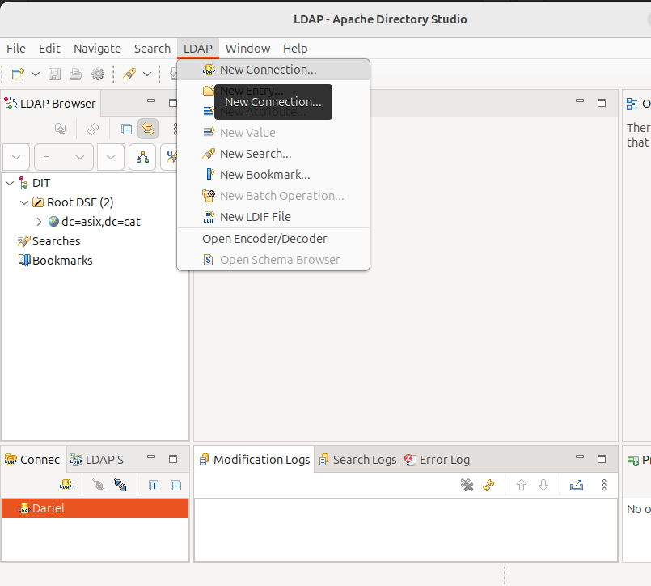

---
En connection name podemos poner el nombre que queramos, en hostname la IP y el puerto lo dejo en default.

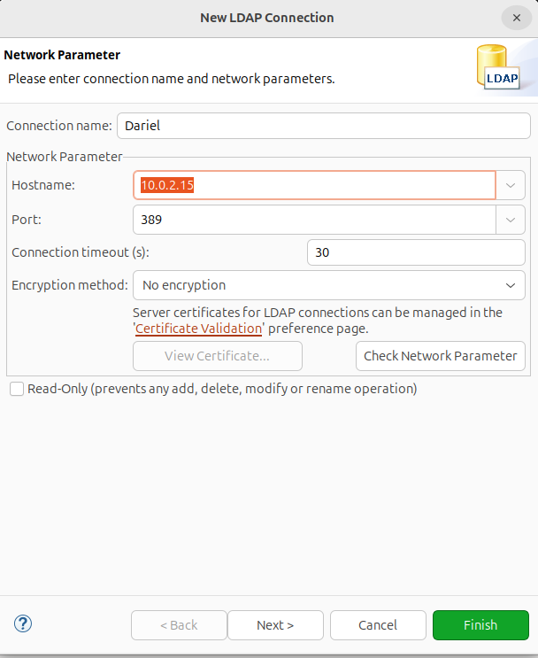

---
Le damos a next y en esta pantalla ponemos los datos de nuestro servidor LDAP ya creado.

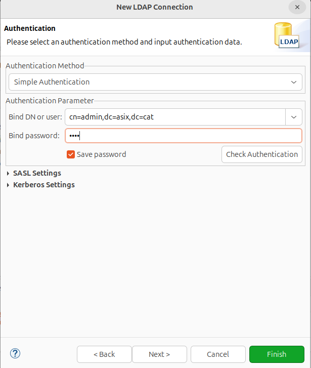

---
Al finalizar nos debe salir en el menu de inicio el servidor.

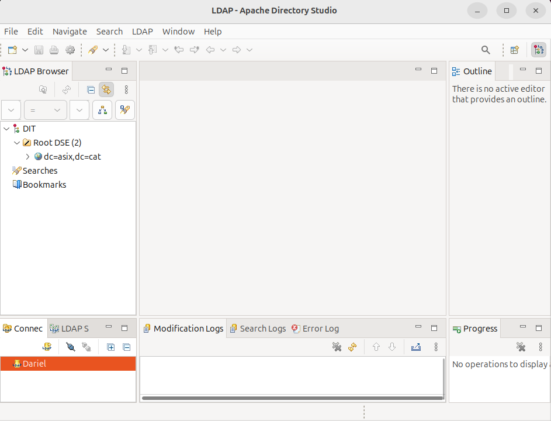

---
## __Creación de nuevos usuarios con la Interfaz Gráfica__
Con click derecho, en la opción "New", le damos a "New Entry".
En mi caso, los usuarios estan todos dentro del grupo PEOPLE.

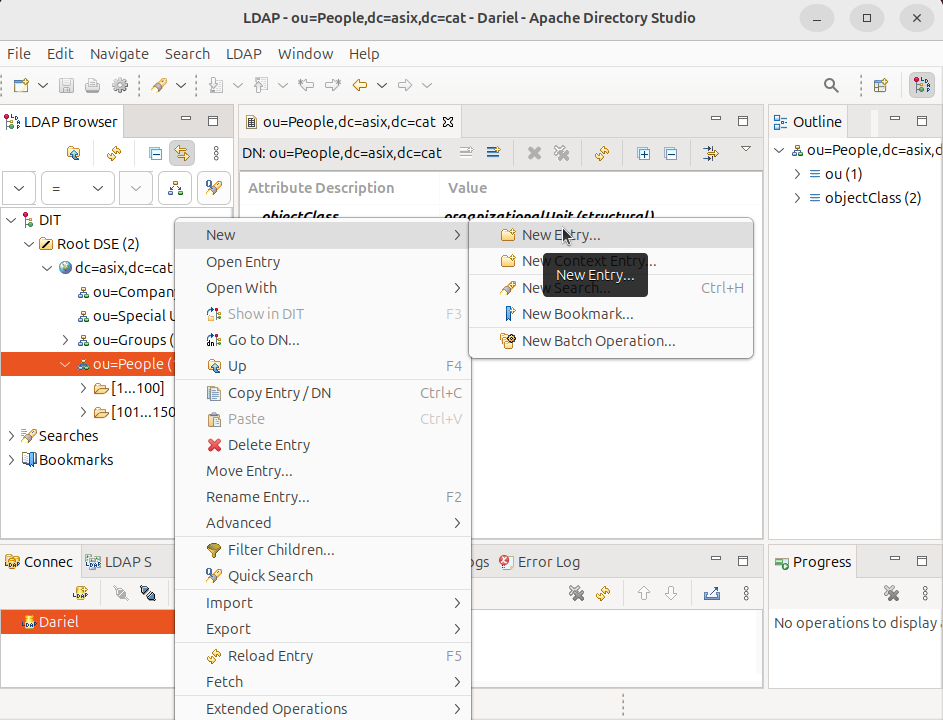

---
Ahora nos da a elegir si crear una entrada a partir de una plantilla o manualmente, este primer ejemplo lo haré manual.

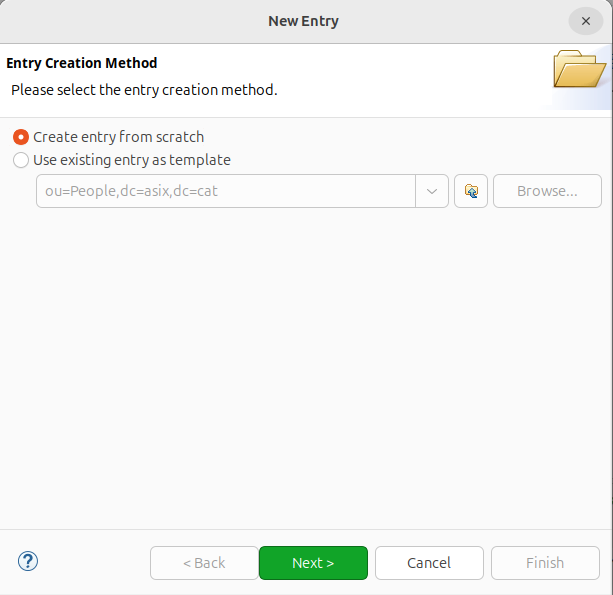

---
Las object classes definen qué tipo de objeto se está creando en LDAP.

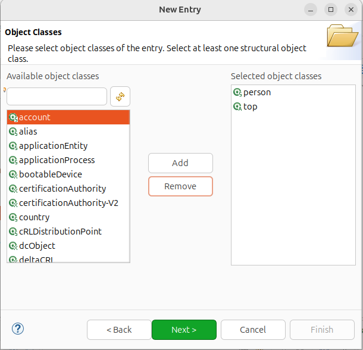

---
El RDN (Relative Distinguished Name) es el nombre distinguido relativo de un objeto dentro de un directorio LDAP. Representa la parte única del nombre de la entrada dentro de su contenedor (OU o dominio).

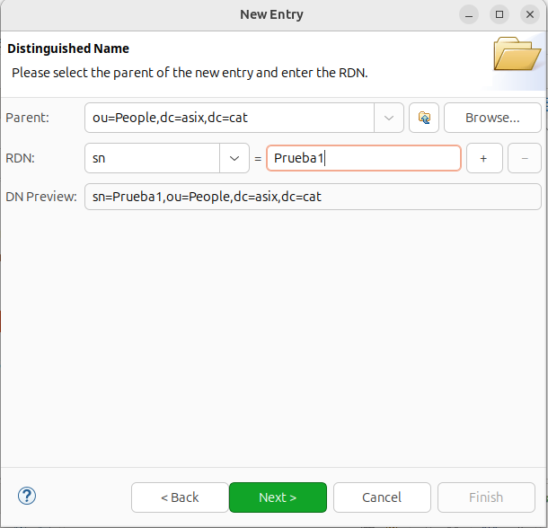

---
Ahora nos pedirá que rellenemos más información sobre el usuario que estamos añadiendo, con los objectClass que hemos seleccionado no hace falta.

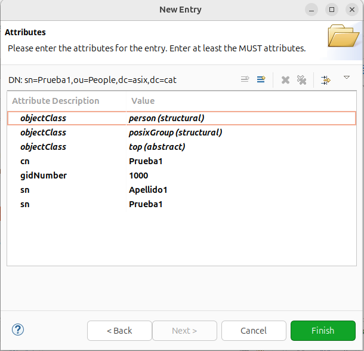

---
Ya tenemos creado un usuario con interfaz gráfica.

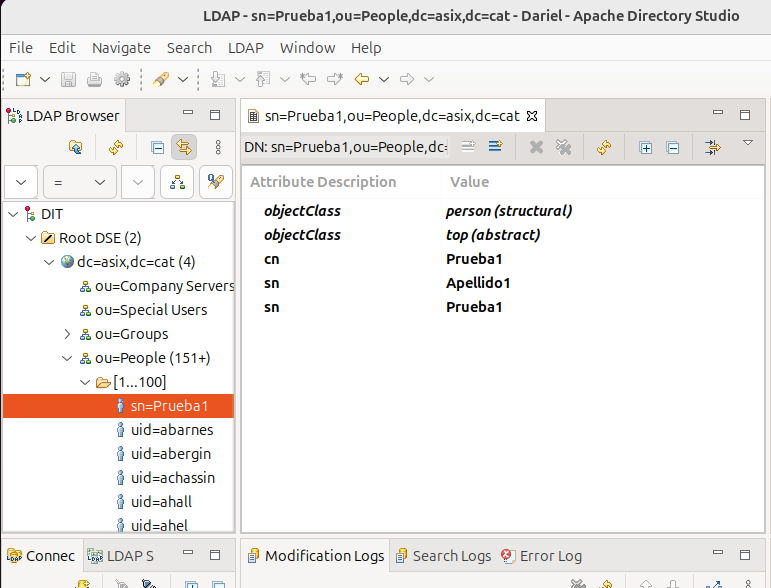

---
## __Creación de usuarios desde plantilla__
Ahora vamos a crear un usuario usando una plantilla.

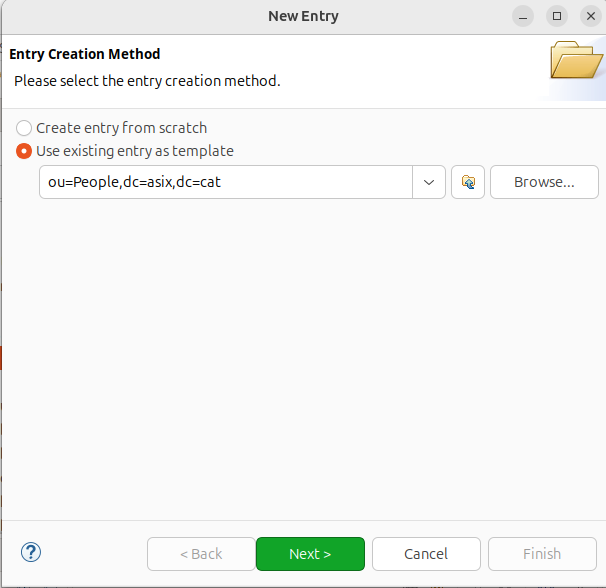

---
Ahora le damos a Next hasta esta pantalla, aquí solo modificamos el cn.

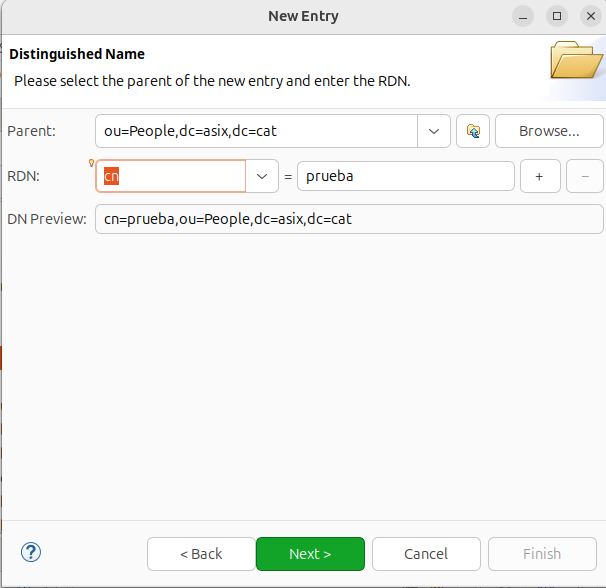

---
Ahora podriamos añadir atributos al usuario, cosa que se me habia olvidado mencionar antes.

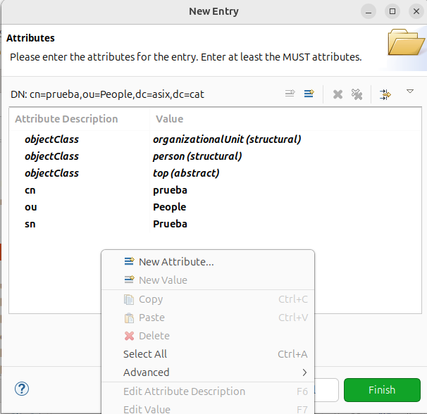
En este caso, como es una prueba, lo dejamos así solo para comprobar que podemos iniciar sesión con él.

---
Para la comprobación, vamos a nuestro cliente Ubuntu e intentamos iniciar sesión con él.

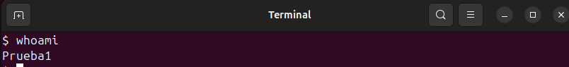