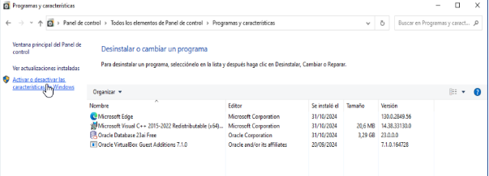

# __Servidor NFS__

Un servidor NFS (Network File System) es un protocolo de sistema de archivos distribuido que permite a los usuarios acceder a archivos y directorios en una red como si estuvieran en su propia máquina local. NFS fue desarrollado por Sun Microsystems en 1984 y se ha convertido en un estándar para compartir archivos en sistemas Unix y Linux.

## __Diferencias entre NFS y SAMBA__

- **NFS (Network File System)**:
    - Diseñado principalmente para sistemas Unix y Linux.
    - Utiliza el protocolo RPC (Remote Procedure Call) para la comunicación.
    - Permite compartir archivos y directorios en una red local.
    - No es compatible de forma nativa con sistemas Windows.

- **SAMBA**:
    - Implementa el protocolo SMB/CIFS (Server Message Block/Common Internet File System).
    - Compatible con sistemas Windows, Unix y Linux.
    - Permite compartir archivos, directorios e impresoras en una red.
    - Ofrece integración con dominios de Windows y Active Directory.

## __Uso de NFS con LDAP__

LDAP (Lightweight Directory Access Protocol) es un protocolo para acceder y mantener servicios de directorio distribuidos. Integrar NFS con LDAP puede proporcionar una gestión centralizada de usuarios y permisos, lo que simplifica la administración y mejora la seguridad.

### __Ventajas de usar NFS con LDAP:__
- **Gestión centralizada**: Permite administrar usuarios y permisos desde un único punto.
- **Consistencia**: Asegura que los mismos usuarios y permisos se apliquen en todos los servidores NFS.
- **Escalabilidad**: Facilita la adición de nuevos usuarios y servidores sin necesidad de configuraciones manuales en cada uno.
- **Seguridad**: Mejora la seguridad al centralizar la autenticación y autorización.

Para configurar NFS con LDAP, se deben seguir estos pasos generales:
1. Configurar un servidor LDAP y añadir los usuarios y grupos necesarios.
2. Configurar los clientes LDAP en los servidores NFS para que utilicen el servidor LDAP para la autenticación.
3. Configurar los permisos de los directorios compartidos en el servidor NFS utilizando los usuarios y grupos definidos en LDAP.

Esta integración permite una administración más eficiente y segura de los recursos compartidos en una red.

## __Instalar NFS en el servidor y clientes__

Descargamos:

---
Comprobamos que se haya instalado correctamente:

---

Instalación para cliente Ubuntu:

---
Instalación para Cliente Windows:

## __Compartir Carpetas__

Una vez tenemos listos nuestro servidor y tenemos los clientes preparados comenzamos con la creación del recurso compartido:

---
Añadimos la ruta de la carpeta al archivo `/etc/exports`:

---
Cada vez que se modifican archivos de nfs hay que reiniciar el servicio:

---
Voy a crear un archivo dentro de la carpeta que hemos creado para comprobar que funciona correctamente y puedo verla desde los clientes:

---
### __Unir Cliente Windows__
En el navegador de archivos, en el apartado de “RED” clickamos en el navegador introducimos la IP del servidor:

---
Entramos en la carpeta compartida para comprobar si el fichero que hemos creado se encuentra:

---
Ahora creamos un fichero desde el cliente y verificamos si nos aparece también desde el servidor.

---
### __Unir Cliente Ubuntu__
Dentro del cliente ubuntu, creamos una carpeta en el directorio /mnt y le damos permisos 777. Una vez tenemos la carpeta creamos un punto de montaje con la carpeta compartida y verificamos que se ha creado:

__IMPORTANTE:__ mount solo monta temporalmente, mas adelante se hace el montaje fijo.

---
### __Perfiles Móviles (UBUNTU LDAP)__
En el servidor, voy a crear otra carpeta:

---
Modificación del archivo etc/exports:

---
Reinicio el sistema:

---
Modificación del archivo “usu.ldif”, para añadir un nuevo usuario con el perfil móvil.

---
Lanzar el fichero con el nuevo usuario:

---
Ahora en el cliente UBUNTU, hacemos el montaje fijo.

__IMPORTANTE:__ Se debe crear la carpeta en la raiz del sistema antes de crear el montaje fijo del perfil movil.

