# __Servidor SAMBA__

Samba es una implementación libre del protocolo de archivos compartidos de Microsoft Windows (SMB/CIFS). Permite la interoperabilidad entre sistemas operativos Unix/Linux y Windows, facilitando el intercambio de archivos, impresoras y otros recursos de red.

A diferencia de NFS, que se basa en hosts, Samba utiliza un modelo de autenticación basado en usuarios, lo que proporciona un control más granular sobre el acceso a los recursos compartidos. Además de compartir carpetas, Samba puede compartir impresoras y otros servicios de red, lo que lo convierte en una solución versátil para entornos mixtos de red.

## __Instalación y Configuración del Servidor SAMBA__

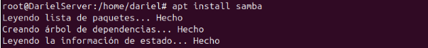

---
Para este ejemplo de configuración, voy a compartir una carpeta, la creo en `/` y la llamo pruebas.

---
Este es el fichero de configuración de samba donde voy a añadir la carpeta que he creado previamente y la configuración de la carpeta compartida con SAMBA:

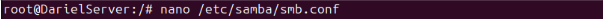
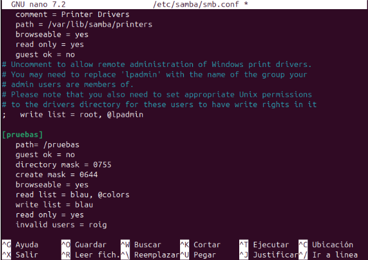

Explicación de cada línea:

**[pruebas]**  
Define el nombre del recurso compartido. En este caso, la carpeta compartida se llama **`pruebas`**.

**path = /pruebas**  
Especifica la ruta en el sistema de archivos donde se encuentra la carpeta compartida.

**guest ok = no**  
No se permite el acceso de invitados. Solo los usuarios autenticados pueden acceder a esta carpeta.

**directory mask = 0755**  
Define los permisos predeterminados para los directorios creados dentro de la carpeta compartida:  
- `0755` significa que el propietario tiene permisos de **lectura, escritura y ejecución** (`rwx`).
- Los demás usuarios solo tienen permisos de **lectura y ejecución** (`r-x`).

**create mask = 0644**  
Especifica los permisos predeterminados para los archivos creados en la carpeta compartida:  
- `0644` significa que el propietario tiene permisos de **lectura y escritura** (`rw-`).
- Los demás usuarios solo tienen permisos de **lectura** (`r--`).

**browseable = yes**  
Permite que la carpeta sea **visible en la red** cuando los usuarios naveguen por los recursos compartidos de Samba.

**read list = blau, @colors**  
Indica que el usuario **`blau`** y el grupo **`@colors`** tienen acceso de **solo lectura** a la carpeta.

**write list = blau**  
El usuario **`blau`** tiene **permisos de escritura** en la carpeta, a pesar de estar en la lista de lectura.

**read only = yes**  
Establece la carpeta como de **solo lectura por defecto**, excepto para los usuarios que están en la `write list`.

**invalid users = roig**  
El usuario **`roig`** tiene **prohibido el acceso** a la carpeta.

    

        Haz clic aquí para ver mas opciones de configuración
    

    Opciones de configuración en smb.conf:

    Configuración básica del recurso compartido
    path = /ruta/del/directorio → Especifica la ruta del directorio a compartir.
    comment = "Descripción del recurso" → Comentario que describe la carpeta compartida.
    browseable = yes/no → Define si el recurso es visible en la red.
    public = yes/no → Sinónimo de guest ok.
    
    Control de acceso
    valid users = usuario1 usuario2 @grupo → Lista de usuarios/grupos permitidos.
    invalid users = usuario1 usuario2 → Usuarios que no pueden acceder al recurso.
    read list = usuario1 @grupo → Usuarios que solo tienen permisos de lectura.
    write list = usuario1 @grupo → Usuarios que pueden escribir en la carpeta.
    admin users = usuario1 usuario2 → Usuarios con privilegios de administrador en la carpeta.
    
    Permisos y máscaras
    read only = yes/no → Indica si el recurso es de solo lectura.
    writable = yes/no → Sinónimo de read only = no, permite escritura.
    force user = usuario → Fuerza que todos los accesos sean con un usuario específico.
    force group = grupo → Fuerza que todos los accesos sean con un grupo específico.
    directory mask = 0755 → Establece permisos para los directorios creados en el recurso.
    create mask = 0644 → Define permisos para los archivos creados dentro del recurso.
    force create mode = 0660 → Fuerza permisos específicos en los archivos creados.
    force directory mode = 0770 → Fuerza permisos específicos en los directorios creados.
    
    Acceso de invitados
    guest ok = yes/no → Permite o no acceso de invitados (sin autenticación).
    guest only = yes/no → Solo permite acceso de invitados sin autenticación.
    guest account = nobody → Define qué cuenta de usuario usará Samba para accesos de invitados.

    Seguridad y autenticación
    security = user/share/domain → Define el nivel de seguridad.
    user → Requiere autenticación con usuario y contraseña.
    share → Permite acceso basado en recursos compartidos sin usuario.
    domain → Usa autenticación en un dominio.
    encrypt passwords = yes/no → Habilita o deshabilita contraseñas cifradas.
    password server = servidor → Especifica un servidor de autenticación.
    map to guest = Bad User → Convierte usuarios desconocidos en invitados.
    
    Control de archivos y directorios
    locking = yes/no → Habilita bloqueo de archivos para evitar accesos simultáneos problemáticos.
    oplocks = yes/no → Activa/desactiva bloqueos oportunistas para mejorar rendimiento en red.
    vfs objects = full_audit recycle shadow_copy → Añade módulos adicionales para control de archivos.
    delete readonly = yes/no → Permite borrar archivos aunque sean de solo lectura.
    
    Rendimiento y optimización
    max connections = 10 → Límite máximo de conexiones simultáneas.
    read raw = yes/no → Activa lecturas directas para mejorar velocidad.
    write raw = yes/no → Activa escrituras directas para mejorar velocidad.
    socket options = TCP_NODELAY → Ajustes para optimizar red.
    
    Otras configuraciones útiles
    hide files = *.txt *.bak → Oculta archivos o extensiones específicas en la carpeta compartida.
    veto files = *.mp3 *.exe → Bloquea ciertos archivos para que no se puedan ver ni usar.
    delete veto files = yes/no → Permite eliminar archivos bloqueados por veto files.
    follow symlinks = yes/no → Habilita o deshabilita el seguimiento de enlaces simbólicos.
    wide links = yes/no → Permite o bloquea enlaces simbólicos fuera del directorio compartido.

---
Es importante reiniciar los servicios implicados con SAMBA cada vez que modifiquemos este fichero.

---
Ahora voy a crear usuarios a nivel de sistema, es decir, no podrá iniciar sesión gráficamente ni tendrá home pero me sirven para las comprobaciones de que el servidor funciona correctamente.

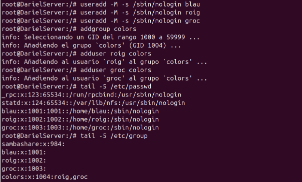

---
Añado estos usuarios a SAMBA:

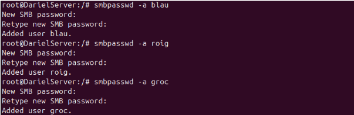

---
## __Instalación del Servicio en el Cliente__

He cambiado la configuración de la carpeta en el servidor:

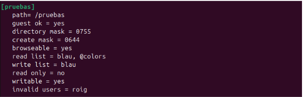

---
Ahora en el cliente, ya instalado smbclient, abrimos el navegador de ficheros e intento iniciar sesión en anónimo.

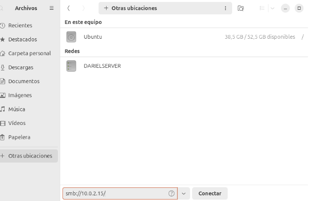

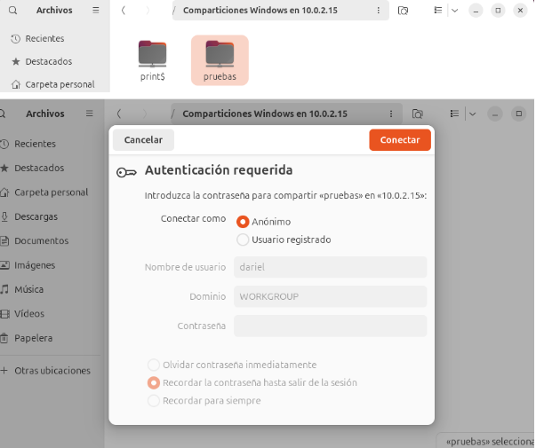

---
Pruebo de crear una carpeta, que me debe dejar por los permisos que he asignado anteriormente.

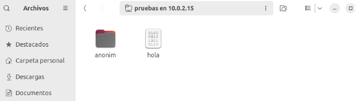

---
Ahora pruebo, en vez de iniciar como anónimo, iniciaré sesión con “blau”.
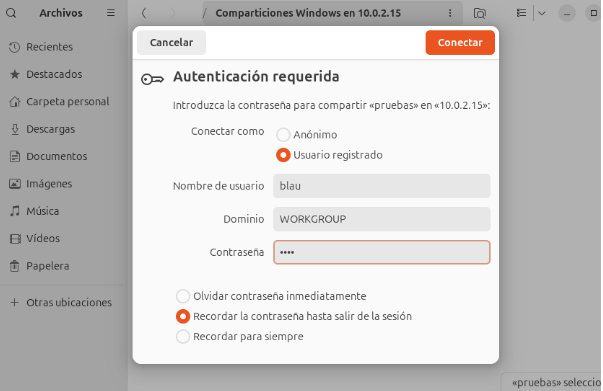

---
Me deja iniciar sesión y crear carpetas como hemos definido en el fichero /etc/samba/smb.conf

---
Ahora pruebo de iniciar sesión con groc, que tiene solo permisos de lectura y no de escritura

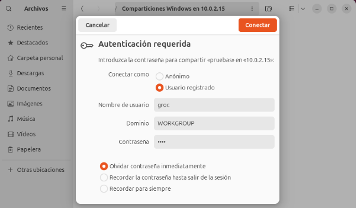

---
Me deja acceder pero no me debe dejar crear carpetas ni ficheros.

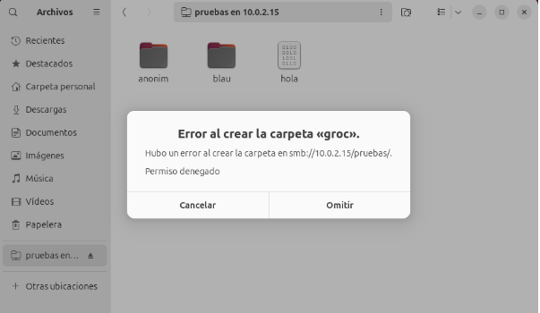

---
Ahora probaré con “roig”, que no deberia dejarme acceder.

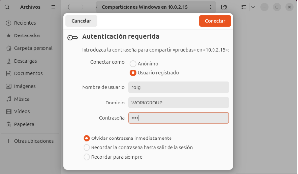

Al hacer click en conectar me saca de la pantalla sin acceder al recurso compartido.