# __Unir un Cliente a nuestro Dominio LDAP__

## __Comprobaciones Previas__

Es importante que las máquinas se encuentren en la misma red, en caso contrario no podríamos conectar el cliente al servidor, para ello hacemos:

Verificación de la Red en el cliente:

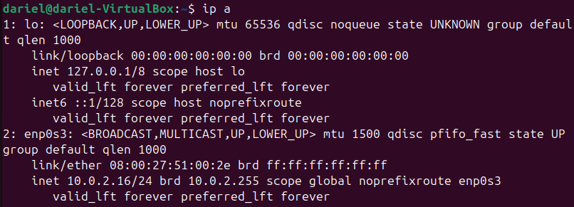

Hacer un ping al servidor:

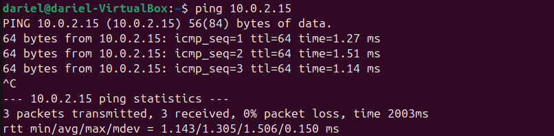

En caso no satisfactorio, verificar la configuración de red y corregir cualquier problema de conectividad.

## __Unir el Cliente al Dominio LDAP__

Instalación los paquetes necesarios:

```bash
sudo apt update
sudo apt install ldap-utils libnss-ldap libpam-ldap nslcd
```


Al terminar la instalación se nos abrirá automáticamente un configurador de paquetes.

---
En caso de querer abrir este configurador en un futuro o cambiar algo si nos hemos equivocado pedemos ejecutar

```bash
sudo dpkg-reconfigure ldap-auth-config
```

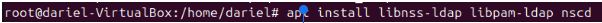

---
Ahora seguimos las indicaciones del configurador


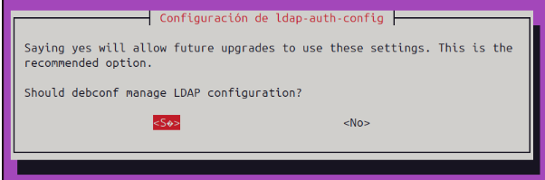

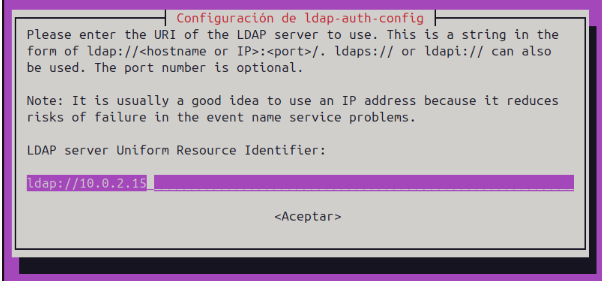

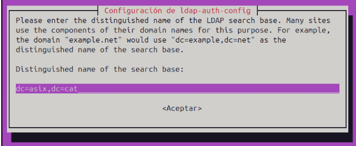

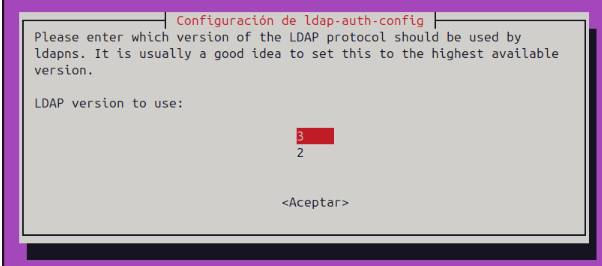

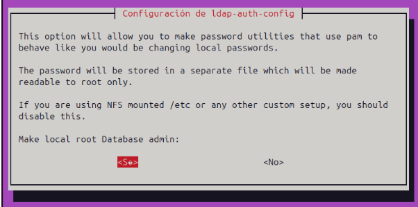

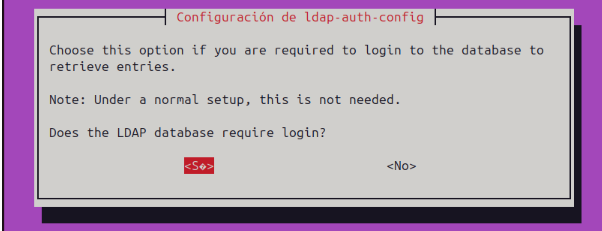

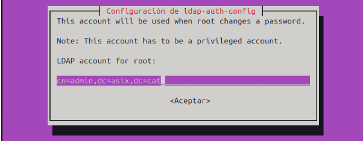

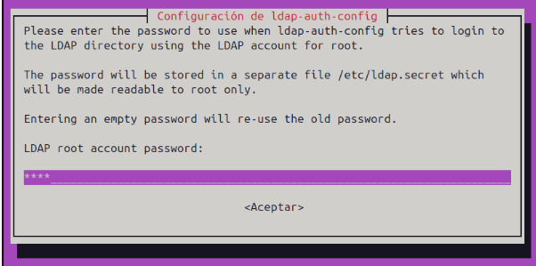

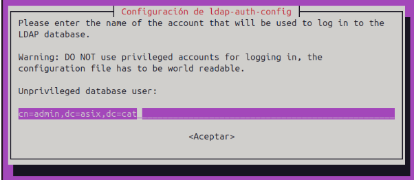

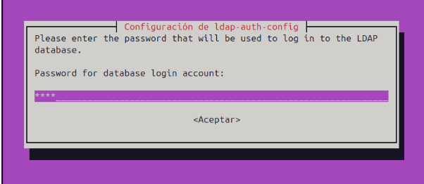

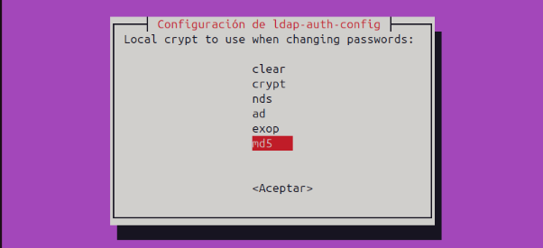

---
Editar el archivo `/etc/nsswitch.conf` para usar LDAP:

```bash
sudo nano /etc/nsswitch.conf
```

Hay que asegurarse de que las líneas `passwd`, `group`, y `shadow` incluyan `ldap`:

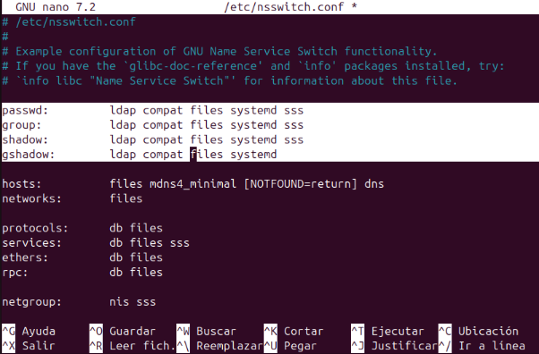

---
Editar el archivo `/etc/pam.d/common-session` para indicar el skel y los permisos predeterminados para los usuarios.

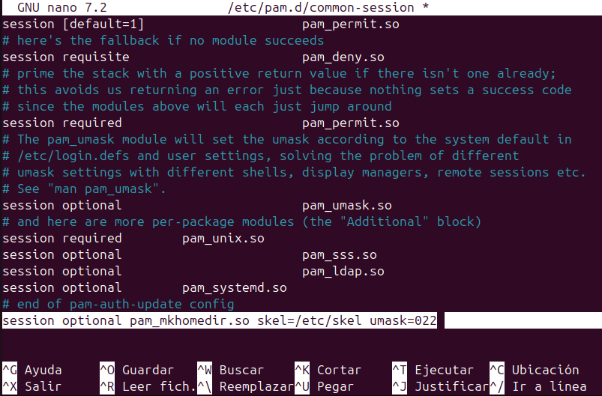

---
Editar el archivo `/usr/share/lightdm/lightdm.conf.d/59-ubuntu.conf` para poder iniciar sesión de manera gráfica.

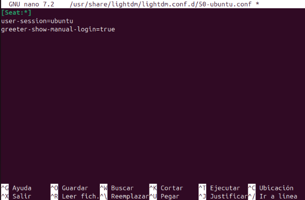

---
Para comprobar si lo estamos haciendo bien podemos ejecutar el comando:

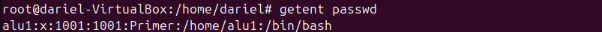

Deberia salirnos el usuario que hemos creado en el anterior apartado.

---
Sabiendo que está bien hecho ya podriamos iniciar sesión con alu1 como miembro del dominio. Lo voy a comprobar reiniciando el PC ya que si solo cierro sesión no va a funcionar.

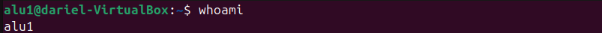