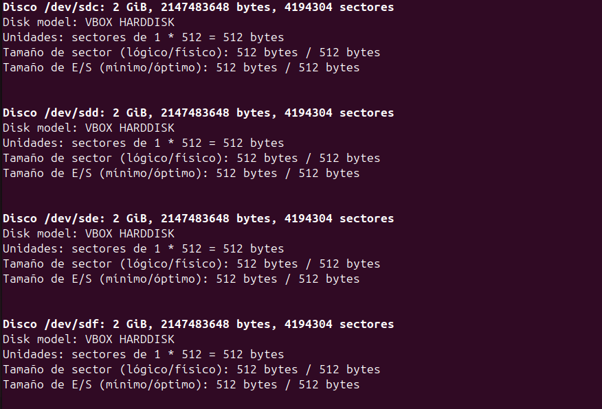
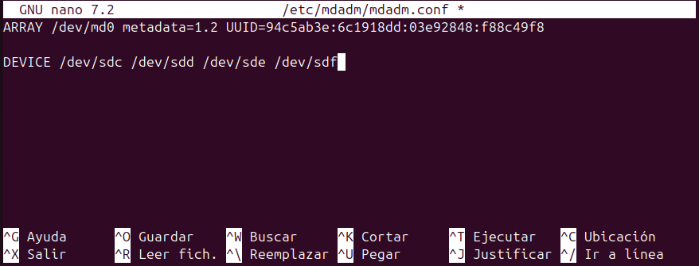
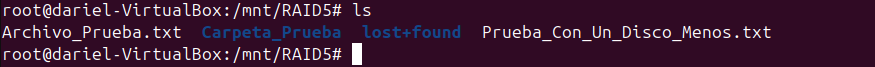

# __RAIDS__
Antes de empezar con los RAIDS, hay que hablar un poco sobre discos duros.

## __Cómo funciona un disco duro__
Imagina que un disco duro es como una gran biblioteca donde se almacenan libros (datos). Cuando necesitas buscar información, el bibliotecario encuentra el libro y te lo entrega.

Piensa en un __HDD__ como una biblioteca con libros físicos.

__Partes del HDD y su función:__

1. Platos giratorios: Son como los estantes de libros. Aquí se almacena toda la información.
2. Cabezal de lectura/escritura: Es como un bibliotecario con una lupa, que busca el libro correcto en los estantes.
3. Motor: Hace que los estantes giren muy rápido para que el bibliotecario pueda acceder a cualquier libro rápidamente.

__Cómo guarda y recupera datos:__

Cuando guardas un archivo, el bibliotecario (cabezal) busca un espacio libre en los estantes (platos) y coloca ahí la información.
Cuando abres un archivo, el bibliotecario tiene que encontrarlo físicamente en el estante, lo que toma algo de tiempo.
Si el bibliotecario tiene que buscar en diferentes estantes, tarda más (por eso los discos duros pueden ser lentos).

__Cómo funciona un SSD:__
Un SSD es como una biblioteca digital con ebooks en vez de libros físicos.

__Partes del SSD y su función:__

1. Memoria Flash: Es como una gran base de datos digital, donde los libros (datos) están organizados electrónicamente.
2. Controlador SSD: Es el que organiza todo y permite buscar información de manera instantánea.
3. Celdas de memoria: Son pequeños compartimentos donde se almacenan los datos.

__Cómo guarda y recupera datos:__
Cuando guardas un archivo, este se almacena en chips de memoria en lugar de en platos giratorios.
Cuando abres un archivo, el SSD lee los datos electrónicamente, sin mover partes mecánicas.
Como todo es digital, es mucho más rápido encontrar la información (casi instantáneo).

__Cómo encaja esto con los RAID__
Ahora que sabes que un disco duro almacena y recupera datos, imagina que en lugar de un solo disco, tienes varios trabajando juntos. Ahí es donde entran los RAID, que básicamente agrupan discos para mejorar velocidad, seguridad o ambas.

__Ejemplo con libros en una biblioteca:__

Si solo tienes un bibliotecario (__un solo disco__), tarda más en buscar cada libro.
Pero si tienes varios bibliotecarios trabajando juntos (__RAID 0__), pueden buscar libros al mismo tiempo, aumentando la velocidad.
Si además hacen copias de cada libro (__RAID 1__), aunque se pierda uno, aún tienes la copia de seguridad.

## __Que són los volúmenes__
Un volumen es un espacio lógico de almacenamiento que el sistema operativo usa como si fuera un solo disco, aunque en realidad puede estar en uno o varios discos físicos.

### __Tipos de volúmenes principales__
__Volumen simple__

- Usa un solo disco.
- Si el disco falla, los datos se pierden.

Ejemplo: Un disco de 1 TB con una sola partición.

__Volumen distribuido__

- Junta el espacio de varios discos en uno solo.
- No tiene protección contra fallos.

Ejemplo: Dos discos de 500 GB aparecen como un único volumen de 1 TB.

__Volumen reflejado (RAID 1)__

- Crea una copia exacta en otro disco (seguridad).
- Se pierde la mitad del espacio.

Ejemplo: Dos discos de 1 TB forman un volumen de 1 TB con datos duplicados.

__Volumen con paridad (RAID 5)__

- Usa varios discos y guarda paridad para recuperar datos si uno falla.
- Se necesita al menos 3 discos.

Ejemplo: Tres discos de 1 TB crean un volumen de 2 TB con paridad para seguridad.


## __Tipos de RAID__
RAID (Redundant Array of Independent Disks) es una tecnología de almacenamiento que combina múltiples discos duros en una sola unidad lógica para mejorar el rendimiento y/o la redundancia de los datos. La redundancia en RAID significa que los datos se duplican en varios discos para protegerse contra la pérdida de datos en caso de fallo de uno de los discos.

__RAID 0__

- **Descripción**: Divide los datos en bloques y los distribuye entre varios discos.
- **Ventajas**: Mejora el rendimiento.
- **Desventajas**: No ofrece redundancia. Si un disco falla, se pierde toda la información.

__RAID 1__

- **Descripción**: Duplica los datos en dos discos.
- **Ventajas**: Alta redundancia. Si un disco falla, los datos están disponibles en el otro disco.
- **Desventajas**: No mejora el rendimiento y requiere el doble de espacio de almacenamiento.

__RAID 2__

- **Descripción**: Utiliza la codificación Hamming para la corrección de errores y distribuye los datos a nivel de bits.
- **Ventajas**: Alta corrección de errores.
- **Desventajas**: No es comúnmente utilizado debido a su complejidad y costo.

__RAID 3__

- **Descripción**: Distribuye los datos a nivel de bytes con un disco dedicado para la paridad.
- **Ventajas**: Buena velocidad de lectura y escritura.
- **Desventajas**: Si el disco de paridad falla, se pierde la capacidad de recuperación de datos.

__RAID 4__

- **Descripción**: Similar a RAID 3, pero distribuye los datos a nivel de bloques con un disco dedicado para la paridad.
- **Ventajas**: Buen rendimiento en lectura.
- **Desventajas**: El disco de paridad puede convertirse en un cuello de botella.

__RAID 5__

- **Descripción**: Distribuye los datos y la paridad entre todos los discos.
- **Ventajas**: Buena combinación de rendimiento, capacidad y redundancia. Puede tolerar la falla de un disco.
- **Desventajas**: La reconstrucción de datos puede ser lenta en caso de fallo de un disco.

__RAID 6__

- **Descripción**: Similar a RAID 5, pero con dos discos de paridad.
- **Ventajas**: Mayor redundancia, puede tolerar la falla de dos discos.
- **Desventajas**: Menor rendimiento de escritura y mayor complejidad en la reconstrucción de datos.


---

### __RAIDS Anidados__
Cuando combinas diferentes tipos de RAID dentro de un mismo sistema, estás creando un RAID anidado o RAID jerárquico. Es como hacer un RAID "dentro de otro RAID", con el objetivo de aprovechar lo mejor de cada nivel y minimizar sus desventajas.

Como he expicado anteriormente, cada RAID tiene sus puntos débiles y sus puntos fuertes. Un RAID 0 es rápido, pero sin redundancia mientras que un RAID 1, tiene alta disponibilidad pero desaprovecha la mitad del espacio. Si combinamos ambos RAIDS, obtenemos un equilibrio entre rendimiento, seguridad y capacidad.

__Ejemplo práctico: RAID 10 (RAID 1+0)__
Uno de los RAIDs anidados más comunes es RAID 10, que combina RAID 1 (espejado) con RAID 0 (striping).

1. Primero, se agrupan los discos en pares y cada par se configura en RAID 1 (cada disco tiene una copia exacta en otro).
2. Luego, esos pares se agrupan en un RAID 0, lo que significa que los datos se reparten entre todos los pares para aumentar la velocidad.

__Ventaja__: Si un disco falla, la copia del RAID 1 sigue funcionando. Además, la velocidad de lectura es alta porque se pueden leer datos de varios discos a la vez.

__Desventaja__: Se pierde el 50% del almacenamiento, porque cada disco tiene un "gemelo" que solo almacena la copia.


---
__Otro ejemplo: RAID 50 (5+0)__
Este combina RAID 5 (paridad) con RAID 0.

Se crean varios grupos de RAID 5, donde los datos y la información de paridad se distribuyen entre los discos.
Luego, estos grupos se organizan en un RAID 0 para mejorar la velocidad.

__Ventaja__: Buen equilibrio entre redundancia y rendimiento. Si un disco falla, los datos se pueden reconstruir gracias a la paridad.

__Desventaja__: Se necesitan al menos 6 discos, lo que puede ser caro.


---

## __EJEMPLO PRÁCTICO CREANDO UN RAID5__
Para esta práctica necesito 4 discos que voy a añadir a una máquina virtual.




---
Para la gestión de RAIDS en Linux, voy a descargar `mdadm`:


---
Una vez instalado, particionamos los discos que hemos localizado antes:`sdc`,`sdd`, `sde` y `sdf`.

Con el comando `fdisk /dev/sdc` entraremos en el particionador de discos. El orden de opciones es el siguiente: 

__N, INTRO, INTRO, INTRO, INTRO, T, FD, W para salir__


Repetimos lo mismo con `sdd`, `sde` y `sdf`.

---
Comprobamos que se han particionado correctamente con un `fdisk -l`, nos deben salir así las particiones:


---
El siguiente paso es crear la carpeta donde se montará el RAID.


---
Ahora ya vamos a crear el RAID5, para ello utilizo este comando:


---
Ya tenemos el RAID creado pero no está formatado, como estamos trabajando en Linux, le vamos a dar formato ext4.


---
Para comprobar el estado del RAID y que todo esta correcto utilizo el comando `mdadm --detail /dev/md0`, al final de toda la información que nos da este comando podemos ver el estado de los discos.


---
En este momento, si reiniciarmos el equipo, el RAID desaparecería ya que no está montado permantentemente. Para ello, seguimos estos pasos:

1. Enviar los detalles del raid y un scan al fichero mdadm.conf
2. Editamos el fichero mdadm.conf con `nano`.


3. Añadimos esta línea:


Cerramos y guardamos.

---
Por úlitmo hacemos el montaje del RAID en la carpeta que hemos creado anteriormente.
Para ello:

1. Editamos el fichero `/etc/fstab`y añadimos la siguiente línea.


2. Guardamos y cerramos. Ahora ejecutamos el comando `mount -a`.


3. Ahora para que esto se aplique, ejecutamos estos dos comandos:


---
Ahora, para comprobar que todo se ha hecho correctamente, reinicio el equipo y el RAID debería seguir montado sin fallos.


---
## __RESOLUCIÓN DE FALLOS DEL RAID__

En este apartado voy a simular posibles fallos que pudieramos tener con nuestro RAID y explicar su posible solución.

Antes de empezar voy guardar contenido en el RAID.


### __Un disco falla__


Simulación del fallo:


Cuando ejecutas el comando `mdadm /dev/(nombre_RAID) -f /dev/(nombre_disco)`, estás forzando un fallo en el disco especificado dentro del conjunto RAID. Esto simula un fallo del disco, lo que permite probar la capacidad del RAID para manejar fallos y activar los mecanismos de recuperación de datos.

Por ejemplo, si tienes un RAID 5 configurado y ejecutas `mdadm /dev/md0 -f /dev/sdf`, el disco `/dev/sdf` será marcado como fallido. __El RAID continuará funcionando en modo degradado__, utilizando los discos restantes y la información de paridad para mantener la integridad de los datos. __Es importante reemplazar el disco fallido lo antes posible__ y reconstruir el RAID para restaurar la redundancia y proteger los datos contra futuros fallos de disco.

Verifico que los archivos y carpetas que habían en `/mnt/RAID5` siguen estando y que puedo seguir trabajando en el RAID. 


---
Voy a volver a activar el disco, para ello utilizo el comando `mdadm /dev/(nombre_RAID) -r /dev/(nombre_disco)`.


---
Lo verifico con `mdadm --detail /dev/md0`.


---
### __Reemplazar un disco roto__

Un disco se nos ha roto y lo queremos reemplazar, en mi caso al ser máquinas virtuales, dentro de los Parametros de VirtualBox he eliminado la adjunción de uno de los discos. Voy a iniciar la máquina virtual para revisar si puedo seguir trabajando con el RAID 5 aunque tenga solo 3 discos.

Primero verifico los discos en el sistema con `fdisk -l`:


El disco `/dev/sdf` ya no está.

---
Ahora para poder seguir trabajando en el RAID con 3 discos ejecutamos esta serie de comandos:


---
Si hacemos `mdadm --detail /dev/md0` nos aparecra el raid con solo 3 discos y sigue en estado `degraded`. Aún asi podemos seguir trabajando con el.




---
Ahora apagamos el equipo y ponemos el disco nuevo, el cual hay que particionar y añadir al RAID.

Lo primero que hacemos es localizar el disco, en mi caso, el nombre del disco es el mismo que el disco que he elimado, lo que me facilita mucho el trabajo. No tengo que modificar el archivo `mdadm.conf`, si el nombre fuera distinto tendria que modificar este archivo eliminado el nombre del disco antiguo por el nombre del nuevo.


---
Particiono el disco igual que hice con los otros:


Como el disco se llama igual no tengo que hacer estos pasos, pero si tu disco se llama de forma distinta debes añadir el nombre del disco al archivo que he mencionado anteriormente y despues hacer este comando para añadirlo:

```bash
mdadm /dev/md0 -a /dev/sd*
```
__* = letra del disco nuevo__

---
Para terminar debemos hacer un reboot del sistema, una vez hecho podemos verificar que nuestro RAID vuelve a tener los 4 discos activos con `mdadm --detail /dev/md0`:


---
### __Que pasas si fallan dos discos__
Si fallan dos discos en un RAID 5, el sistema no podrá recuperar los datos. RAID 5 puede tolerar la falla de un solo disco gracias a la paridad distribuida, pero si se pierden dos discos, la información de paridad no es suficiente para reconstruir los datos perdidos. En este caso, se produce una pérdida total de datos y el RAID entra en un estado irrecuperable. Es crucial realizar copias de seguridad regulares para evitar la pérdida de datos en situaciones como esta.

Para forzar este fallo, he eliminado un disco desde los paramatros de VirtualBox.


---
### __Borrar un RAID__
Para borrar un RAID en Linux, sigue estos pasos:

1. **Desmontar el RAID**:
    Primero, desmonta el RAID si está montado. Usa el comando `umount` seguido del punto de montaje.
    
    ```bash
    sudo umount /mnt/RAID5
    ```

2. **Detener el RAID**:
    Detén el RAID usando el comando `mdadm --stop`.
    
    ```bash
    sudo mdadm --stop /dev/md0
    ```

3. **Borrar la configuración del RAID**:
    Borra la superblock de cada disco que formaba parte del RAID.
    
    ```bash
    sudo mdadm --zero-superblock /dev/sdX
    ```
    Repite este comando para cada disco (`/dev/sdX`) que formaba parte del RAID.

4. **Eliminar entradas en `mdadm.conf`**:
    Si tienes configuraciones persistentes en `/etc/mdadm/mdadm.conf`, edita el archivo y elimina las entradas correspondientes al RAID que has borrado.

5. **Actualizar el initramfs**:
    Actualiza el initramfs para asegurarte de que los cambios se reflejen en el arranque.
    
    ```bash
    sudo update-initramfs -u
    ```


---
Con estos pasos, habrás borrado completamente el RAID de tu sistema.

