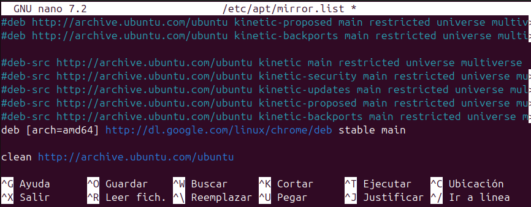
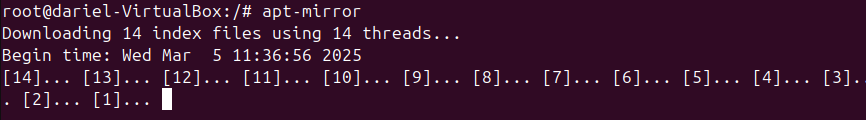
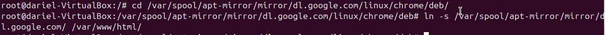
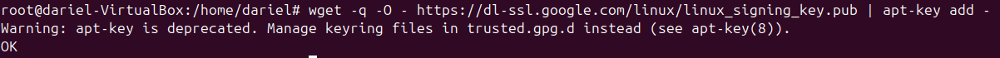
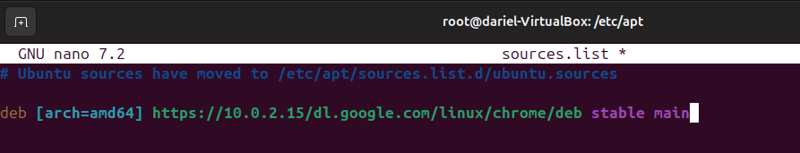
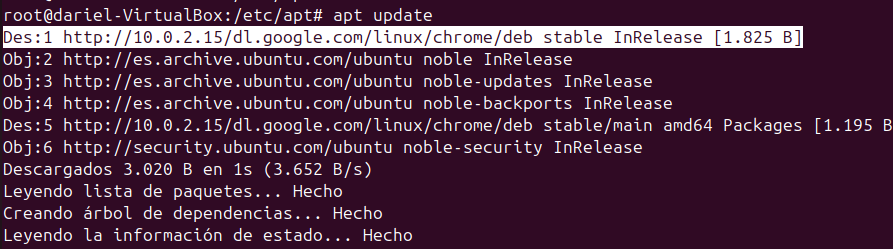
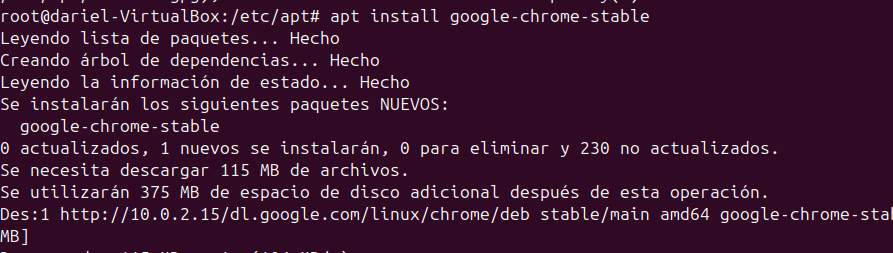

# __Servidor de Actualizaciones__
En este apartado voy a mostrar como montar un servidor de actualizaciones para Ubuntu.

Un servidor de actualizaciones es un sistema que permite gestionar y distribuir actualizaciones de software a múltiples equipos dentro de una red. Este tipo de servidor es especialmente útil en entornos empresariales donde se necesita asegurar que todos los equipos tengan las últimas actualizaciones de seguridad y software instaladas de manera eficiente y controlada. Al centralizar las actualizaciones, se reduce el uso del ancho de banda de internet y se facilita la administración de las mismas.

## __Configuración del Servidor__

Instlamos estos paquetes:

+ `sudo apt install apache2`
+ `sudo apt install apt-mirror`

---
A continuación modifico el archivo `/etc/apt/mirror-list`, donde se encuentran todos los repositorios oficiales de ubuntu, los voy a comentar ya que hacer una copia de todos los repositorios ocuparia mucho espacio y el caso es demostrar que funciona.

En este mismo archivo, añado una línea, el repositorio oficial de google chrome.

---
Para aplicar los cambios y que se realize la copia en el servidor, ejecuto el comando `sudo apt-mirror`.

---
El servidor apache que hemos instalado nos va a servir para crear un soft link hacia el directorio del repositorio de Chrome.
Para ello ejecuto el comando `ln -s <ruta_del_repositorio> /var/www/html`

---
## __Configuración del Cliente__
Google Chrome necesita que firmemos las llaves, pues es lo primero que haremos para evitar conflictos.

Para ello uso el comando:

---
Ahora ya podemos añadir el repositorio que hemos creado en el servidor a la lista de repositorios del cliente, para ello editamos ese archivo:

---
Ejecutamos un `sudo apt update` y ya nos deberia salir reflejado el nuevo repositorio.

---
Ahora ya podemos instalar Chrome con `sudo apt install google-chrome-stable`.

