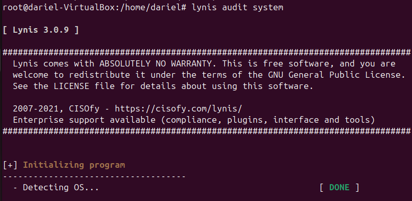

# __Auditorias de Seguridad__

En este apartado voy a hablar sobre la herramienta Lynis, una herramienta de auditoría de seguridad para sistemas basados en Unix. 

Lynis realiza un análisis exhaustivo del sistema, identificando posibles vulnerabilidades y proporcionando recomendaciones para mejorar la seguridad. Es ampliamente utilizada por administradores de sistemas y profesionales de la seguridad para evaluar y fortalecer la seguridad de sus entornos.

## __Instalación de Lynis__

Para instalar Lynis en un sistema basado en Unix, sigue estos pasos:

1. **Actualizar los repositorios del sistema:**
    ```
    sudo apt-get update
    ```

2. **Instalar Lynis:**
    ```
    sudo apt-get install lynis
    ```


---
## __Uso de Lynis__

Una vez instalado, puedes ejecutar Lynis con el siguiente comando:

```bash
sudo lynis audit system
```



Este comando iniciará una auditoría completa del sistema y generará un informe detallado con los hallazgos y recomendaciones.

---
## __Interpretación del Informe__

El informe generado por Lynis incluye varias secciones, como:

- **Información del sistema:** Detalles sobre el sistema operativo, kernel, y hardware.
- **Controles de seguridad:** Resultados de las pruebas de seguridad realizadas.
- **Recomendaciones:** Sugerencias para mejorar la seguridad del sistema.

Entre muchos otros y más pluggins que puedes instalar si tienes la version Enterprise de Lynis.

---
## __Resultados__

Lynis, al final del informe, ofrece recomendaciones para aplicar, incluyendo:

- **Actualizaciones de software:** Asegúrate de que todos los paquetes y el sistema operativo estén actualizados.
- **Configuraciones del sistema:** Ajusta las configuraciones del sistema para mejorar la seguridad.
- **Políticas de contraseñas:** Implementa políticas de contraseñas más estrictas.
- **Monitoreo y registros:** Configura el monitoreo y los registros para detectar actividades sospechosas.

Siguiendo estas recomendaciones, puedes fortalecer la seguridad de tu sistema y reducir el riesgo de posibles vulnerabilidades.


---
Si entras en el link de los `Warnings`o `Suggestions`, encontrarás posibles mejoras o soluciones.

En mi caso he revisado el primer `Warning` y me sugiere hacer un `apt-update %% apt-upgrade`, voy a ejecutarlo y volver a lanzar lynis.


Corregido!