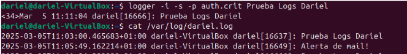
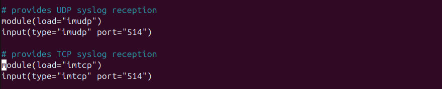

# __MONITORIZACIÓN__

En este apartado voy a hablar sobre el monitoreo basado en logs del sistema o logs que queramos crear.

---
## __Que es un log__
Los logs son registros que documentan eventos que ocurren en un sistema informático. Estos registros pueden ser generados por el sistema operativo, aplicaciones, servicios o cualquier componente que desee realizar un seguimiento de sus actividades. Los logs son esenciales para la monitorización y el diagnóstico de problemas, ya que proporcionan información detallada sobre el comportamiento del sistema y los eventos que han ocurrido.

Existen diferentes tipos de logs, como:

- **Logs del sistema**: Registran eventos relacionados con el sistema operativo.
- **Logs de aplicaciones**: Registran eventos específicos de aplicaciones.
- **Logs de seguridad**: Registran eventos relacionados con la seguridad, como intentos de inicio de sesión fallidos.

La monitorización basada en logs implica recopilar, analizar y visualizar estos registros para identificar patrones, detectar anomalías y solucionar problemas de manera proactiva.

---
## __Donde se almacenan los logs en Ubuntu__

En Ubuntu, los logs del sistema se almacenan en el directorio `/var/log`. Este directorio contiene varios archivos de logs que registran diferentes tipos de eventos del sistema. 
A continuación, describo tres archivos de logs comunes que se encuentran en esta ubicación:

- **/var/log/syslog**: Este archivo registra una variedad de mensajes del sistema, incluyendo mensajes del kernel, servicios y aplicaciones. Es útil para obtener una visión general del estado del sistema y para diagnosticar problemas generales.

- **/var/log/auth.log**: Este archivo registra todos los eventos relacionados con la autenticación, como inicios de sesión exitosos y fallidos, cambios de usuario y otros eventos de seguridad. Es esencial para monitorear la seguridad del sistema.

- **/var/log/kern.log**: Este archivo contiene mensajes específicos del kernel de Linux. Es útil para diagnosticar problemas relacionados con el hardware y el núcleo del sistema operativo.

Estos archivos de logs son fundamentales para la monitorización y el diagnóstico de problemas en sistemas Ubuntu.


En `/var/log/` se encuentran muchos ficheros, entre ellos se encuentran `dmesg`, `dmesg.0`, `dmesg.1.gz`, `dmesg.2.gz`. 

Estos ficheros cumplen una función similar a kern.log:

- **dmesg**: Este archivo contiene mensajes del anillo de mensajes del kernel. Es útil para diagnosticar problemas relacionados con el hardware y el arranque del sistema.
- **dmesg.0**: Es una copia del archivo `dmesg` anterior, que se guarda cuando el sistema se reinicia.
- **dmesg.1.gz**, **dmesg.2.gz**: Son versiones comprimidas de archivos `dmesg` más antiguos. Estos archivos se comprimen para ahorrar espacio y permiten mantener un historial de mensajes del kernel.

Estos archivos son útiles para realizar un seguimiento de los eventos del kernel y diagnosticar problemas relacionados con el hardware y el arranque del sistema.

---
## __Gestión de logs con logrotate__

Para evitar que los archivos de logs crezcan indefinidamente y consuman todo el espacio en disco, se utiliza una herramienta llamada `logrotate`. Esta herramienta permite rotar, comprimir y eliminar archivos de logs de manera automática, según una configuración predefinida.

---
### __Configuración de logrotate__

La configuración principal de `logrotate` se encuentra en el archivo `/etc/logrotate.conf`. Este archivo contiene las directivas globales que afectan a todos los archivos de logs gestionados por `logrotate`. Algunas de las directivas comunes incluyen:

- `weekly`: Especifica que los logs deben rotarse semanalmente.
- `rotate 4`: Indica que se deben mantener cuatro archivos de logs antiguos antes de eliminar el más antiguo.
- `compress`: Indica que los archivos de logs rotados deben ser comprimidos para ahorrar espacio en disco.
- `create`: Especifica que se debe crear un nuevo archivo de log vacío después de rotar el archivo actual.

Además del archivo de configuración principal, `logrotate` también utiliza el directorio `/etc/logrotate.d` para almacenar configuraciones específicas para diferentes servicios y aplicaciones. Cada archivo en este directorio contiene directivas de rotación de logs para un servicio o aplicación particular. Por ejemplo, puede haber un archivo `/etc/logrotate.d/apache2` que contenga la configuración de rotación de logs para el servidor web Apache.


---
## __Configuración de logs en /etc/rsyslog.d/50-default.conf__

El archivo `/etc/rsyslog.d/50-default.conf` es parte de la configuración del sistema de registro de mensajes `rsyslog` en Ubuntu. Este archivo define qué mensajes de log se envían a qué archivos de log específicos. A continuación, describo algunas de las configuraciones comunes que se pueden encontrar en este archivo:

- `auth,authpriv.*`: Los mensajes relacionados con la autenticación y la privacidad se registran en `/var/log/auth.log`.
- `*.*;auth,authpriv.none`: Todos los mensajes, excepto los relacionados con la autenticación y la privacidad, se registran en `/var/log/syslog`.
- `daemon.*`: Los mensajes del daemon se registran en `/var/log/daemon.log`.
- `kern.*`: Los mensajes del kernel se registran en `/var/log/kern.log`.
- `mail.*`: Los mensajes relacionados con el correo se registran en `/var/log/mail.log`.
- `user.*`: Los mensajes del usuario se registran en `/var/log/user.log`.

Estas configuraciones permiten que `rsyslog` dirija los mensajes de log a los archivos adecuados, facilitando la monitorización y el diagnóstico de problemas específicos del sistema. Es posible personalizar este archivo para ajustar la configuración de los logs según las necesidades específicas del sistema o de las aplicaciones que se estén ejecutando.


Siempre que se modifique este fichero, es necesario ejecutar los siguientes comandos para aplicar los cambios:

```bash
sudo systemctl restart rsyslog
sudo systemctl daemon-reload
```

---
## __Pruebas y Personalización__

En este apartado voy a mostrar cómo personalizar los registros de logs, pero primero voy a hacer una prueba con logs del sistema.

### __Forzar un resgistro de log__

Por ejemplo, voy a realizar una simulación de alerta en el log de correo:

En un terminal, ejecuta el comando `tail -f /var/log/syslog` para registrar en tiempo real lo que va pasando en este fichero de logs.

En otro terminal, ejecuta el comando `logger` para simular logs: `logger -i -s -p mail.alert "Descripción de la alerta"`


Tanto el fichero que he hecho el tail que es `/var/log/syslog` que registra todos los logs del sistema como `/var/log/mail.log` han registrado la simulación de log.

---
### __Personalización de logs__

Modifico el fichero `/etc/rsyslog.d/50-default.conf` como ejemplo añado esta línea donde todos los servicios con prioridad `crit`, se almacenarán en `/var/log/dariel.log`.


He añadido la línea que está subrallada, esta línea indica que:

- `*`: Se aplica a todas las facilidades del sistema, como auth, kern, mail, etc.
- `crit`: Especifica el nivel de severidad crítico. Solo se registran mensajes graves.
- `/var/log/dariel.log`: Es el archivo donde se almacenarán esos logs críticos.

La ruta personalizada se crea sola, no hace falta crear la carpeta préviamente.

---
### __Verificar log personalizado__

Como verificación, vuelvo a hacer uso del comando `logger` para simular un log con prioridad `crit` y ver si se ha almacenado correctamente.



---
## __Comando JOURNALCTL__
El comando `journalctl` se utiliza para consultar y mostrar los registros del sistema almacenados por el servicio `systemd-journald`. Este comando permite a los administradores del sistema ver los mensajes de registro generados por el kernel, los servicios del sistema y otras aplicaciones que utilizan el sistema de registro de `systemd`.

### __Funcionalidades principales:__
- **Visualización de registros**: Permite ver los registros del sistema en tiempo real o históricos.
- **Filtrado de registros**: Ofrece opciones para filtrar los registros por unidad de servicio, prioridad, fecha, etc.
- **Exportación de registros**: Permite exportar los registros en diferentes formatos, como JSON.

### __Ejemplos de uso:__

- `journalctl -p crit`: Muestra todos los logs con este estado


---
- `journalctl _COMM=(comando)`: Filtra por comandos.


---
- `journalctl -u systemd-logind`: Muestra los logs del servicio `systemd-logind`, que gestiona sesiones de usuario, inicios y cierres de sesión.


---
Existen más opciones para `journalctl`, como por ejemplo buscar fallos de inicio de sesión por fallo de contraseña: `journalctl -u systemd-logind | grep "Failed password"`

También podemos filtrar por fechas, por ejemplo si quisieramos filtrar que nos muestre los inicios de sesión desde el 1 de febrero de 2025: `journalctl -u systemd-logind --since "2025-02-01"`

## __Monitorización en Red de Logs__
Voy a explicar como podemos compartir los logs de un usuario a un administrador para que los gestione.

### __Ordenador receptor (administrador)__
Primero habilitamos la recepción de logs en el fichero `/etc/rsyslog.conf`.


Descomentamos estas líneas:



---
Reiniciamos el servicio `rsyslog` para aplicar los cambios:

```bash
sudo systemctl restart rsyslog
```


---
### __Ordenador emisor (usuario)__
En el ordenador del usuario, configuramos el envío de logs al servidor del administrador. Editamos el archivo `/etc/rsyslog.d/50-default.conf` y añadimos la siguiente línea:

```bash
*.* @IP_DEL_SERVIDOR:514
*.* @@IP_DEL_SERVIDOR:514
```


---
Reiniciamos el servicio `rsyslog` en el ordenador del usuario:

```bash
sudo systemctl restart rsyslog
```

### __Verificación de logs en red__
Para verificar que los logs se están enviando correctamente, en el servidor del administrador podemos utilizar el comando `tail` para ver los logs en tiempo real:

```bash
sudo tail -f /var/log/syslog
```

De esta manera, los logs del usuario se enviarán al servidor del administrador, permitiendo una monitorización centralizada de los eventos del sistema.

---