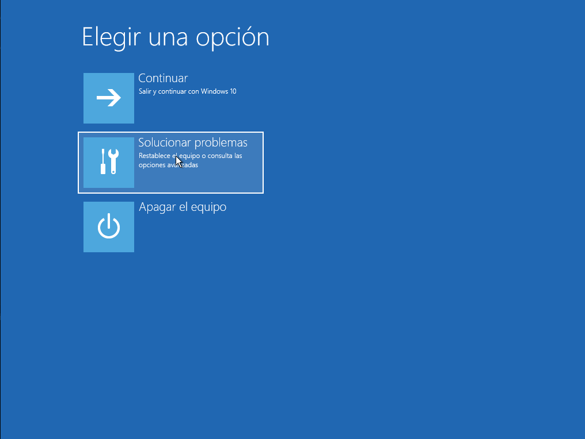
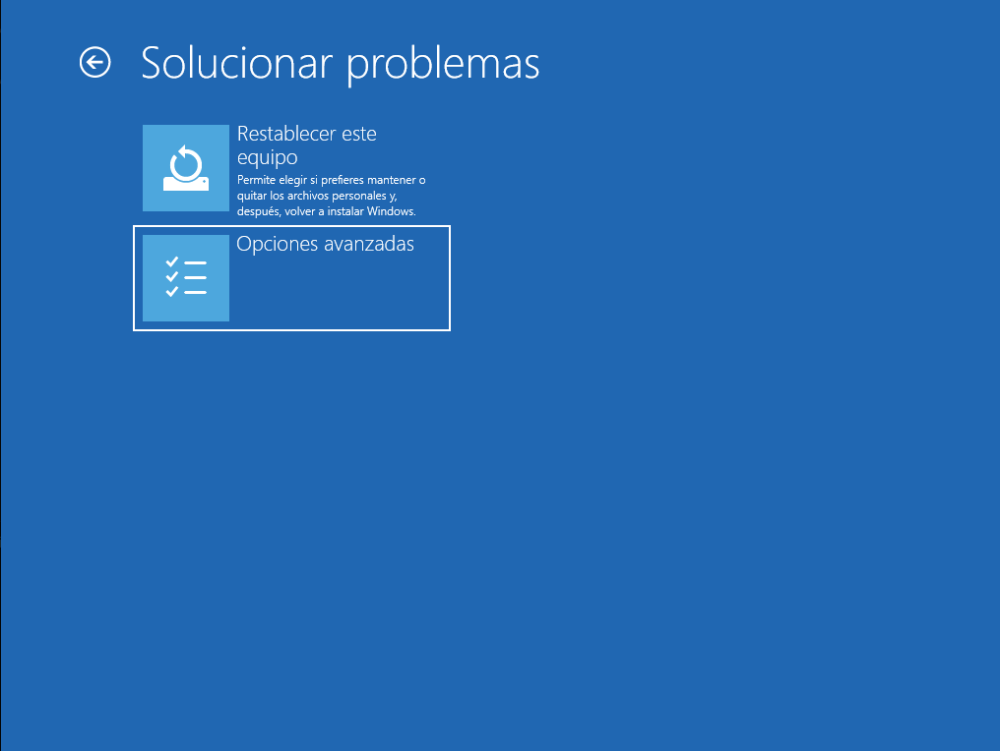
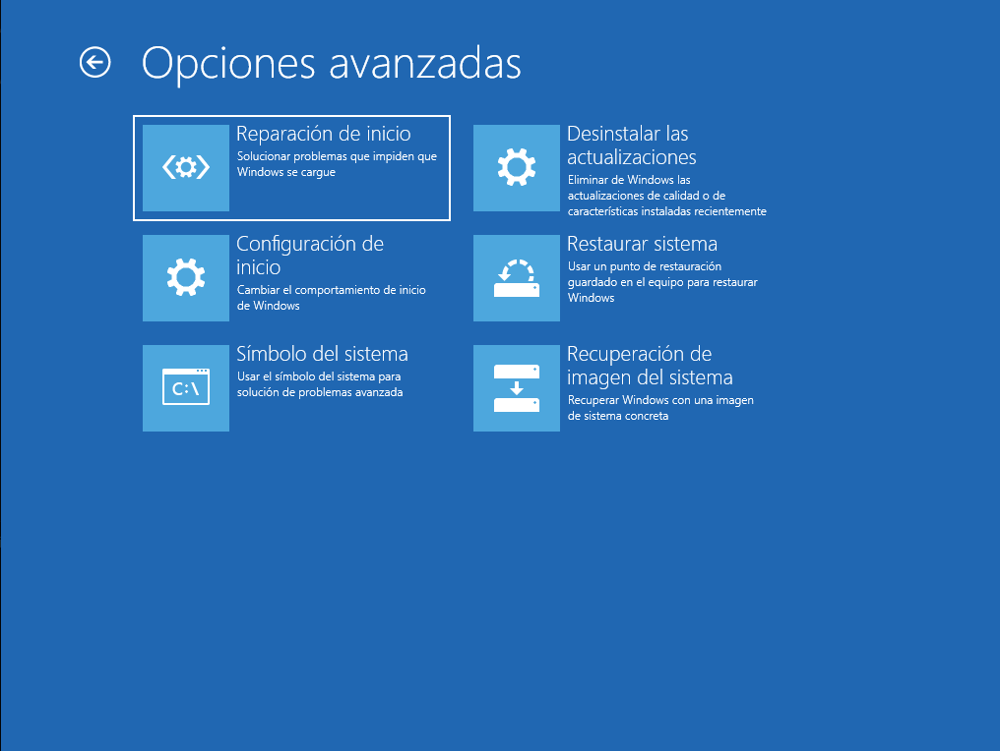
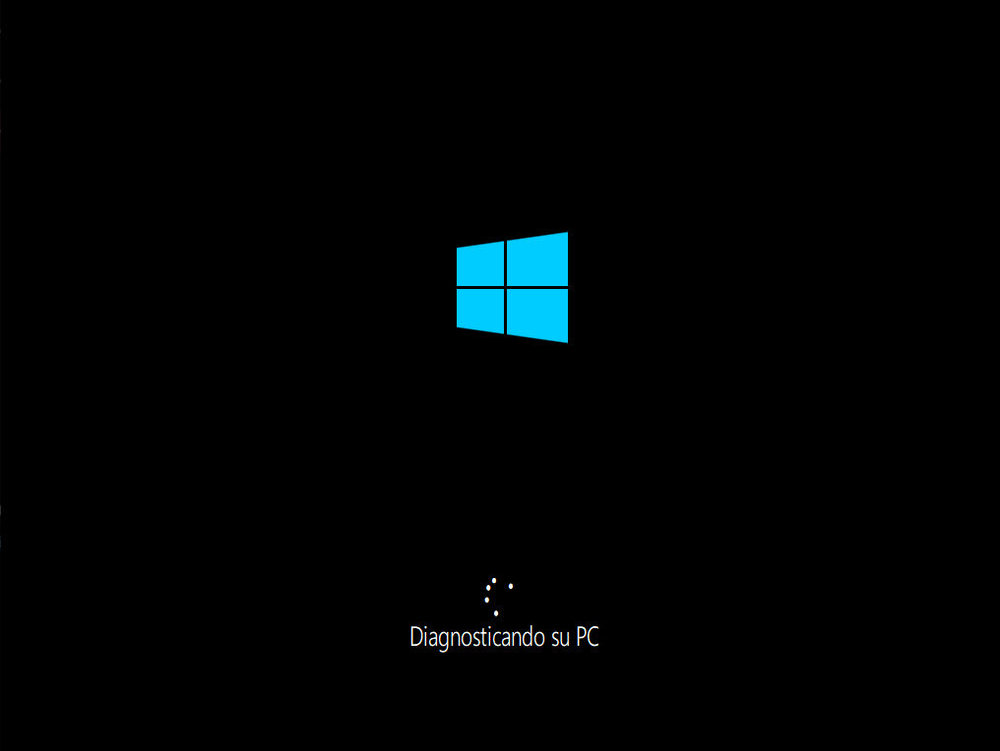
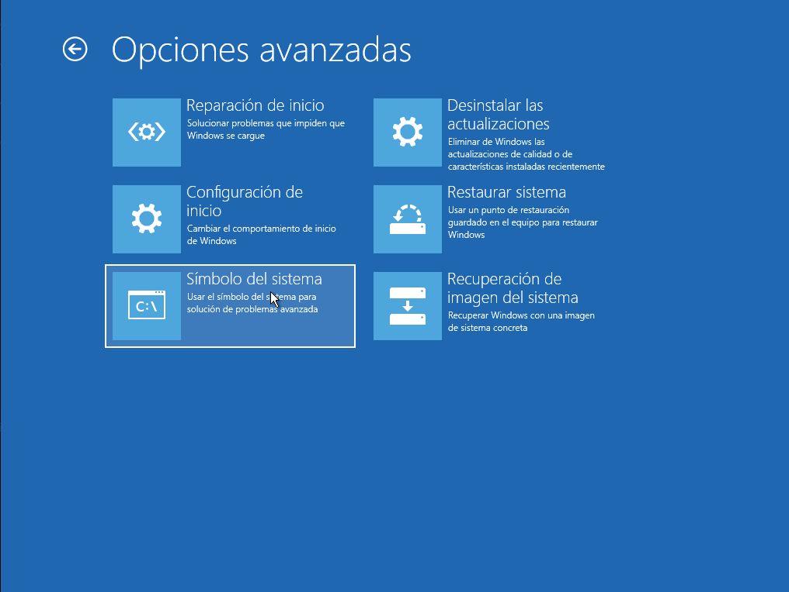
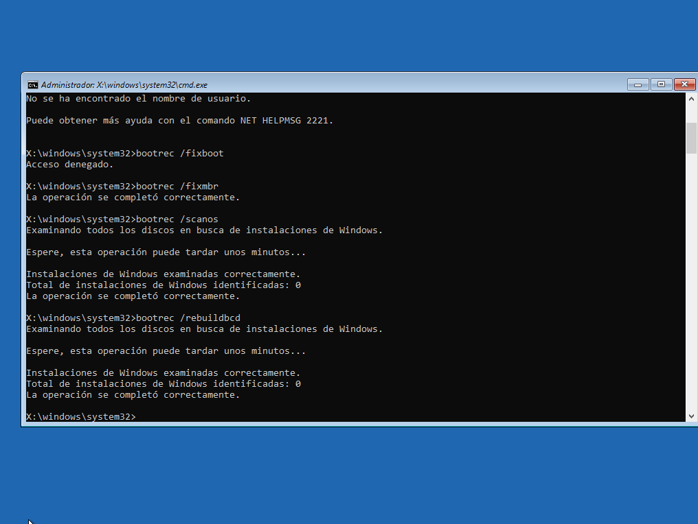
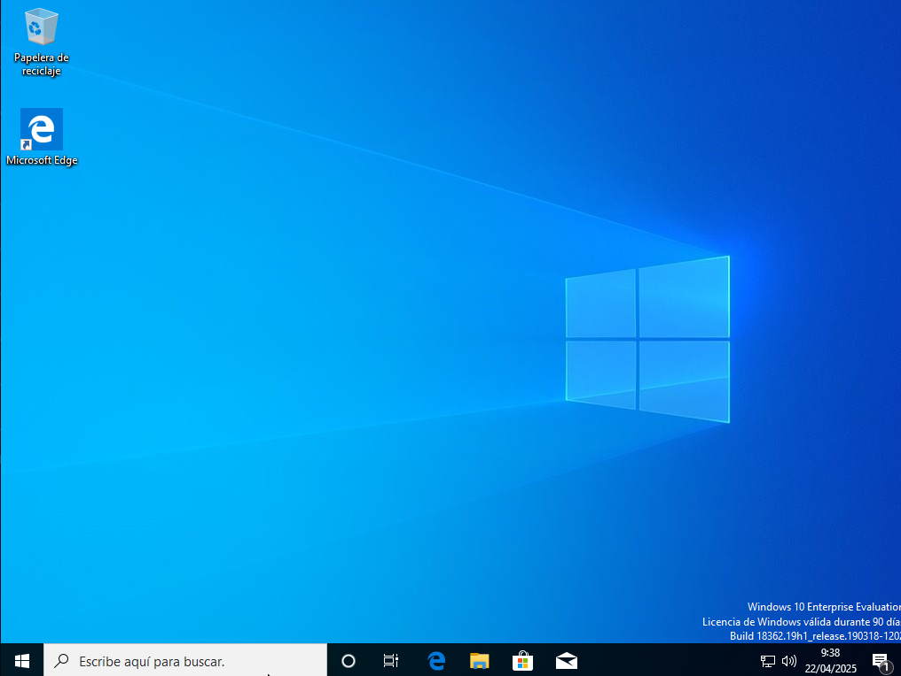

# __Resolución de una incidencia de arranque en Windows 10__

En este apartado vamos a simular un problema de arranque en el sistema y veremos cómo solucionarlo utilizando distintas herramientas disponibles en el entorno de recuperación de Windows (WinRE). El objetivo es que, si en algún momento tu sistema no arranca correctamente, sepas cómo actuar para recuperarlo sin necesidad de reinstalarlo.

---

## __Simulación del fallo de arranque__

Para provocar un error de arranque, podemos forzar el apagado de la máquina virtual varias veces seguidas, por ejemplo cerrándola directamente desde VirtualBox sin apagar el sistema correctamente. Después de 2 o 3 intentos, Windows detectará que algo no va bien y cargará automáticamente el entorno de recuperación.

Otra opción es entrar manualmente manteniendo pulsada la tecla `Shift` mientras hacemos clic en **Reiniciar** desde el menú de apagado.

---

## __Acceso a las opciones avanzadas de recuperación__

Una vez dentro de **WinRE**, veremos varias opciones. Vamos a:

- Pulsar en **Solucionar problemas**.
- Luego en **Opciones avanzadas**.

Desde aquí podremos acceder a las herramientas que nos ayudarán a reparar el arranque.



---

## __Reparación automática con la herramienta de inicio__

La forma más sencilla de intentar reparar el problema es con la opción **Reparación de inicio**.

Pasos:

1. Seleccionamos **Reparación de inicio**.
2. Elegimos el sistema operativo instalado (Windows 10).
3. El sistema intentará detectar y arreglar los errores automáticamente.

Si todo va bien, tras un reinicio el sistema debería arrancar con normalidad. Si no funciona, pasamos al plan B: la reparación manual.





---

## __Reparación manual con comandos__

Desde el menú anterior, seleccionamos **Símbolo del sistema**.



Aquí escribimos uno a uno los siguientes comandos:

```cmd
bootrec /fixmbr
bootrec /scanos
bootrec /rebuildbcd
```



¿Qué hacen?

- `fixmbr` repara el registro de arranque maestro.
- `scanos` busca instalaciones de Windows no registradas.
- `rebuildbcd` reconstruye la configuración de arranque.

También podemos usar el comando `bcdedit` para ver o modificar manualmente las entradas de arranque, aunque esto solo sería necesario en casos más complejos.

---

## __Reiniciar y comprobar que todo funciona__

Una vez hechos los pasos anteriores:

1. Cerramos la ventana del símbolo del sistema.
2. Volvemos al menú de recuperación y elegimos **Continuar con Windows 10**.

Si todo ha ido bien, el sistema debería arrancar normalmente.


---