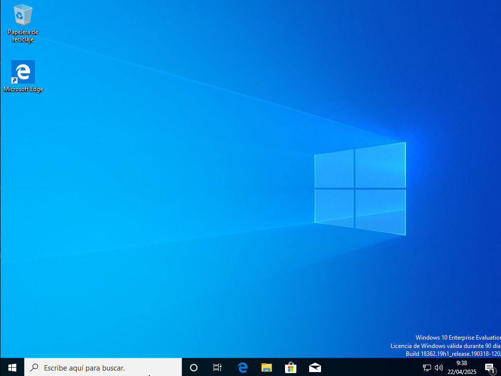

# __Instalación de Windows 10 Enterprise en VirtualBox__

En este documento se detalla paso a paso el proceso de instalación y configuración de **Windows 10 Enterprise** dentro de una máquina virtual creada con **VirtualBox 7.0.16**, ejecutándose en un sistema **Ubuntu 22.04**. El objetivo es simular un entorno ofimático funcional, conectado a red y con el software básico necesario para un uso seguro y eficiente.

---

## __Creación de la máquina virtual__

### __Requisitos previos__

- Sistema operativo anfitrión: **Ubuntu 22.04 LTS**
- Software de virtualización: **VirtualBox 7.0.16**
- Imagen ISO de **Windows 10 Enterprise** (x64)

---

### __Crear nueva máquina virtual__

1. Abrimos **VirtualBox**.
2. Pulsamos **Nueva** (`Ctrl+N`).
3. Configuramos:
   - **Nombre**: `Windows 10 Enterprise`
   - **Tipo**: `Microsoft Windows`
   - **Versión**: `Windows 10 (64-bit)`
4. Pulsamos **Siguiente**.

---

### __Configurar memoria y disco duro__

1. Asignamos **4096 MB** de memoria RAM.
2. Creamos un nuevo disco duro virtual (VDI):
   - Almacenamiento dinámico
   - Tamaño: **50 GB**
3. Finalizamos la creación.

---

### __Insertar la ISO de Windows__

1. Abrimos **Configuración** de la máquina.
2. Vamos a **Almacenamiento**.
3. En el controlador IDE, seleccionamos el icono de disco y pulsamos **Elegir un archivo de disco**.
4. Seleccionamos la ISO de Windows 10 Enterprise.
5. Confirmamos con **Aceptar**.

---

### __Ajustes adicionales__

- Procesador: **2 CPUs**
- Habilitar **VT-x/AMD-V** y **PAE/NX**
- Memoria de vídeo: **128 MB**
- Red: **Adaptador en modo puente**
- USB: habilitar **USB 2.0 (EHCI)**

---

### __Iniciar la máquina virtual__

1. Pulsamos **Iniciar**.
2. Comienza la instalación del sistema operativo.

---

## __Instalación de Windows 10__

### __Configuración inicial__

1. Elegimos idioma, formato de hora y teclado.
2. Pulsamos **Siguiente** y luego **Instalar ahora**.

---

### __Introducción de clave de producto__

1. Si se dispone de una clave válida, introducirla.
2. En caso contrario, pulsar **No tengo clave de producto**.

---

### __Selección de edición__

1. Elegimos **Windows 10 Enterprise**.
2. Aceptamos los términos de licencia.

---

### __Tipo de instalación__

Seleccionamos **Personalizada: instalar solo Windows (avanzado)**.

---

### __Crear partición y seleccionar disco__

1. Seleccionamos el disco virtual.
2. Pulsamos **Nuevo** para crear la partición.
3. Pulsamos **Siguiente**.

---

### __Instalación del sistema__

1. Se copian los archivos y se reinicia automáticamente.
2. Esperamos a que se complete la instalación.

---

## __Configuración inicial de Windows__
Para este paso, hay que suprimir la ISO anteriormente añadida.

### __Configurar región y distribución de teclado__

1. Seleccionamos país y tipo de teclado.

---

### __Configuración de red__

1. Seleccionamos **Configuración para uso personal**.
2. Creamos un usuario local y contraseña.

---

### __Opciones de privacidad__

1. Desactivamos todas las opciones no necesarias.
2. Pulsamos **Aceptar**.

---

### __Finalización__

1. El sistema se inicia y muestra el escritorio de Windows 10 Enterprise.

---