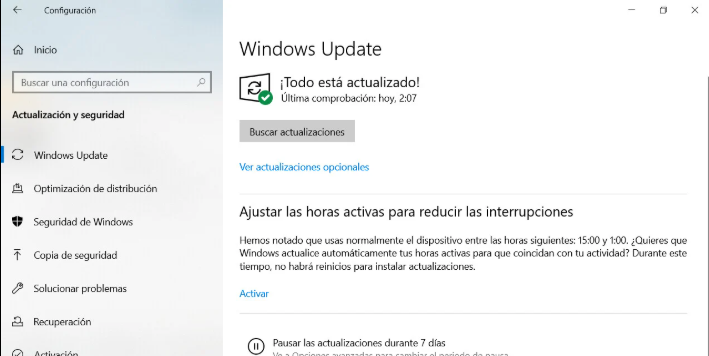

# __Configuración de red y software base tras la instalación__

Una vez completada la instalación de Windows 10 Enterprise, es fundamental configurar adecuadamente los servicios de red y asegurar el sistema con herramientas básicas. A continuación, se detallan los pasos necesarios:

---

## __Configuración de red__

### DHCP (por defecto)
1. Ir a `Panel de control > Centro de redes y recursos compartidos`.
2. Seleccionar "Cambiar configuración del adaptador".
3. Clic derecho en el adaptador de red > "Propiedades".
4. Seleccionar `Protocolo de Internet versión 4 (TCP/IPv4)` > "Propiedades".
5. Asegurarse de que esté seleccionada la opción:
   - "Obtener una dirección IP automáticamente"
   - "Obtener la dirección del servidor DNS automáticamente"


---

### IP estática (opcional)
1. En la misma ventana, seleccionar "Usar la siguiente dirección IP" y configurar por ejemplo:
   - IP: `192.168.1.150`
   - Máscara: `255.255.255.0`
   - Puerta de enlace: `192.168.1.1`
   - DNS: `8.8.8.8` y `1.1.1.1`


---

### Grupo de trabajo
1. Ir a `Este equipo > Propiedades > Cambiar configuración (Nombre del equipo)`.
2. Pulsar en "Cambiar" y establecer:
   - Nombre del equipo: `PC-W10`
   - Grupo de trabajo: `OFICINA`
3. Reiniciar el sistema para aplicar cambios.


---

### Verificación
- En `CMD`, ejecutar:
  ```cmd
  ipconfig /all
  ping 8.8.8.8
  ping google.com
  ```
- Comprobar que hay conexión a Internet y que se resuelven nombres DNS.


---
## __Instalación del software base__

### Antivirus
- Verificar que **Windows Defender** esté activo desde `Configuración > Seguridad de Windows`.
- Opcional: instalar antivirus adicional (Avast, Bitdefender, etc.).

---

### Cortafuegos
- Asegurarse de que el **Firewall de Windows** esté habilitado en:
  `Panel de control > Sistema y seguridad > Firewall de Windows Defender`.


---
### Herramientas de actualización
- Ir a `Configuración > Actualización y seguridad > Windows Update`.
- Pulsar en "Buscar actualizaciones" y aplicar todas las disponibles.



---
### Compresor de archivos
- Descargar e instalar **7-Zip** desde [https://www.7-zip.org](https://www.7-zip.org).
- Verificar su funcionamiento creando y extrayendo un `.zip`.


---
### Navegador alternativo
- Instalar un navegador como:
  - Firefox: [https://www.mozilla.org](https://www.mozilla.org)
  - Chrome: [https://www.google.com/chrome](https://www.google.com/chrome)


---
### Herramientas de administración
- Recomendaciones:
  - **CCleaner** (limpieza del sistema)
  - **Process Explorer** (monitor de procesos)
  - **HWMonitor** (monitor de hardware)

