# __Puntos de Restauración en Windows 10__

Un **punto de restauración** es una copia de seguridad del sistema creada en un momento determinado, que permite revertir el estado del sistema a ese momento en caso de que se produzca un problema. Es una herramienta de recuperación útil cuando se experimentan errores después de una actualización o instalación de software.

---
## __¿Qué son los puntos de restauración?__

Los **puntos de restauración** almacenan archivos del sistema, configuraciones del registro y otros archivos importantes para el funcionamiento de Windows. Sin embargo, no incluyen archivos personales como documentos, imágenes o videos. Los puntos de restauración ayudan a **recuperar el sistema** sin afectar los archivos personales del usuario.

---
## __¿Cómo funcionan los puntos de restauración en Windows 10?__

Windows crea puntos de restauración automáticamente en ciertos momentos, como durante la instalación de nuevas actualizaciones, controladores o software importante. Sin embargo, los usuarios también pueden crear puntos de restauración manualmente. Cuando se restaura el sistema a un punto de restauración, Windows deshace los cambios realizados desde el momento en que se creó el punto.

---
## __Cómo crear un punto de restauración__

**Accede a la Configuración del Sistema**:
Haz clic derecho en el botón de **Inicio** y selecciona **Configuración**.

En la barra de búsqueda, escribimos **Restauración**.

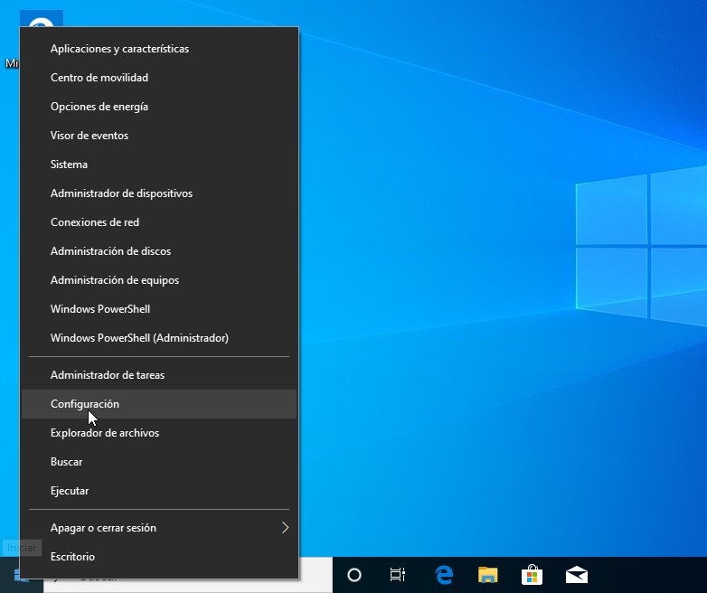
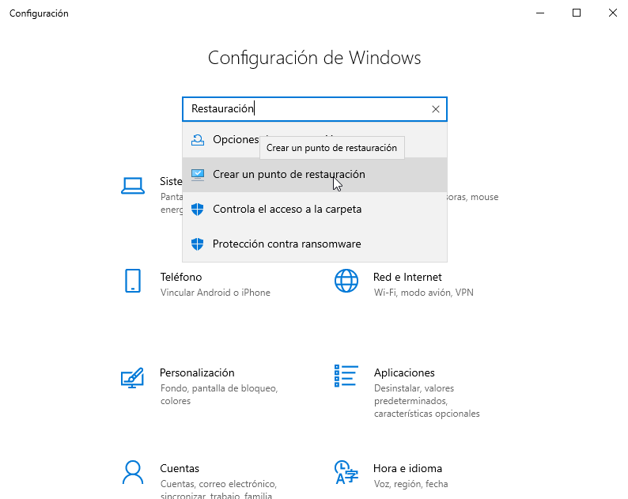

---
**Configurar la protección del sistema**:
En la ventana de **Propiedades del sistema**, en la pestaña **Protección del sistema**, selecciona la unidad de disco donde está instalado Windows (por lo general, **C:**).
Haz clic en **Configurar** y asegúrate de que la protección del sistema esté activada para esa unidad.

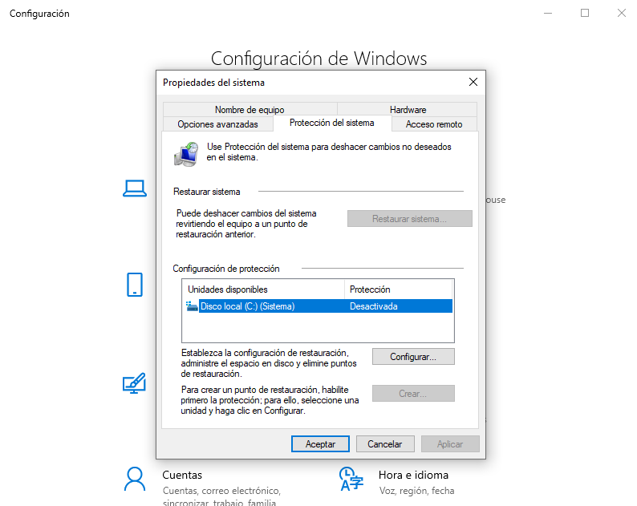
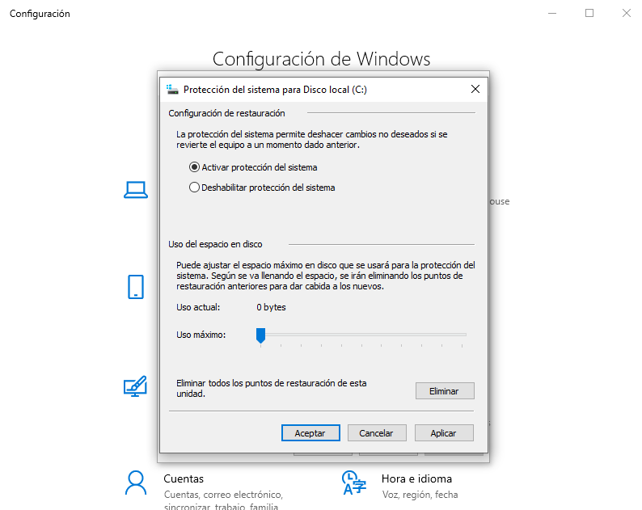

---
**Crear el punto de restauración**:
En la misma pestaña, haz clic en **Crear**.
Escribe una descripción para el punto de restauración (por ejemplo, "Antes de la actualización de Windows").

Haz clic en **Crear** y espera a que el proceso termine.

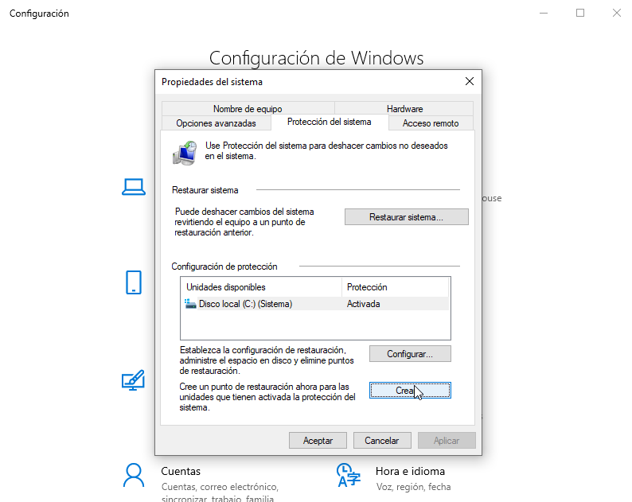
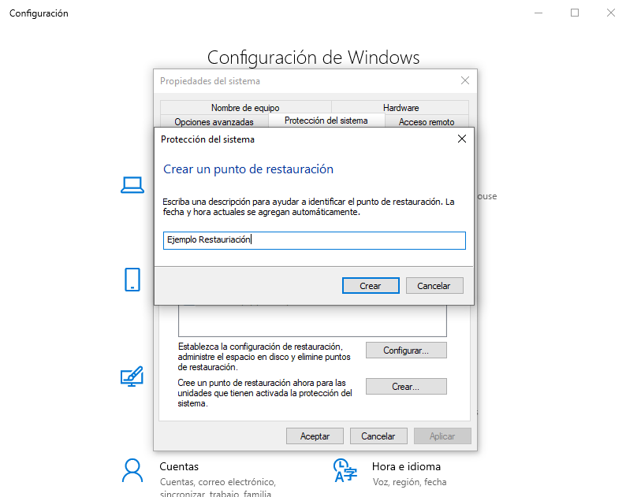
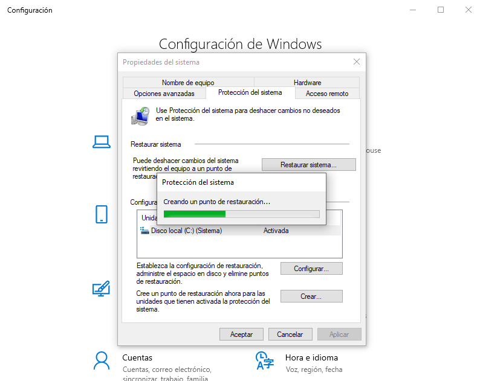

---
## __Cómo realizar una prueba de restauración__
Antes de realizar la prueba voy a instalar Google Chrome.

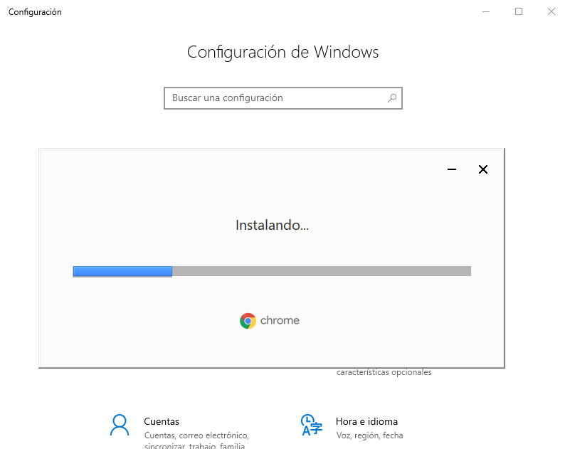

---
### **Accede a la ventana de restauración:**
Vuelve a **Propiedades del sistema** y haz clic en **Restaurar sistema**.

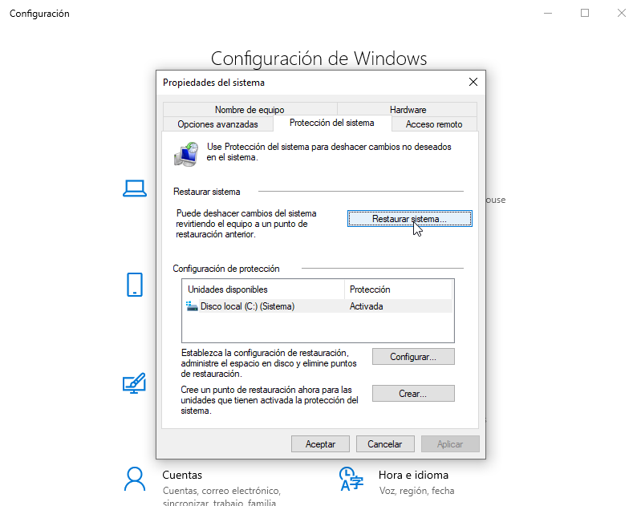

Se abrirá el asistente para restaurar el sistema a un punto anterior.

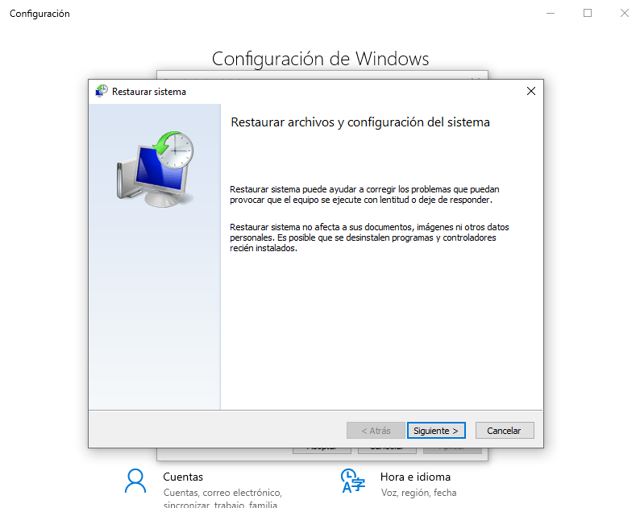

---
### **Seleccionar el punto de restauración:**
En el asistente de restauración, selecciona el punto de restauración que creaste anteriormente.

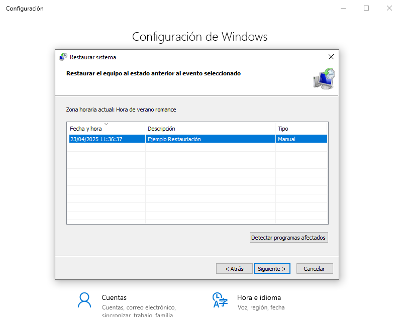

Haz clic en **Siguiente** y luego en **Finalizar**.

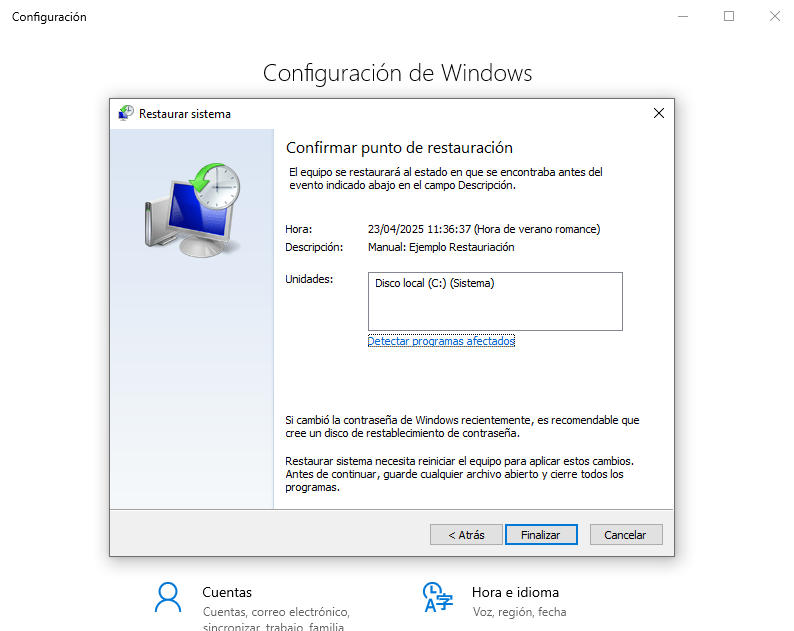

---
### **Restauración y prueba:**

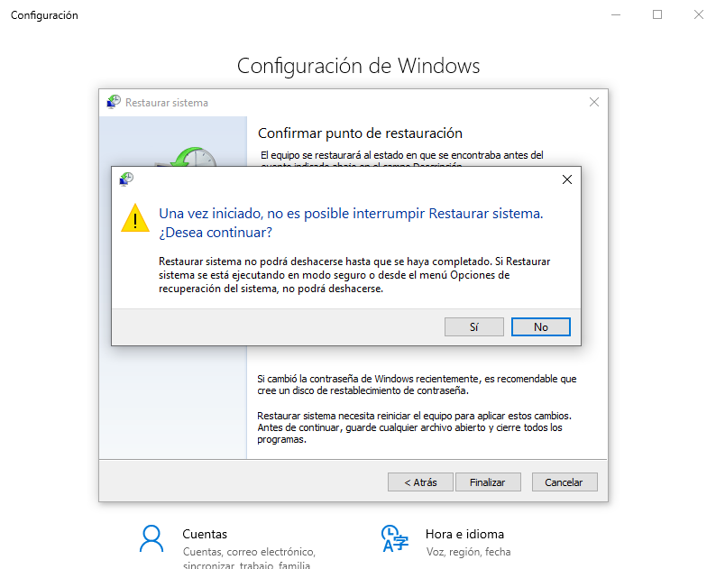

Windows reiniciará el sistema y restaurará el estado anterior. El proceso puede tardar unos minutos.

Una vez que el sistema se haya restaurado, verifica que las configuraciones o programas instalados después del punto de restauración ya no están presentes.

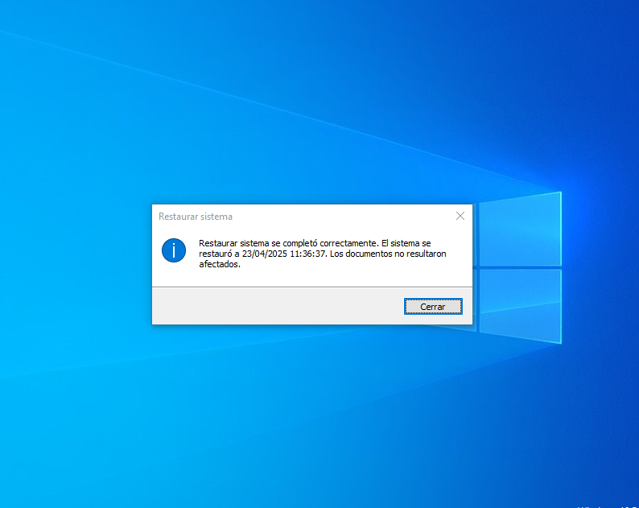

Busco la aplicación de Chrome ya que la instalé después de la restauración y no debería estar:

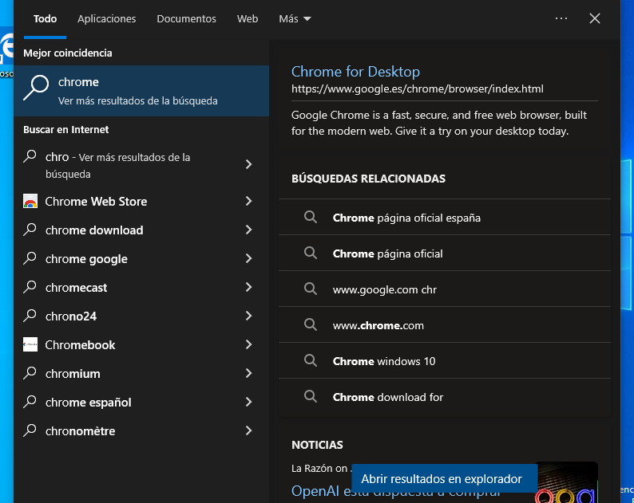

---
## __Importancia de los puntos de restauración__

- **Recuperación ante fallos del sistema**: Permiten deshacer cambios indeseados o solucionar problemas causados por actualizaciones, controladores o software problemático.
- **Seguridad**: Ofrecen una capa adicional de protección, permitiendo revertir cambios de configuración o archivos que podrían haber afectado negativamente el rendimiento o la estabilidad del sistema.

---