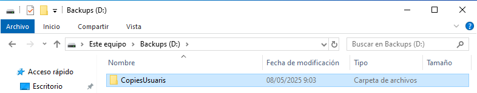

# __Script de copia y automatización__

En este apartado configuraremos un sistema de copias de seguridad automáticas del perfil del usuario, usando un script por lotes (.bat) que se ejecutará al iniciar sesión.

---

## __Preparación Prévia__
Para este apartado reutilazaré el disco del apartado anterior o se podría añadir uno nuevo, para ello:

1. Apaga la máquina virtual.
2. Desde **VirtualBox > Configuración > Almacenamiento**, añade un nuevo disco virtual.
3. Crea el disco con formato **VDI**, almacenamiento dinámico, tamaño recomendado: **2-4 GB**.
4. Inicia la máquina virtual.
5. Entra en **Administración de discos** y formatea este disco como **NTFS**.
6. Asígnale el nombre **Backups** y la letra `E:`.


---
### __Crear carpeta CòpiesUsuaris__

1. Accede al nuevo disco **E:** desde el explorador de archivos.
2. Crea una carpeta llamada `CòpiesUsuaris`.



---
### __Crear script de copia__

1. Abre el Bloc de notas.
2. Escribe lo siguiente:

   ```bat
   @echo off
   xcopy "C:\Users\%USERNAME%" "E:\CòpiesUsuaris\%USERNAME%" /E /H /C /I /Y
   ```

3. Guarda el archivo como `copia_perfil.bat` en `C:\scripts` (crear la carpeta si no existe).


---
### __Configurar ejecución automática del script__

1. Pulsa `Win + R` y escribe `gpedit.msc`.
2. Navega a **Configuración de usuario > Configuración de Windows > Scripts (inicio/cierre de sesión)**.
3. Haz doble clic en **Inicio de sesión** y pulsa **Agregar**.
4. Selecciona el script `copia_perfil.bat` desde la ubicación donde lo guardaste.


---
### __Asignar el script a los usuarios__

1. Asegúrate de que tanto `alumne1` como `alumne2` tengan acceso a la carpeta `C:\scripts`.
2. Inicia sesión con cada uno y verifica que al hacerlo se copia automáticamente su carpeta de usuario a `E:\CòpiesUsuaris\`.


Al iniciar sesión se debe abrir y cerrar rápidamente una pantalla de CMD, es buena señal, ya que se ha ejecutado el script de inicio de sesión.


Se ha copiado todo el contenido de la home del alumne1.
---
