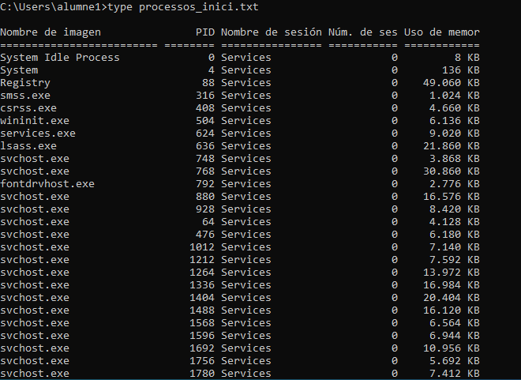

# __Gestión de procesos y servicios__

En esta fase vamos a trabajar con los procesos activos del sistema. Identificaremos cuáles son esenciales, cuáles se pueden eliminar y cómo automatizar su cierre al iniciar sesión, especialmente pensando en máquinas virtuales o con recursos limitados.

---

## __Listar procesos activos__

1. Inicia sesión con el usuario `alumne1`.
2. Abre una ventana de comandos (`CMD`) como usuario.
3. Ejecuta el siguiente comando:

   ```
   tasklist > C:\Users\%USERNAME%\processos_inici.txt
   ```

4. Este archivo contendrá una lista completa de procesos activos al inicio de sesión.




---
## __Identificar procesos prescindibles__

Revisa el archivo generado y localiza procesos que no son estrictamente necesarios para el funcionamiento básico del sistema. Algunos ejemplos comunes:

| Nombre del proceso   | Memoria usada aprox. | Justificación para eliminarlo              |
|----------------------|----------------------|--------------------------------------------|
| OneDrive.exe         | 25 MB                | No se usa almacenamiento en la nube        |
| Teams.exe            | 80 MB                | No se necesita comunicación corporativa    |
| SkypeApp.exe         | 60 MB                | No está previsto su uso en este entorno    |

*Nota: los valores de memoria son aproximados y pueden variar.*

---

## __Eliminar procesos manualmente__

1. Desde el CMD (modo usuario o administrador), ejecuta:

   ```
   taskkill /IM OneDrive.exe /F
   ```

2. Vuelve a ejecutar `tasklist` para comprobar si el proceso ha desaparecido.

   ```
   tasklist
   ```

3. Puedes capturar pantalla antes y después para documentar la diferencia.


---
## __Automatizar cierre de procesos__

1. Edita el archivo `copia_perfil.bat` que ya usamos anteriormente.
2. Añade al final del script las siguientes líneas:

   ```
   taskkill /IM OneDrive.exe /F
   taskkill /IM Teams.exe /F
   ```

3. Guarda los cambios y cierra el editor.

4. Inicia sesión como `alumne2` y comprueba que los procesos se cierran automáticamente al iniciar sesión (puedes verificarlo con `tasklist`).


---
