# __Quotas y Usuarios__

## __Preparación del sistema__

En este apartado vamos a preparar el entorno de almacenamiento de la máquina virtual añadiendo un disco nuevo, creando particiones y configurando sus letras.

---
### __Añadir un nuevo disco virtual__

1. Apaga la máquina virtual si está encendida.
2. Abre **VirtualBox**, selecciona la VM y haz clic en **Configuración**.
3. Entra en el apartado **Almacenamiento**.
4. Haz clic en el controlador SATA y después en el icono del disco con un “+”.
5. Crea un **nuevo disco virtual** de unos **5-10 GB**, en formato **VDI** y almacenamiento **dinámico**.
6. Una vez añadido, inicia la máquina virtual.

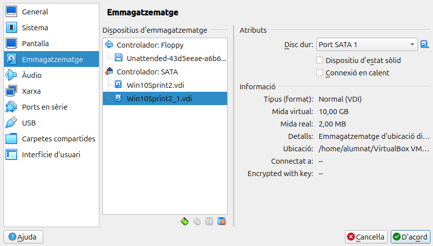

---
### __Iniciar Windows y abrir la gestión de discos__

1. Inicia sesión en Windows.
2. Pulsa `Win + X` y selecciona **Administración de discos**.
3. Verás un mensaje para **inicializar el nuevo disco**. Selecciona **GPT** y acepta.

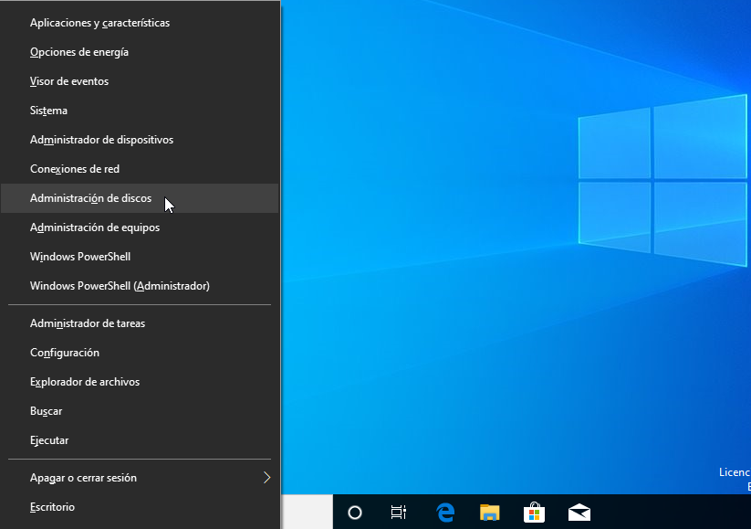

---
### __Crear particiones: Dades y Portable__

1. Sobre el espacio no asignado del nuevo disco, haz clic derecho y selecciona **Nuevo volumen simple**.
2. Crea una primera partición de tipo **NTFS**, tamaño aproximado de 5 GB, y llámala **Dades**.
3. Luego, con el espacio restante, crea otra partición en formato **FAT32** y nómbrala **Portable**.

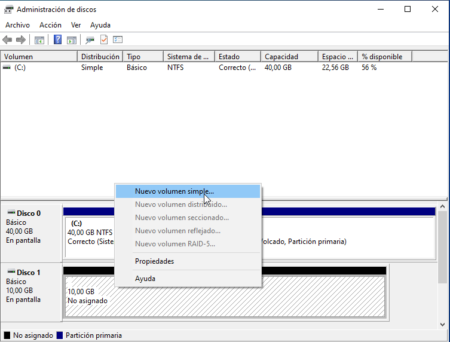

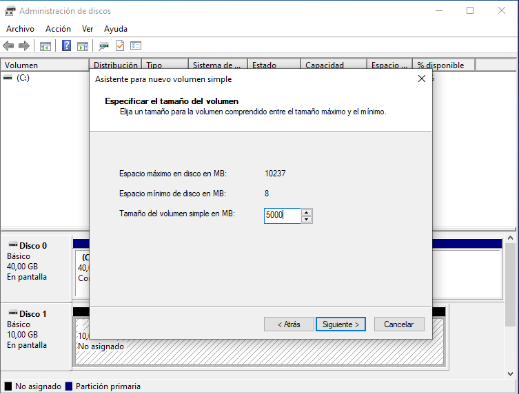

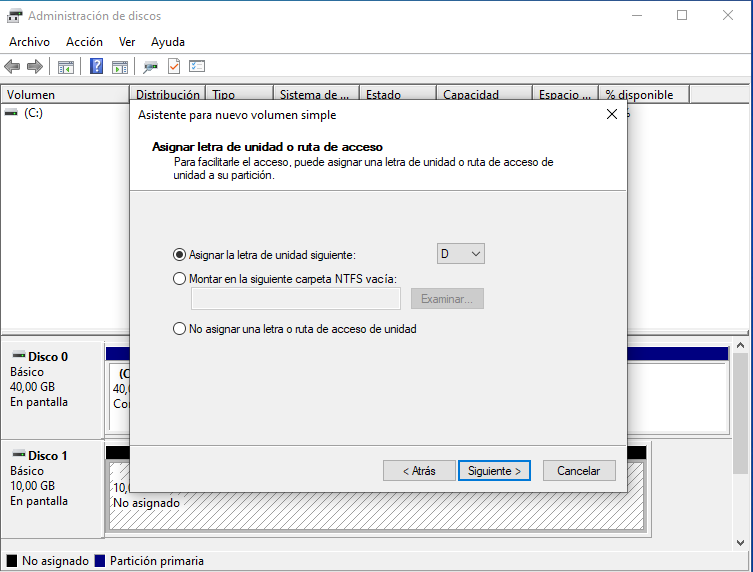

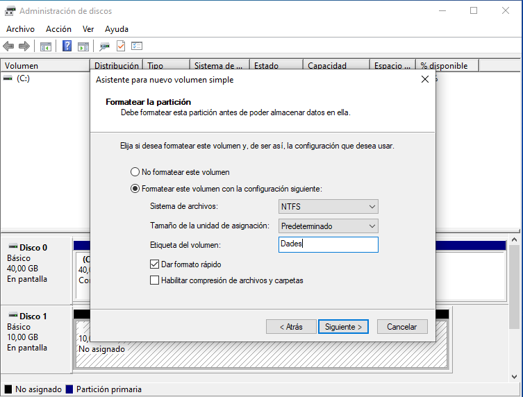

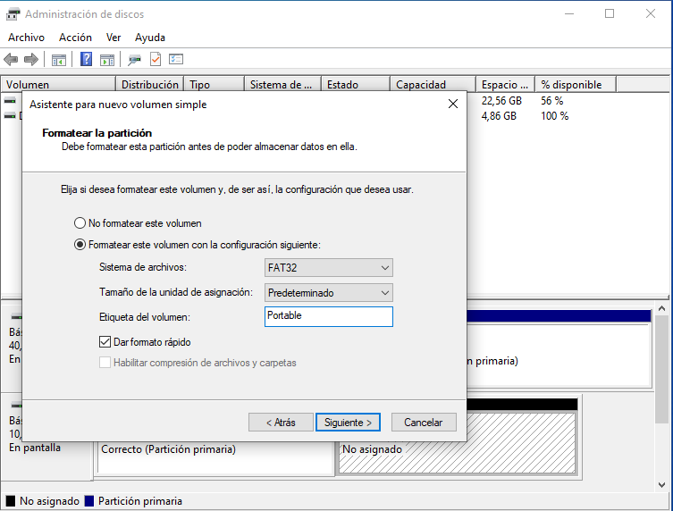

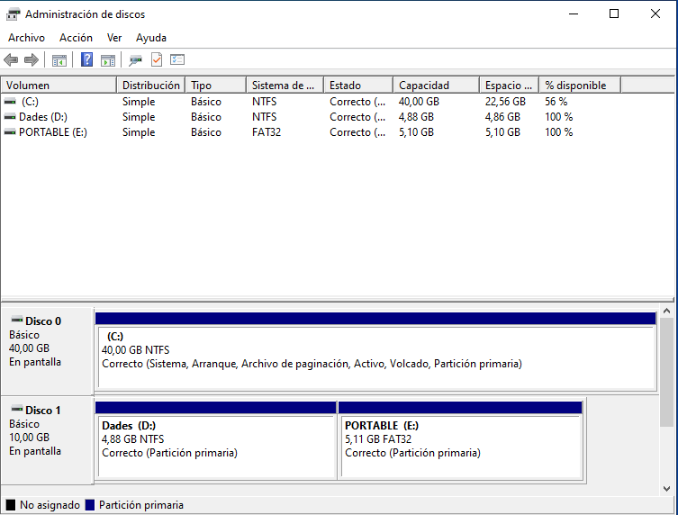

---
### __Asignar letras y verificar con `diskpart`__

1. Para asegurar que ambas particiones tengan letras asignadas automáticamente (por ejemplo, D: y E:).
2. Abre una terminal como administrador (`CMD`) y escribe:

   ```cmd
   diskpart
   list volume
   ```

3. Verifica que aparecen las dos nuevas particiones correctamente identificadas.

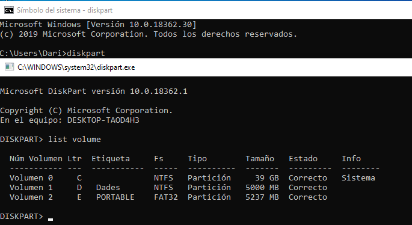

---
## __Gestión de cuotas y usuarios__

En esta fase vamos a configurar cuotas de disco para controlar el espacio asignado por usuario y a crear dos cuentas con permisos limitados para hacer pruebas.

---
### __Activar cuotas de disco en la partición Dades__

1. Ve a **Este equipo**, haz clic derecho sobre la unidad **Dades (D:)** y elige **Propiedades**.
2. En la pestaña **Cuota**, haz clic en **Mostrar configuración de cuotas**.
3. Marca la casilla **Habilitar la administración de cuotas**.
4. Activa también **Denegar espacio en disco a los usuarios que superen el límite de cuota**.

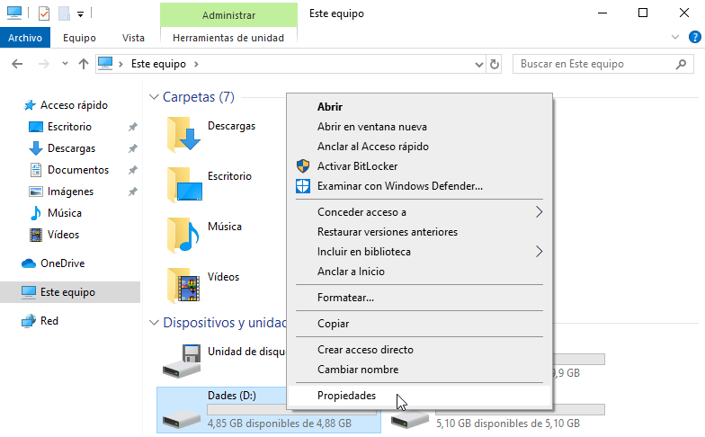

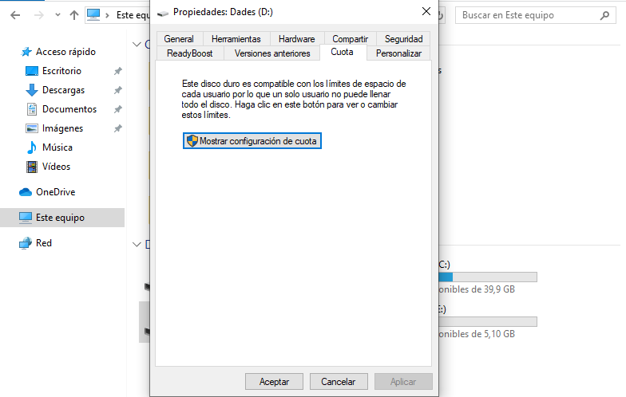

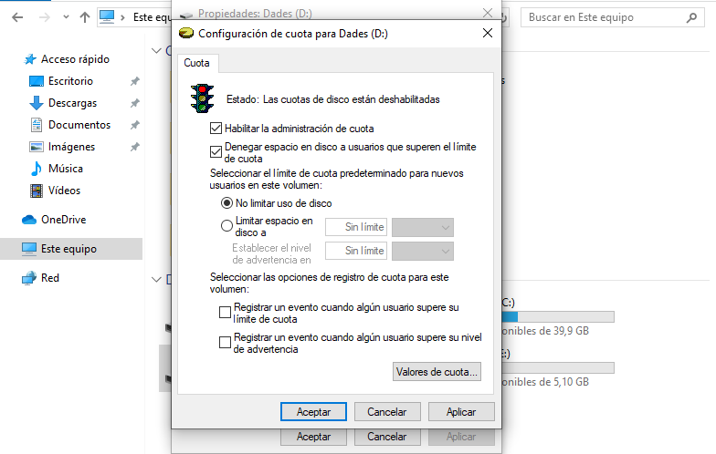

---
### __Establecer límite de 300 MB__

1. En la misma ventana, haz clic en **Límite de cuota predeterminado**.
2. Establece:
   - **Límite de disco**: 300 MB
   - **Nivel de advertencia**: 250 MB
3. Aplica los cambios.

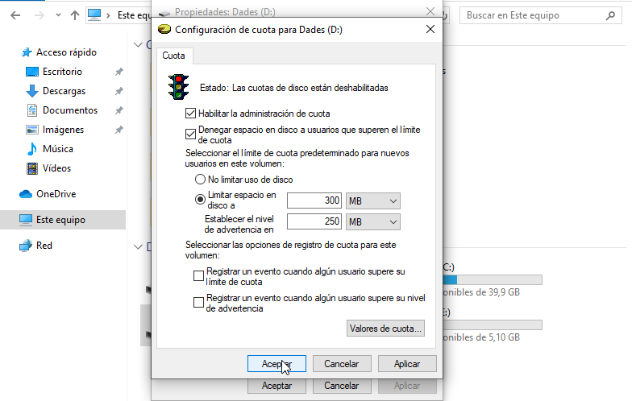

---
### __Crear dos usuarios locales: alumne1 y alumne2__

1. Abre una terminal como administrador o usa el panel de control.
2. Ejecuta estos comandos:

   ```cmd
   net user alumne1 alumne1 /add
   net user alumne2 alumne2 /add
   ```

---
### __Crear grupo Limitats y añadir usuarios__

```cmd
net localgroup limitats /add
net localgroup limitats alumne1 /add
net localgroup limitats alumne2 /add
```

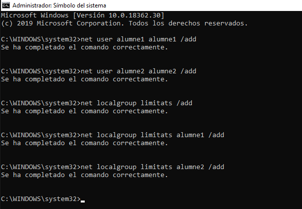

---
### __Probar límites de cuota__

1. Inicia sesión con el usuario **alumne1**.
2. Intenta copiar varios archivos pesados (por ejemplo, vídeos o ISO pequeñas) dentro de la unidad **Dades (D:)**.
3. Deberías recibir un aviso cuando se supere el umbral de advertencia y, eventualmente, un bloqueo al llegar a los 300 MB.

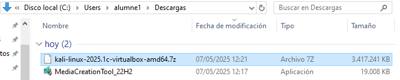

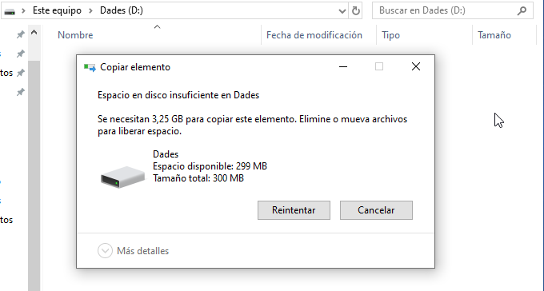
