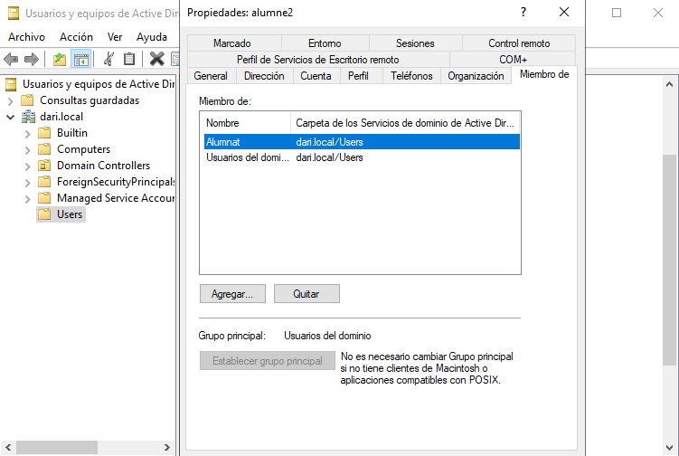

# __Implementación y administración del dominio__

## __1 Implementar el dominio__

El primer paso para centralizar la gestión de usuarios y recursos es instalar y configurar un **controlador de dominio** en un servidor Windows. Esto se hace a través del rol de **Servicios de dominio de Active Directory (AD DS)**.

---
### __Preparar la máquina virtual__

1. Crear una máquina virtual con **Windows Server 2019 o 2022**.
2. Asignar nombre al host.
3. Configurar la IP de forma **estática** (no DHCP), por ejemplo: `10.0.2.20`.
4. Establecer el nombre del equipo definitivo antes de unirlo al dominio.
5. Desactivar el Firewall


---
## __1.1 Instalar el rol de Active Directory__

1. Abrir el **Administrador del servidor**.
2. Hacer clic en **Agregar roles y características**.
3. Seleccionar:
    - **Instalación basada en características o roles**.
    - El servidor local como destino.
4. En roles, marcar **Servicios de dominio de Active Directory (AD DS)**.
5. Continuar hasta el final y hacer clic en **Instalar**.


---
### __Promocionar el servidor a controlador de dominio__

1. Una vez instalado el rol, en el **Administrador del servidor**, aparecerá una advertencia para promocionar el servidor.
2. Hacer clic en **Promover este servidor a controlador de dominio**.
3. Seleccionar:
    - **Agregar un nuevo bosque**.
    - Nombre del dominio raíz: `dari.local` (puedes personalizarlo).
4. Establecer una **contraseña del modo de restauración (DSRM)**.
5. Continuar con la configuración por defecto hasta el final.
6. El sistema se reiniciará automáticamente al finalizar la promoción.


---
### __Verificar que el dominio funciona correctamente__

1. Iniciar sesión como administrador del dominio (`DARI\Administrador`).
2. Abrir la consola **"Usuarios y equipos de Active Directory"**.
3. Verificar que el dominio `dari.local` aparece y que el servidor está en la OU `Domain Controllers`.


---
Con esto, el controlador de dominio principal (DC1) queda configurado y listo para empezar a gestionar usuarios, grupos, equipos y políticas en red.

---
## __1.2 Administrar cuentas de usuario y cuentas de equipo__

Una vez configurado el dominio, el siguiente paso es crear usuarios y preparar los equipos cliente que se unirán al dominio.

---

### __Crear cuentas de usuario en el dominio__

1. Abrir la consola **Usuarios y equipos de Active Directory** (`dsa.msc`).
2. Dentro del dominio (`dari.local`), clic derecho sobre **Usuarios** > **Nuevo > Usuario**.
3. Crear, por ejemplo, los siguientes usuarios:
    - `alumne1` – Nombre completo: Alumne 1
    - `alumne2` – Nombre completo: Alumne 2
4. Establecer una contraseña segura (ej. `Alumne123!`) y desactivar la opción “El usuario debe cambiar la contraseña en el siguiente inicio de sesión” si se desea facilitar las pruebas.
5. Confirmar que los usuarios aparecen correctamente en el contenedor `Usuarios`.


---
### __Crear cuentas de equipo (opcional)__

Aunque las cuentas de equipo se crean automáticamente al unir un PC al dominio, también pueden precrearse:

1. En la consola de AD, clic derecho en **Computers** > **Nuevo > Equipo**.
2. Asignar un nombre como `CLIENTE-01`.
3. (Opcional) Establecer qué usuario podrá unir ese equipo al dominio.

Esto puede ser útil si se quiere restringir quién tiene permiso para unir equipos al dominio.

---

### __Preparar la máquina cliente__

1. Iniciar una máquina virtual con **Windows 10 o 11 Pro**.
2. Cambiar el nombre del equipo a algo identificable (ej. `CLIENTE-01`).
3. Establecer una IP en la misma red del servidor, con la **IP del DC como servidor DNS principal**.

Ejemplo de configuración:

    - IP: `10.0.2.21`
    - Máscara: `255.255.255.0`
    - Puerta de enlace: `10.0.2.1`
    - DNS: `10.0.2.20` (IP del controlador de dominio)


---
### __Unir el equipo al dominio__

1. Desde **Este equipo > Propiedades > Cambiar configuración > Cambiar...**
2. Seleccionar "Miembro de dominio" e introducir: `dari.local`
3. Introducir las credenciales de un administrador del dominio.
4. Reiniciar el sistema cuando lo pida.


---

### __Comprobar el inicio de sesión con usuarios del dominio__

1. En el cliente, después de reiniciar, seleccionar **Otro usuario**.
2. Iniciar sesión como `dari\alumne1` con la contraseña correspondiente.
3. Verificar que se crea un perfil nuevo y que el usuario accede al escritorio con sus permisos.


---
## __1.3 Centralizar la información personal con perfiles móviles__
Un **perfil móvil** permite que los datos del usuario (escritorio, documentos, configuración del entorno) se almacenen en el servidor, no solo en el equipo local. Así, el usuario puede iniciar sesión en cualquier equipo del dominio y mantener su entorno.

---
### __Crear una carpeta compartida para perfiles__
1. En el controlador de dominio (DC), crea una carpeta en `E:\` llamada `Perfils`.
2. Clic derecho > **Propiedades > Compartir > Uso compartido avanzado**.
3. Marca **Compartir esta carpeta**, y como nombre de recurso compartido escribe: `perfils$` (el `$` lo hace oculto en la red).
4. En **Permisos**, añade el grupo `Usuarios del dominio` y da **control total**.
5. Aplica y cierra.


---

### __Asignar ruta de perfil móvil a cada usuario__
1. Abre la consola **Usuarios y equipos de Active Directory**.
2. Doble clic sobre `alumne1` > pestaña **Perfil**.
3. En el campo **Ruta de perfil**, introduce:
   
    ```
    \\SERVERDP\perfils$\alumne1
    ```


*Importante: usa el nombre de red (hostname o IP del servidor), no una ruta local.*

---
### __Probar el funcionamiento__
Se puede probar de varias formas, dependiende si existen mas máquinas "cliente".

1. Desde un equipo cliente unido al dominio, inicia sesión con `alumne1`.
2. Windows debería tardar un poco más en cargar la sesión, ya que está creando el perfil y sincronizándolo con el servidor.
3. Crea un archivo en el escritorio o documentos.
4. Cierra sesión y vuelve a iniciar en otro equipo del dominio (o reinicia el mismo).
5. Verifica que el entorno del usuario y sus archivos se mantienen.

En este caso como solo tengo una maquina cliente pruebo de cerrar y volver a iniciar sesión para comprobar que el archivo se mantiene.


Tambien se puede verificar desde el servidor, donde se debe haber creado una copia de toda el perfil.


---
## __1.4 Crear y administrar grupos de seguridad__
Los **grupos de seguridad** permiten aplicar permisos o directivas a varios usuarios a la vez, lo que facilita enormemente la administración. En este punto crearé grupos según roles y necesidades del dominio `dari.local`.

---

### __Crear grupos de seguridad__
1. Abrir la consola **Usuarios y equipos de Active Directory** (`dsa.msc`).
2. Dentro de la OU `Usuarios` o una unidad organizativa personalizada, hacer clic derecho > **Nuevo > Grupo**.
3. Crear, por ejemplo, los siguientes grupos:
   - `Professors`
   - `Alumnes`
4. Asegurarse de que el tipo sea **Grupo de seguridad** y el ámbito **Global**.


---
### __Añadir usuarios a los grupos__
1. Hacer doble clic en `alumne1`, ir a la pestaña **Miembro de**.
2. Pulsar **Agregar** y escribir `Alumnes`, luego aceptar.
3. Crear usuarios para profesores o técnicos y asignarlos a los grupos correspondientes.


---
### __Crear carpetas o recursos asociados a cada grupo__
1. En el servidor `SERVERDP`, crear en `E:\` una carpeta llamada `Departaments`.
2. Dentro de esa carpeta, crear subcarpetas como:
    - `Alumnes`
    - `Professors`

3. Hacer clic derecho en cada una > **Propiedades > Seguridad**.
4. Eliminar entradas como `Everyone` o `Usuarios`.
5. Añadir el grupo correspondiente (ej. `Alumnes`) y otorgarle los permisos adecuados, por ejemplo:
   - **Lectura y escritura**
   - O solo **lectura**, según el uso


---
### __Probar el acceso según grupo__
1. Inicia sesión en un equipo cliente como `prof1`.
2. Accede a la ruta compartida (por ejemplo):

    ```
    \\SERVERDP\Departaments\Professors
    ```

3. Comprueba que no se puede acceder, modificar o visualizar los archivos según los permisos asignados al grupo y que no puede entrar en __Alumnes__.


---
## __1.5 Crear plantillas de usuario__

Cuando se gestionan muchos usuarios con configuraciones similares (como alumnado de un centro), crear **plantillas de usuario** permite ahorrar tiempo y asegurar coherencia en la configuración.

---
### __Crear un usuario plantilla__

1. En la consola **Usuarios y equipos de Active Directory**, hacer clic derecho sobre la OU donde se crean los usuarios (por ejemplo, `Alumnes`) > **Nuevo > Usuario**.
2. Introducir un nombre representativo como:
    - Nombre: `Plantilla`
    - Apellido: `Alumnes`
    - Nombre de inicio de sesión: `plantilla.alumnes`
3. Establecer una contraseña segura, como `Plantilla123!`, y marcar:
    - El usuario no puede cambiar la contraseña
    - La contraseña nunca expira
4. Finalizar la creación del usuario.


---
### __Configurar propiedades comunes en la plantilla__

Editar la cuenta `plantilla.alumnes` y establecer las opciones que se quieran copiar a nuevos usuarios:

- En la pestaña **Miembro de**, añadirla al grupo `Alumnat`.
- En la pestaña **Perfil**, establecer:
    - Ruta del perfil móvil:  
        ```
        \\SERVERDP\perfils$\%username%
        ```
- En la pestaña **Cuenta**, configurar opciones como:
    - Inicio de sesión permitido
    - Horarios de acceso (si se desea restringir)


---
### __Crear nuevos usuarios basados en la plantilla__

1. Hacer clic derecho sobre el usuario `plantilla.alumnes` > **Copiar**.
2. Se abrirá un asistente para crear un nuevo usuario con las mismas configuraciones:

    - Introducir datos reales: nombre, apellido, usuario, contraseña.
    - El nuevo usuario heredará:
        - Pertenencia a grupos
        - Configuración de perfil
        - Opciones de cuenta

3. Repetir el proceso para cada nuevo usuario.


---
### __Comprobar funcionamiento__

Verificar que:

    - Se ha unido automáticamente al grupo `Alumnes`.
    - Tiene ruta de perfil móvil configurada.
    - Las restricciones establecidas se mantienen.




---
## __1.6 Organizar los objetos del dominio mediante unidades organizativas (OUs)__

Las **Unidades Organizativas (OUs)** permiten estructurar los objetos del dominio (usuarios, grupos, equipos) en contenedores lógicos. Esto facilita su administración, delegación de permisos y aplicación de políticas de grupo (GPO) de forma segmentada.

---
### __Crear las OUs__

1. Abrir la consola **Usuarios y equipos de Active Directory**.
2. Clic derecho sobre el dominio `dari.local` > **Nuevo > Unidad organizativa**.
3. Crear al menos las siguientes OUs:

    - `Alumnes`
    - `Professors`


*Puedes crear sub-OUs si quieres agrupar por curso, departament, aula, etc.*

---
### __Mover objetos a sus OUs correspondientes__

1. Arrastrar o hacer clic derecho sobre cada objeto (usuario, grupo o equipo) > **Mover**.
2. Colocar:
    - Los usuarios `alumne1`, `alumne2` en la OU `Alumnes`.
    - Los profesores (si existen) en la OU `Professors`.


---
### __Beneficios de la estructura con OUs__

- Permite aplicar **GPO diferentes** por tipo de usuario o equipo.
- Facilita el mantenimiento: todo está organizado y es localizable.
- Es posible **delegar administración** solo sobre una OU concreta (por ejemplo, permitir que un técnico solo gestione los `Alumnes`).

---
### __Verificar la estructura__

1. Revisa que en la consola `dsa.msc` se visualicen claramente las OUs con sus objetos bien distribuidos.
2. Si se ha creado una jerarquía de OUs, comprobar que tiene sentido para la administración real del entorno.

---
Organizar el dominio correctamente desde el principio es fundamental para evitar el caos en entornos reales. Una estructura bien pensada facilita enormemente la gestión a medio y largo plazo.

## __2.Configuración de seguridad (GPO)__

## __2.1 Prevenir bloqueos de acceso no autorizados al dominio__

Para evitar accesos indebidos o ataques de fuerza bruta en el entorno del dominio `dari.local`, es fundamental aplicar **políticas de bloqueo de cuenta** y otras configuraciones de seguridad que limiten los intentos fallidos de inicio de sesión.

---
### __Acceder a las directivas de seguridad del dominior__

1. Desde el servidor `SERVERDP`, abrir la herramienta **Group Policy Management** (`gpmc.msc`).
2. Expandir el dominio `dari.local`.
3. Clic derecho en **Default Domain Policy** > **Editar**.


---
### __Configurar directiva de bloqueo de cuenta__

Dentro del editor de GPO, navegar hasta:

```
Configuración del equipo > Configuración de Windows > Configuración de seguridad > Directivas de cuenta > Directiva de bloqueo de cuenta
```

Modificar los siguientes parámetros:

- **Umbral de bloqueo de cuenta**: 3 intentos fallidos
- **Duración del bloqueo de cuenta**: 15 minutos
- **Restablecer el contador de bloqueos**: 15 minutos

*Esto significa que si un usuario falla 3 veces al poner su contraseña, su cuenta quedará bloqueada durante 15 minutos.*


---
### __Aplicar y probar la directiva__

1. Desde un equipo cliente, iniciar sesión con un usuario del dominio (`alumne1`) introduciendo mal la contraseña 3 veces.
2. Verificar que el sistema muestra un mensaje de cuenta bloqueada.
3. Esperar el tiempo configurado o desbloquear manualmente desde el servidor (en `dsa.msc` > usuario > propiedades > desbloquear cuenta).


---
### __Reforzar la complejidad de contraseñas (opcional)__

Desde la misma GPO (o una nueva), se puede aplicar también:

```
Configuración del equipo > Configuración de Windows > Configuración de seguridad > Directivas de cuenta > Directiva de contraseñas
```

Recomendaciones:
- **Longitud mínima**: 8 caracteres
- **Debe cumplir con los requisitos de complejidad**: Activado
- **Historial de contraseñas**: recordar al menos 5

Estas políticas contribuyen a proteger el dominio de intentos de acceso no autorizados y garantizan una mejor higiene de seguridad en la red.

---