# __Implementación de RAID 5__

En esta fase se realiza la configuración de un sistema de almacenamiento redundante **RAID 5** mediante discos virtuales y herramientas integradas en **Windows Server 2022**. Se utilizan un mínimo de **tres discos duros virtuales** y se comprueba el funcionamiento, la tolerancia a fallos y la recuperación del volumen.

---

## __Preparación de la máquina virtual__

1. Crear una máquina virtual con **Windows Server 2022** instalado.
2. Apagar la máquina y añadir **tres discos virtuales adicionales** (por ejemplo, de 10 GB cada uno, sin formatear).
3. Reiniciar la máquina virtual una vez añadidos los discos.

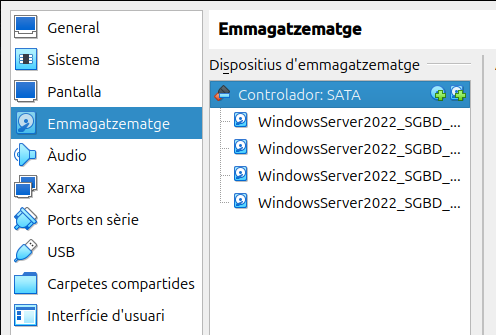

---
## __Inicializar y configurar los discos__

1. Abrir **Disk Management** ejecutando `diskmgmt.msc`.
2. Al abrirse, aparecerá un asistente para **inicializar los nuevos discos**.
3. Seleccionar **GPT** como tipo de partición.
4. **No formatear ni crear particiones** en los discos. Dejarlos como espacio no asignado.

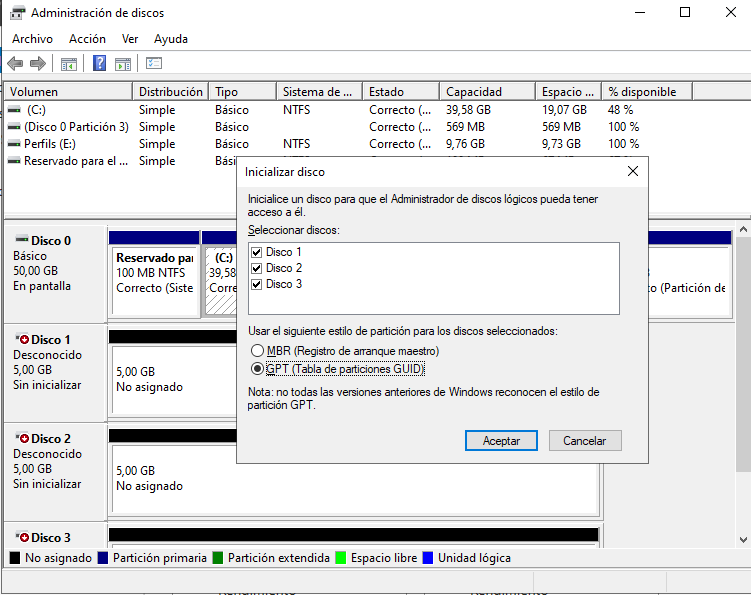

---
## __Crear el RAID 5 desde el Administrador de discos__

1. Hacer clic derecho sobre uno de los nuevos discos y seleccionar **New RAID-5 Volume**.
2. En el asistente, seleccionar los otros dos discos para formar el volumen RAID-5.
3. Asignar una letra al volumen (por ejemplo, `R:`).
4. Asignar nombre: **RAID5-Test** y seleccionar formato **NTFS**.
5. Esperar a que finalice el formato. El volumen aparecerá como una única unidad lógica combinando los 3 discos.

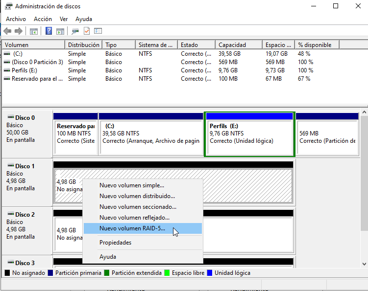

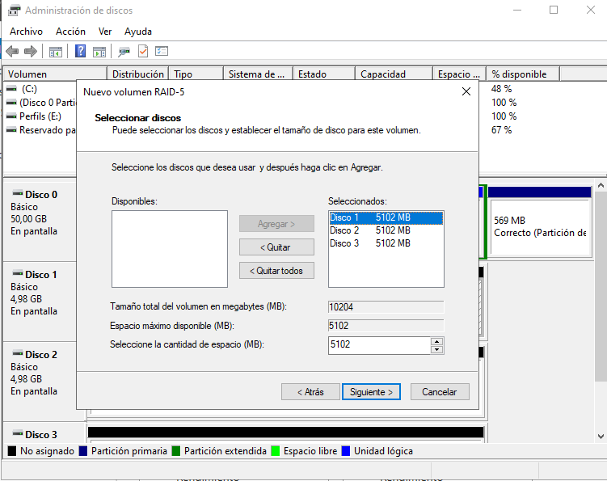

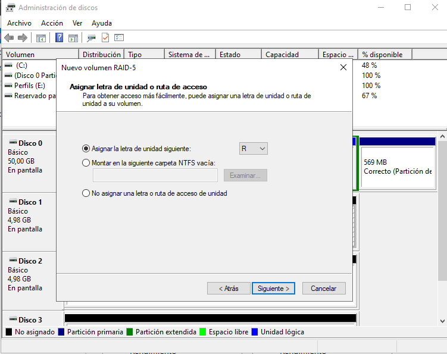

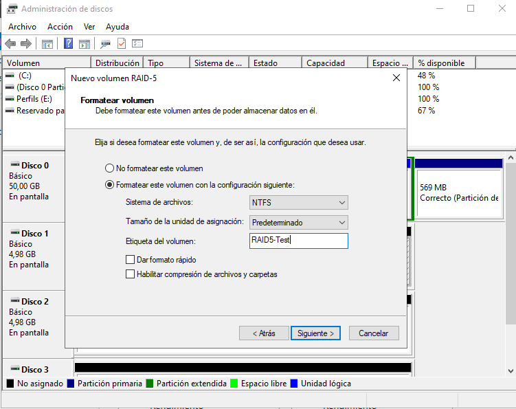

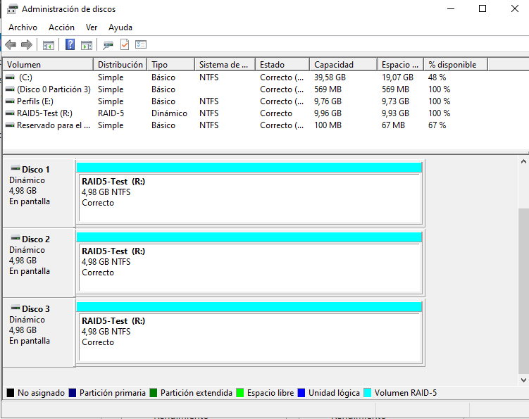

---
## __Pruebas de funcionalidad__

1. Copiar varios archivos al volumen `R:\`, como por ejemplo:
   - Una carpeta con documentos
   - Imágenes
   - Archivos de texto
2. Abrir algunos archivos para comprobar que el volumen funciona correctamente.

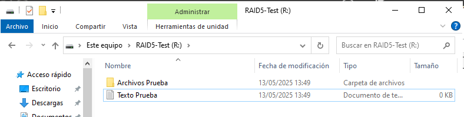

---
## __Simulación de fallo (desconectar un disco)__

1. Volver a **Disk Management**.
2. Hacer clic derecho sobre uno de los discos del RAID y seleccionar **Sin Conexión**.
3. El volumen aparecerá como **Error de Redundancia**, pero seguirá siendo accesible.
4. Intentar abrir archivos para verificar que siguen disponibles a pesar del fallo de un disco.

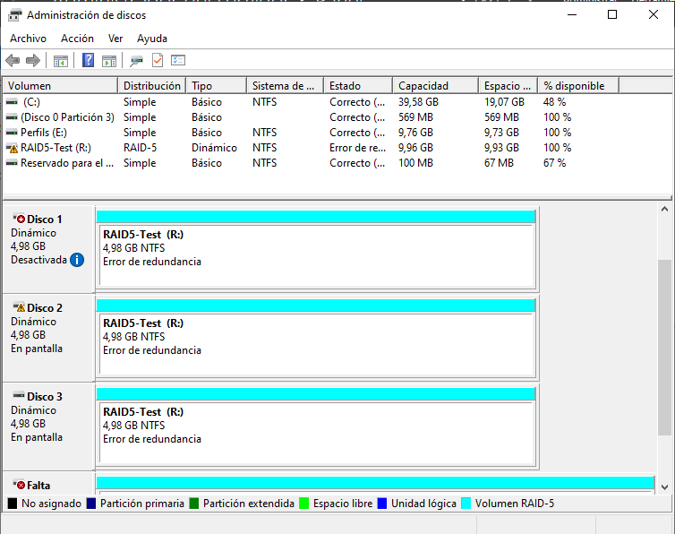

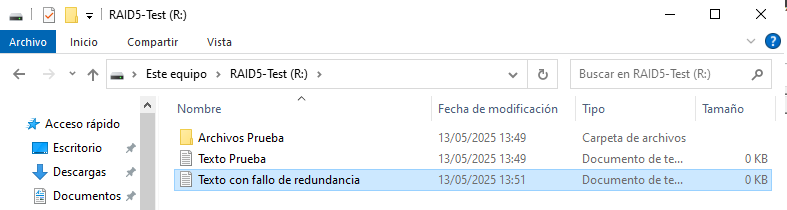

---
## __Simulación de segundo fallo__

1. Poner **Offline** un segundo disco del RAID.
2. Ahora el volumen quedará **inaccesible**. Windows mostrará un error y no se podrá acceder a los archivos.
3. Esto demuestra que **RAID 5 solo tolera un fallo simultáneo**.

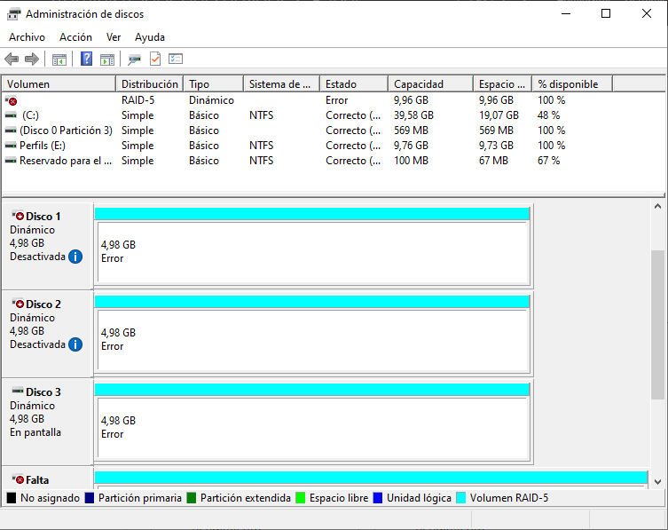

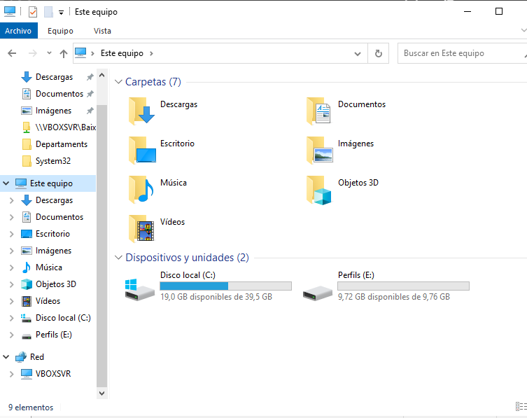

---
## __Recuperación__

1. Volver a poner **Online** uno de los discos que se había desconectado.
2. El volumen debería iniciar un proceso de **recuperación automática** (rebuild).
3. Una vez completada la reconstrucción, volver a acceder a `R:\` y comprobar que los archivos están intactos.

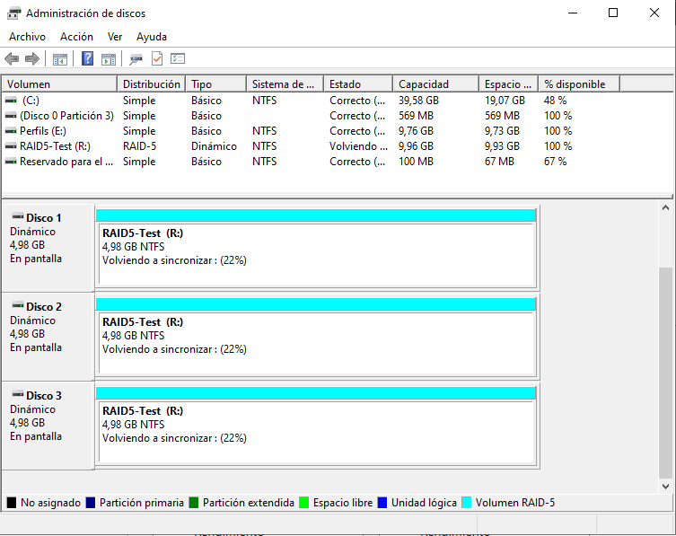

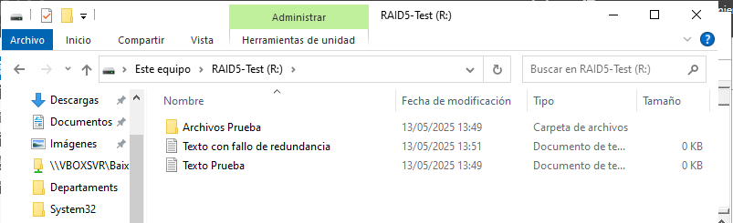

---
## __Conclusiones y observaciones__

- **RAID 5** distribuye tanto los datos como la paridad entre todos los discos.
- Tolera **un único fallo** sin pérdida de datos.
- Ofrece un buen equilibrio entre **rendimiento, capacidad y seguridad**.
- **No sustituye una copia de seguridad**: si fallan dos discos o hay corrupción de datos, se puede perder toda la información.
- El proceso de reconstrucción puede ser largo y estresante para los discos restantes.

---
