# __Configuración y prueba de la auditoría en Active Directory__

La auditoría de Active Directory permite registrar acciones críticas como la creación, modificación o eliminación de objetos como usuarios, grupos o equipos. En este bloque se configura la auditoría desde el servidor, se vincula a una GPO y se verifica desde un cliente que los eventos quedan registrados.

---
## __Activar la auditoría en el controlador de dominio__

1. Abrir la consola **Group Policy Management** (`gpmc.msc`).
2. Clic derecho sobre el dominio `dari.local` > **Create a GPO in this domain and Link it here...**
3. Nombre: `GPO_Auditoria_AD`
4. Clic derecho sobre la GPO > **Edit**.

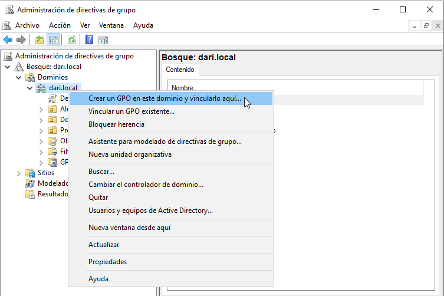

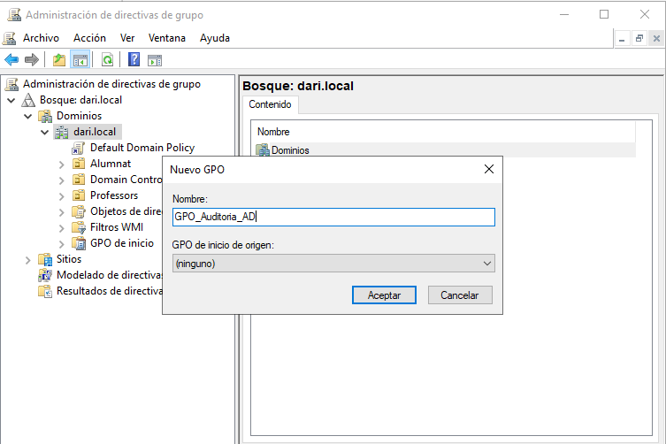

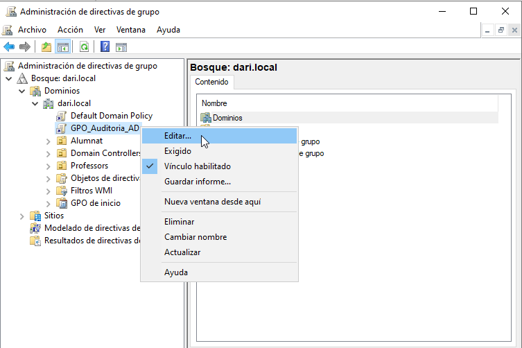

---
## __Configurar las políticas de auditoría__

Dentro del GPO, ir a:

```
Configuración del equipo > Directivas > Configuración de Windows > Configuración de seguridad > Políticas locales > Política de auditoría
```

Activar las siguientes opciones:

- **Auditoría de eventos de cuenta**: Éxito y error
- **Auditoría de gestión de cuentas**: Éxito y error
- **Auditoría de acceso a objetos**: Éxito y error

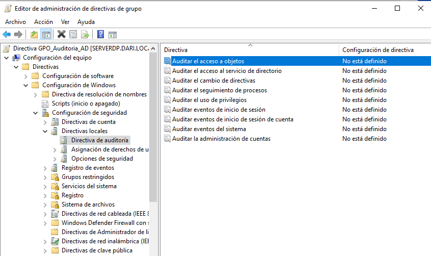

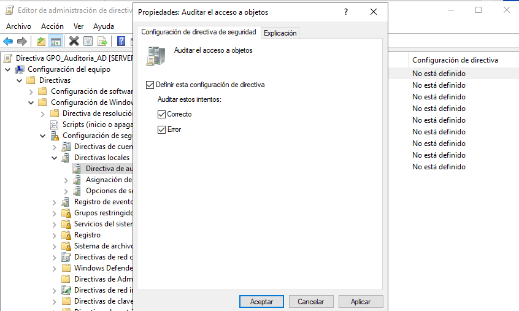

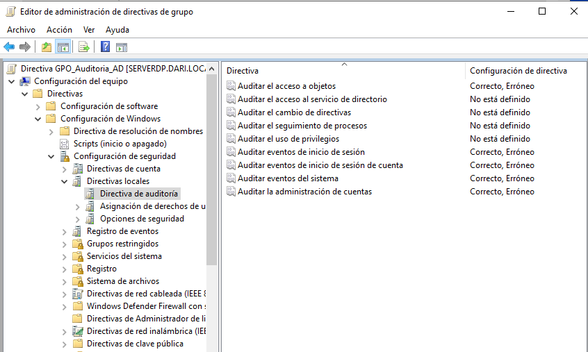

---
## __Aplicar permisos de auditoría sobre un objeto de AD__

Por ejemplo, para auditar cambios sobre un usuario concreto:

1. Abrir **Usuarios y equipos de Active Directory** (`dsa.msc`).
2. En la pestaña **Ver**, activar **Características avanzadas**.
3. Botón derecho sobre un usuario > **Propiedades > Seguridad > Avanzado > Auditoría**.
4. Añadir `Everyone` o un grupo concreto.
5. Configurar acciones a auditar (eliminación, modificación, etc.) → Marcar Éxito y/o Error según el caso.

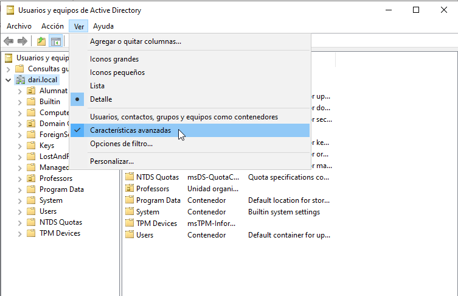

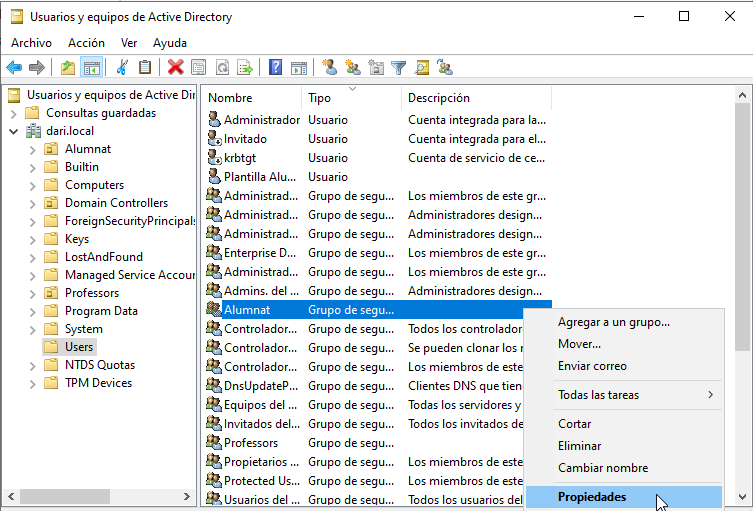

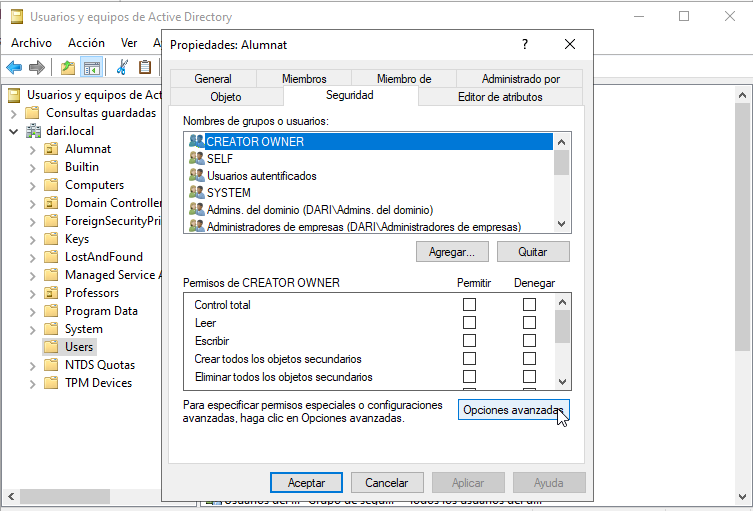

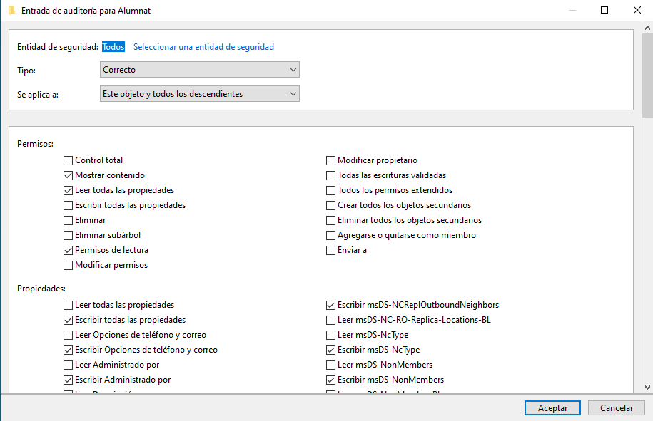

---
## __Forzar actualización de políticas__

En la máquina cliente (ej. `CLIENTE01`), iniciar sesión como `alumno1` y ejecutar:

```cmd
gpupdate /force
```

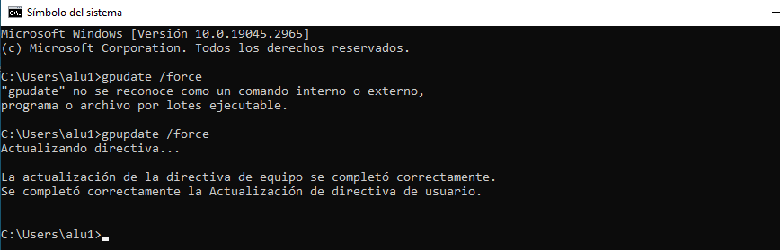

Después, realizar alguna acción que desencadene un registro de auditoría, como:

- Cambiar el nombre de un usuario.
- Añadir o eliminar un usuario de un grupo.

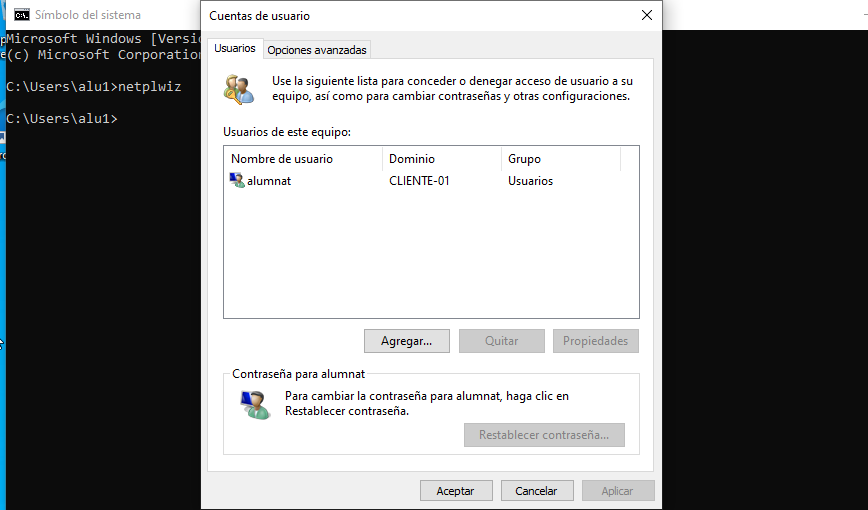

---
## __Comprobar eventos registrados__

En el servidor (`SERVERDP`):

Abrir el **Visor de eventos** (`eventvwr.msc`).
Ir a:
   ```
   Registros de Windows > Seguridad
   ```

Filtrar por ID de evento relacionados con auditoría de AD:
   
   - **4720**: Creación de una cuenta de usuario
   - **4722**: Activación de una cuenta
   - **4723 - 4724**: Cambio de contraseña
   - **4725 - 4726**: Desactivación o eliminación de cuentas
   - **4732 - 4733**: Cambios en miembros de grupos

Comprobar que aparecen los eventos generados desde el cliente e incluyen:
   - Hora de la acción
   - Quién lo ha hecho (usuario)
   - Qué acción se ha realizado

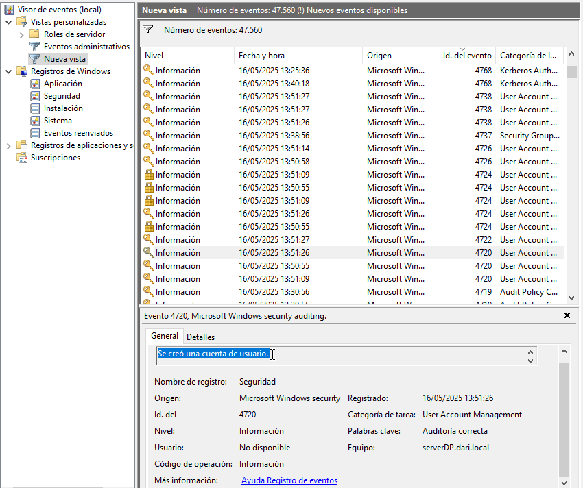

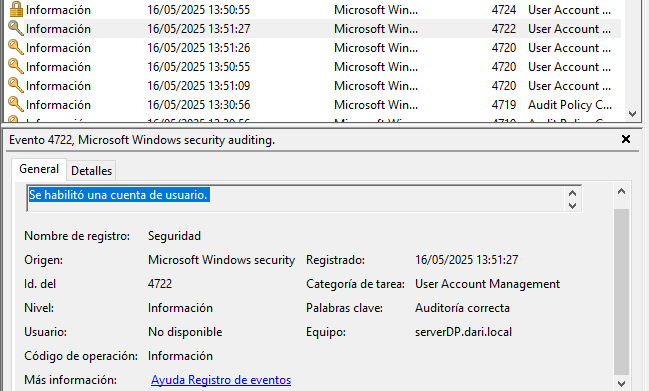

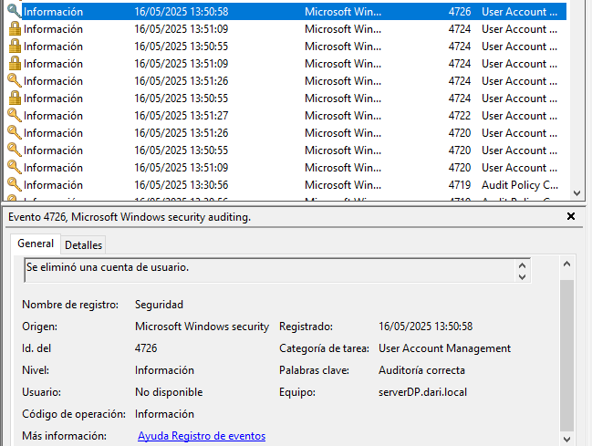

## __Importancia de monitorizar las auditorías__

Monitorizar las auditorías en Active Directory es crucial para garantizar la seguridad y el cumplimiento normativo en una organización. Algunas razones clave incluyen:

- **Detección de actividades sospechosas**: Permite identificar accesos no autorizados o intentos de comprometer cuentas.
- **Cumplimiento de normativas**: Muchas regulaciones, como GDPR o HIPAA, exigen un registro detallado de las actividades en los sistemas.
- **Análisis forense**: En caso de incidentes de seguridad, los registros de auditoría ayudan a reconstruir los eventos y determinar el alcance del problema.
- **Gestión de cambios**: Facilita el seguimiento de modificaciones en la infraestructura, como cambios en permisos o configuraciones críticas.

### __Ejemplos adicionales de eventos a monitorizar__

Además de los eventos mencionados, es útil supervisar otros ID de eventos relacionados con Active Directory:

- **4670**: Cambios en permisos de un objeto.
- **5136**: Modificación de un objeto de directorio.
- **5141**: Eliminación de un objeto de directorio.
- **4767**: Desbloqueo de una cuenta de usuario.
- **4740**: Bloqueo de una cuenta debido a intentos fallidos de inicio de sesión.
- **4756 - 4757**: Cambios en políticas de auditoría.

Estos eventos proporcionan una visión más completa de las actividades en el entorno y ayudan a mantener un control efectivo sobre los recursos de la organización.

---