# __Sprint 1: Instalación, configuración inicial y programas básicos.__

## __Enunciado__
Comença amb la instal·lació d'Ubuntu Linux en un entorn de màquina virtual, assegurant-te que el
sistema operatiu es configura correctament per a un ús general. Aquesta configuració inclourà l'ús i la
personalització de gestors d'arrencada, l'assignació i la gestió de llicències, i la configuració de punts
de restauració del sistema per assegurar la recuperació davant qualsevol error o problema.
Després de la instal·lació inicial, procedeix amb la instal·lació i configuració del programari de base
necessari, incloent-hi eines de gestió, seguretat, i aplicacions essencials per a un entorn de treball
productiu. Això també inclourà la instal·lació i configuració de programari de virtualització per habilitar
la creació de màquines virtuals addicionals, així com la configuració de còpies de seguretat
automàtiques.
Realitza proves exhaustives per verificar que tots els components funcionen com s'esperava, incloent
la comprovació del correcte funcionament dels gestors d'arrencada, la recuperació del sistema des
dels punts de restauració creats, i la instal·lació i execució d'aplicacions.
Documenta detalladament cada pas del procés d’instal·lació, incloent les opcions de configuració
inicial seleccionades, el programari instal·lat i configurat, i qualsevol ajustament realitzat durant la
configuració. A més, inclou captures de pantalla per il·lustrar el procés i notes específiques sobre la
configuració del sistema, els gestors d'arrencada, l'assignació de llicències, la virtualització, els punts
de restauració del sistema, i la instal·lació d'aplicacions. 

## __Objetivos__

- Comprendre i identificar els components funcionals clau del sistema operatiu Ubuntu
- Realitzar la instal·lació i configuració inicial d’Ubuntu
- Realitzar la verificació i configuració dels protocols de xarxa
- Utilitzar màquines virtuals per a la configuració i simulació d'entorns diversos
- Implementar i gestionar punts de restauració del sistema utilitzant eines com Timeshift
- Configurar gestors d'arrencada (GRUB) i optimitzar l'ordre d'arrencada del sistema
- Explorar i gestionar opcions de llicenciament de programari i utilitzar eines de virtualització
- Instal·lar, configurar, verificar, i desinstal·lar aplicacions 

## __Virtualización__
Para hacer los ejercicios utilizaré una máquina virtual con VirtualBox.
A continuación mostraré los pasos que he seguido para crear la máquina virtual.

Para este paso, una vez creada la máquina virtual, he entrado en parámetros y en el apartado "Xarxa", y he cambiado el adaptador1 a Xarxa NAT

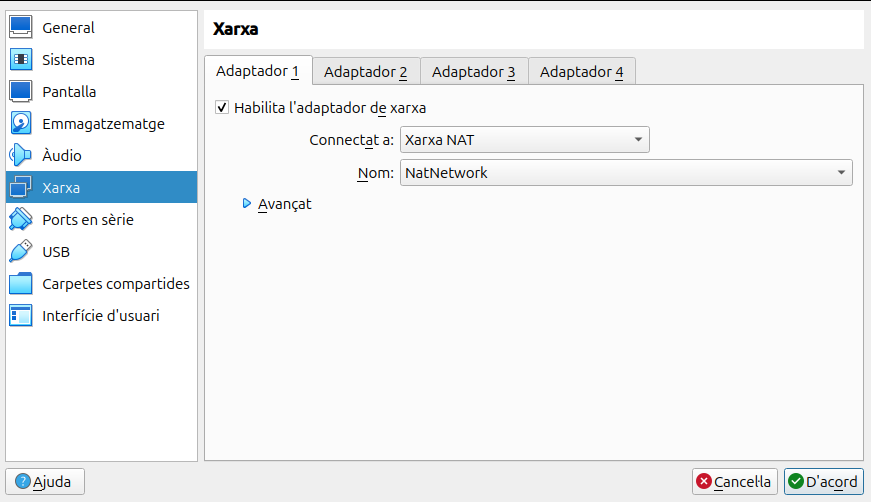

## __Instalación de Ubuntu__

Al empezar la instalción de Ubuntu saldrá unas cuantas pantallas donde es todo darle a siguiente

En esta pantalla que es la octava, selecciono la instalación manual para poder hacer las particiones a mi gusto.

Aqui sale un único disco en el cual comienzo a hacer particiones. 
La primera para SWAP, a la cual le asigno 5000MB.

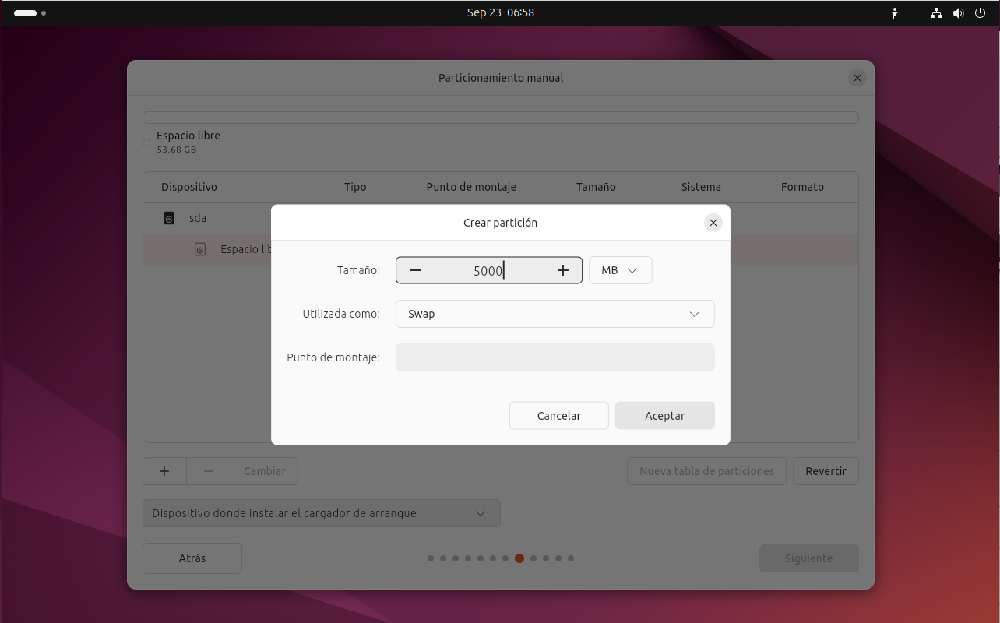

Tambien crearemos dos particiones más, donde una será para la "/home" y otra para "/". 

Una vez creadas las particiones se ve asi.

Ahora ya solo queda crear un usuario y revisar las elecciones que hemos hecho. Ya tenemos Ubuntu instalado.

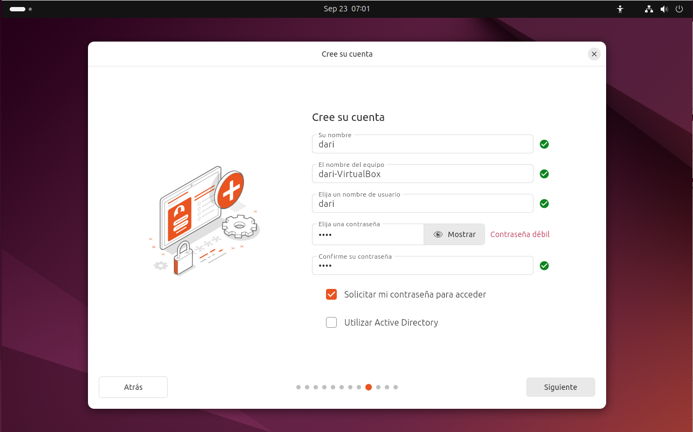

## __Licencias__

### __Licencia de Ubuntu__
Ubuntu se distribuye bajo la licencia GPL (Licencia publica general), es un tipo de licencia donde:

 * Eres libre de utilizar el software para cualquier propósito.
 * Eres libre de modificar el software para adaptarlo a tus necesidades.
 * Eres libre de compartir el software.
 * Eres libre de comparit las mejores que aportes.

### __Licencia GitHub__
GitHub te ofrece la posibilidad de utilizar la licencia que consideres mas adecuada a tu proyecto, en mi caso es GNU General Public License v3.0, que es la misma licencia que utiliza Ubuntu.

Esta versión de la GLP ofrece una protección para los usuarios contra tres amenazas recientes:

* __La tivoización__: algunas empresas han creado distintos tipos de dispositivos que funcionan con software bajo la licencia GPL, y después han manipulado el dispositivo de forma que ellos pueden cambiar el software que lo hace funcionar, pero los usuarios no. Si un dispositivo puede ejecutar un software arbitrariamente, es necesario considerarlo como un ordenador para uso general, y su propietario debería poder controlar lo que hace. Cuando un dispositivo impide ser controlado, decimos que es el resultado de una tivoización.
* __Las leyes que prohíben el software libre__: ciertas leyes, como la Digital Millennium Copyright Act en Estados Unidos o la Copyright Directive de la Unión Europea, han convertido en delito el hecho de escribir o distribuir programas que pueden saltarse las restricciones establecidas por la DRM (Digital Restrictions Management; véase más abajo). Estas leyes no deberían interferir con los derechos que le confiere la GPL.
* __Acuerdos de patentes discriminatorios__: Microsoft ha empezado recientemente a decir que no denunciaría a los usuarios de software libre por infracciones de patente, siempre y cuando obtengan el programa de un distribuidor que está pagando a Microsoft por ese privilegio. Últimamente, Microsoft está intentando cobrar derechos de autor por el uso de software libre, lo que interfiere con la libertad de los usuarios. Ninguna empresa debería poder hacer esto.

Esta información la he sacado de la página oficial de GNU (https://www.gnu.org/licenses/quick-guide-gplv3.html)

## __Puntos de restauración__

Anteriormente, en windows, habia una aplicación que venia con el sistema operativo llamada __System Restore__, dicha aplicación no realizaba cópias de seguridad de archivos ni los restaruaba, era solo para el sistema, actualmente en Windows 11 ya hay una opción en el panel de control para crear puntos de restauración para unidades.

Esto es lo que voy a hacer en Ubuntu instalando una aplicación llamada __timeshift__.

### __Timeshift__

Lo primero es instalarla, usando el terminal usamos la sintaxis "sudo apt install timeshift", aun que previamente va siempre bien asegurarse que el sistema se encuentra completamente actualizado, eso se puede hacer con la sintaxis "sudo apt update && upgrade -y"

Antes de abrir la aplicación voy a crear una carpeta.

Ahora voy a mirar en que partición esta almacenado el directorio "/home".

Ahora ya puedo abrir la aplicación y crear un punto de restauración.

Al abrirla lo primero que sale es un asistente de configuración que te pregunta que ficheros quieres incluir.
Yo selecciono que quiero todos los ficheros.

Presiono siguiente y me pregunta que partición quiero salvaguardar.
En este caso "/home" está montado en "sda2", como se puede comprobar en la segunda captura.

Presiono siguiente y ahora te pregunta cada cuánto quieres generar otro punto de restauración, aqui cada uno a conveniencia pone cada cuanto tiempo lo quiere.

Este ya ha sido el último paso. Ahora voy a comprobar que funciona borrando la carpeta creada previamente y usando el punto de restauración.

Vuelvo a abrir la aplicación __timeshift__ y me sale el punto de restauración que creé. Lo abro y le doy a todo siguiente.

Aquí puede que se te reinicie el ordenador, y ya está hecha la restauración, voy a comprobarlo haciendo un "ls" donde estaba la carpeta.

Funciona.

## __Configuración básica de red__
En Ubuntu 24 podemos configurar la red vía interfaz gráfica o por terminal.

### __Interfaz gráfica__
Entrando en __parámetros__ del sistema las dos primeras opciones son __wifi__ y __red__, ya en dependecia si estamos conectados por wifi o cable entraremos en una de las dos.

Indiferentemente de cual sea el caso hay que entrar en __opciones de red__.

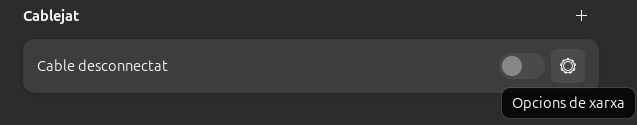

Dentro del apartado __ipv4__ selecciono manual ya que me interesa poner una ip estática. Introduzco la ip que quiero, su máscara y puerta de enlace, además tambien pongo un servidor dns manualmente.

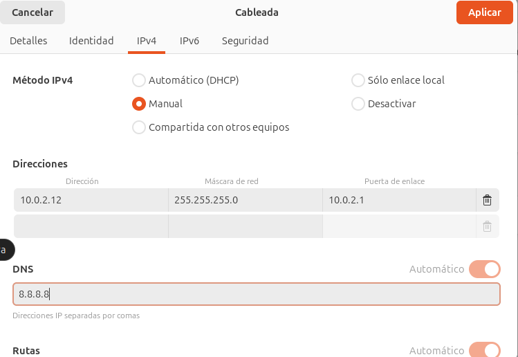

### __Terminal__

Para configurar la red por el terminal he seguido estos comandos y configurado estos ficheros manualmente.

Este archivo nos aparece con dhcp4 en "yes" por defecto,

Para poner una ip estática se cambia el "yes" por un no y se rellena el archivos con la siguiente información.

Para guardar el archivo se usa __CTRL + O__ y después para salir __CTRL + X__.

Por último para aplicar los cambios se usa este comando.

### __Clonezilla__

Sobre clonezilla entraremos en profundidad en el sprint 2 pero se usa a nivel de gestor de sistemas, donde hay que hacer puntos de restauración para muchos equipos e ir uno a uno es una tarea que nos ocuparía mucho tiempo pudiendo utilizar está herramienta.

Clonezilla Server se utiliza para clonar simultáneamente varios equipos a través de una red, es decir, en remoto. También se puede utilizar para implementar sistemas operativos en varios equipos mediante la creación de imágenes de uno solo.

## __Instalación de programas__

En este apartado instalaremos aplicaciones en Ubuntu usando diferentes formas. 

### __Entorno gráfico__
Actualmente, Ubuntu ofrece la instalación de programas mediante su App Center. ES tan fácil como buscar la aplicación y descargarla mediante clicks.

### __apt install__

__Apt install__ es parte del conjunto de comandos de APT (Advanced Package Tool), que es el sistema de gestión de paquetes predeterminado en Ubuntu y Debian. Este comando se usa para instalar paquetes de software desde los repositorios oficiales o desde otras fuentes configuradas.

Funcionamiento de apt install:
Instalación de paquetes: Cuando ejecutas sudo apt install nombre_paquete, APT se conecta a los repositorios configurados, descarga el paquete, junto con las dependencias necesarias, y lo instala en el sistema.

Ahora después de instalarlo, en la misma consola escribo "pacman" para comprobar que se ha instalado correctamente y puedo jugar.

Ahora voy a borrarlo.

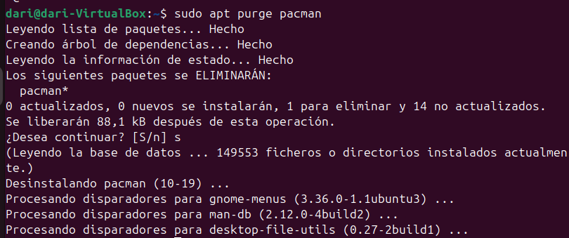

### __aptitude__

__Aptitude__ es otra herramienta de gestión de paquetes en Debian y Ubuntu que ofrece más funcionalidades que apt. Es más avanzado y ofrece tanto una interfaz de texto interactiva como un conjunto de comandos de línea similar a apt.

Funcionamiento de aptitude:
Interfaz gráfica en la terminal: Puedes lanzar una interfaz interactiva en la terminal donde puedes navegar, buscar, instalar, eliminar o actualizar paquetes con un sistema de menús.

### __dpkg__

__Dpkg__ se utiliza principalmente para instalar, eliminar y gestionar paquetes .deb de manera directa.

Conceptos básicos sobre dpkg:
Paquetes .deb: Los paquetes que dpkg maneja tienen la extensión .deb, que es el formato estándar de los paquetes de software en sistemas basados en Debian, como Ubuntu.

Instalación manual: A diferencia de apt, que se encarga de descargar los paquetes y resolver las dependencias automáticamente, dpkg se usa principalmente para instalar paquetes locales que ya has descargado en tu equipo.

### __Añadir repesitorios__

Añadir repositorios en Ubuntu permite acceder a software que no está en los repositorios oficiales, como versiones más recientes o programas propietarios (por ejemplo, Google Chrome o controladores de hardware). También facilita actualizaciones automáticas. Los repositorios son fuentes seguras y verificadas que permiten instalar y actualizar software de forma sencilla.

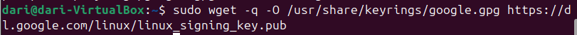

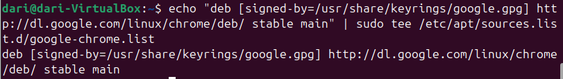

## __Gestores de arranque__

Un gestor de arranque es aquel software cuya función es ayudar al hardware y al firmware a cargar un sistema operativo, incluyendo la elección del mismo si hubieran varios.

### __Grub2__

Grub2 es el gestor de arranque de la mayoria de distribuciones de Linux ya que es un gestor de arranque famoso por su flexibilidad y compatibilidad.

Esta flexibilidad permite al usuario realizar configuraciones avanzadas como hacer un dual boot o restaurar sistemas si el kernel no carga correctamente entre otras cosas.

### __MBR y GPT__

* __MBR:__ es más antiguo, limitado a discos de hasta 2 TB y a un máximo de 4 particiones primarias.
* __GPT:__ es más moderno, soporta discos grandes, muchas particiones, mayor fiabilidad y está diseñado para trabajar con sistemas UEFI.

## __Recuperación gestor de arranque__

Con estas dos herramientas de recuperación del gestor de arranque, para simular un fallo, borraremos el directorio grub de /boot. 

### __Boot-Repair__

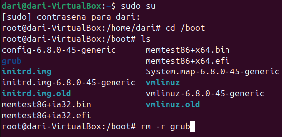

Con esta captura se demuestra que el gestor de arranque falla.

Ahora mediante una iso haciendo como si fuera un liveUSB, ponemos el boot-repair en la máquina virtual y empezamos la recuperación.

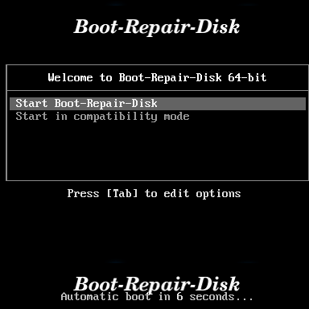

En este caso no he querido probar de utilizar la ultima versión, asi que le doy a no.

En esta pantalla he seleccionado la opción recomendada.

Aqui hago click en si.

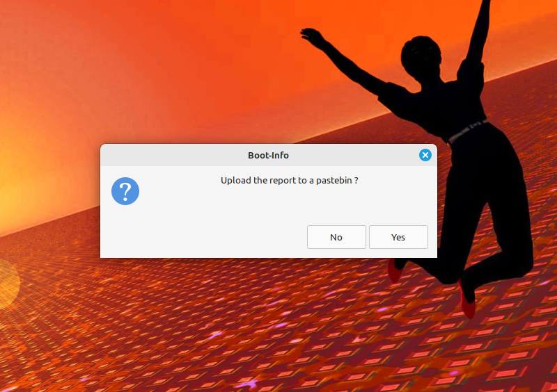

Al terminar muestra un archivo .txt con información de lo que ha hecho boot-repair.

Esta captura muestra como ha funcionado correctamente.

### __SuperGrub 2__

Vuelvo a repetir la simulación de fallo borrando el directorio grub y vuelvo a repetir el proceso de antes pero ahora con la iso de supergrub.

Entro en la opcion de detectar y mostrar los metodos de boot.

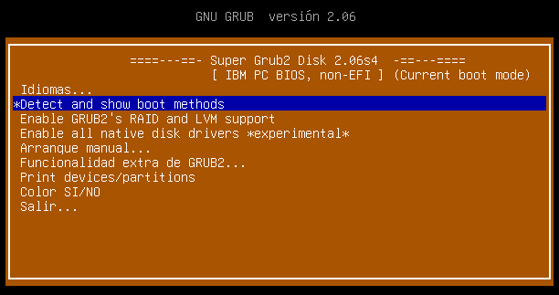

Busco la opción de linux y le doy al enter para que empiece la recuperación.

Al terminar cierro el pc y extraigo la iso que simula el liveUSB, el sistema operativo vuelve a cargar correctamente.

Con SuperGrub2, al terminal hay que poner unos comandos en la terminal para que se aplique la restauración, sino al reiniciar vuelve a petarse.

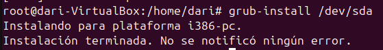

